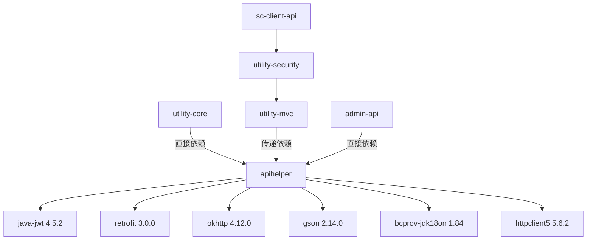
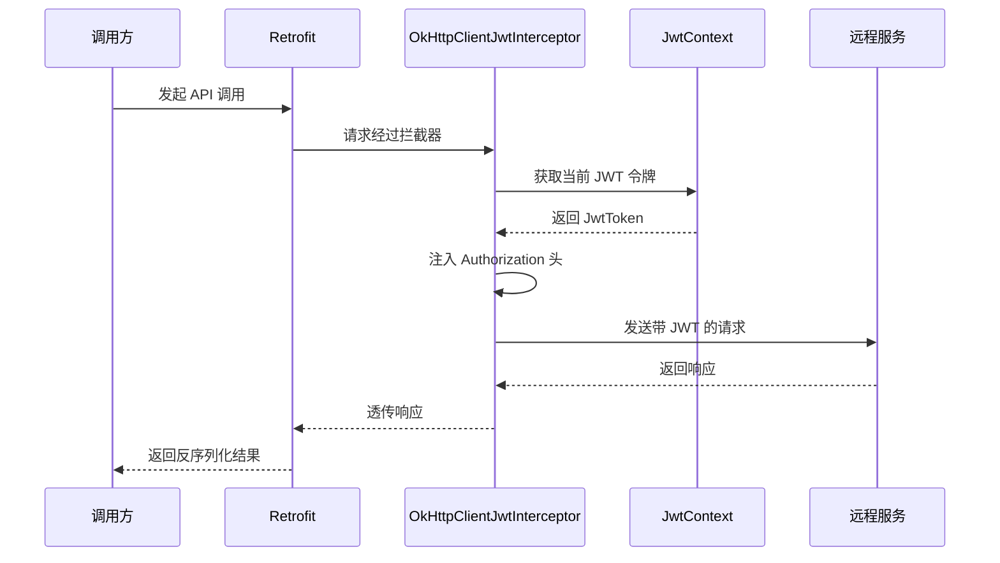
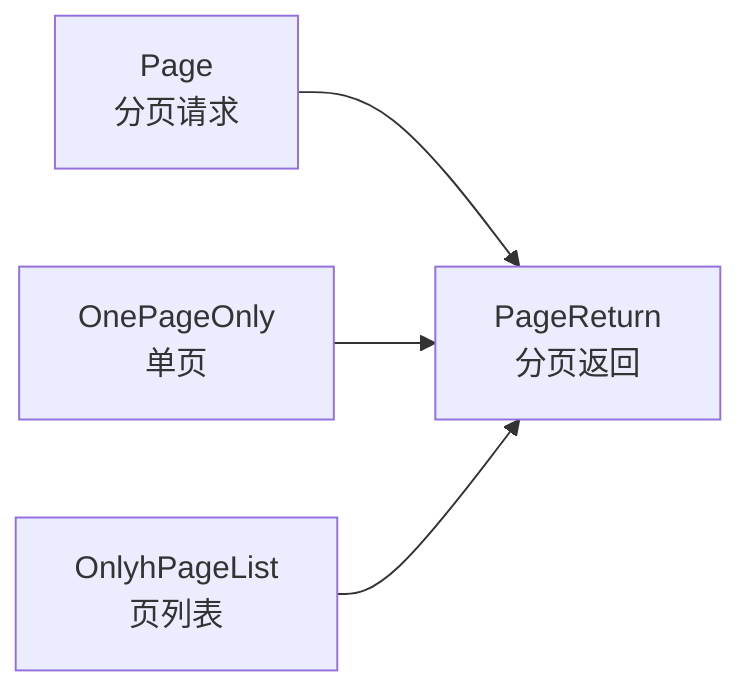

# ApiHelper 模块

## 概述

`ApiHelper` 是网关 API 调用辅助模块，为上层应用提供基于 Retrofit + OkHttp + Gson 的 HTTP 客户端调用能力，并封装了 JWT 令牌管理、RSA 加解密、分页模型等通用工具。

## 基本信息

| 属性 | 值 |
|------|-----|
| groupId | `com.snz1.gateway` |
| artifactId | `apihelper` |
| version | `3.0.0-SNAPSHOT` |
| packaging | `jar` |
| name | ApiHelper |
| description | Helper for call api via gateway |

> 该模块为独立项目，无 parent POM，通过 `dependencyManagement` 引入 Spring Boot BOM 进行版本管理。

## 环境与版本

| 属性 | 版本 |
|---|---|
| revision | 3.0.0 |
| jdk.version | 21 |
| spring-boot.version | 3.5.16 |
| commons-io.version | 2.22.0 |
| commons-codec.version | 1.22.0 |
| java-jwt.version | 4.5.2 |
| bcprov.version | 1.84 |
| httpclient.version | 5.6.2 |
| retrofit.version | 3.0.0 |
| gson.version | 2.14.0 |
| okhttp.version | 4.12.0 |
| kotlin-stdlib.version | 2.1.21 |
| okio.version | 3.10.2 |

## 依赖关系

### 关键依赖

| 依赖 | 版本 | Scope | 说明 |
|------|------|--------|------|
| `com.auth0:java-jwt` | 4.5.2 | compile | JWT 令牌库，排除了 bouncycastle / commons-codec / jackson |
| `com.squareup.retrofit2:retrofit` | 3.0.0 | compile | Retrofit HTTP 客户端，排除了 okhttp |
| `com.squareup.okhttp3:okhttp` | 4.12.0 | compile | OkHttp 底层 HTTP 引擎，排除了 okio / kotlin-stdlib |
| `com.squareup.okio:okio` | 3.10.2 | compile | OkHttp I/O 库 |
| `com.squareup.okio:okio-jvm` | 3.10.2 | compile | OkHttp JVM 实现，排除了 kotlin-stdlib |
| `org.jetbrains.kotlin:kotlin-stdlib-jdk8` | 2.1.21 | compile | Kotlin 标准库（OkHttp 依赖） |
| `org.bouncycastle:bcprov-jdk18on` | 1.84 | compile | RSA 加解密扩展包 |
| `org.apache.httpcomponents.client5:httpclient5` | 5.6.2 | compile | Apache HttpClient 5 |
| `com.google.code.gson:gson` | 2.14.0 | compile | JSON 序列化/反序列化 |
| `commons-io:commons-io` | 2.22.0 | compile | Apache Commons IO |
| `commons-codec:commons-codec` | 1.22.0 | compile | 编解码工具 |
| `com.fasterxml.jackson.core:jackson-databind` | BOM 管理 | compile | Jackson（由 Spring Boot BOM 管理版本） |
| `jakarta.servlet:jakarta.servlet-api` | BOM 管理 | provided | Servlet API |

### 依赖排除说明

由于部分传递依赖的子模块在本项目中已有独立版本管理，以下依赖做了显式排除：

1. **java-jwt** 排除了 `bouncycastle`、`commons-codec`、`jackson` → 需在 apihelper 中单独声明 `bcprov-jdk18on:1.84` 和 `commons-codec:1.22.0`
2. **retrofit** 排除了 `okhttp` → 需单独声明 `okhttp:4.12.0` 和 `okio:3.10.2`
3. **okhttp** 排除了 `okio` 和 `kotlin-stdlib` → 需单独声明 `okio:3.10.2` 和 `kotlin-stdlib-jdk8:2.1.21`

### 框架内依赖关系图



::: tip JWT 唯一直接声明者
apihelper 是 `java-jwt:4.5.2` 在全部项目中的**唯一直接声明者**，其他模块均通过传递依赖获取 JWT 能力。
:::

## 源码结构

模块共包含 **52 个 Java 文件**，分布在两套包路径下：

| 包路径 | 文件数 | 说明 |
|--------|--------|------|
| `com.snz1.gateway.api` | 26 | 新包路径（推荐使用） |
| `gateway.api` | 26 | 旧包路径（历史迁移遗留） |

## 核心类职责

### JWT 与安全

| 类名 | 职责 |
|------|------|
| `JwtToken` | JWT 令牌封装 |
| `JwtContext` | JWT 上下文管理 |
| `RSAUtils` | RSA 加解密工具 |
| `OkHttpClientJwtInterceptor` | OkHttp JWT 注入拦截器，自动为请求注入 JWT 头 |

### HTTP 客户端

| 类名 | 职责 |
|------|------|
| `RetrofitUtils` | Retrofit 工具类，构建 HTTP 调用实例 |
| `GsonConverterFactory` | Gson 转换工厂，处理请求/响应的 JSON 序列化 |
| `GsonRequestBodyConverter` | 请求体转换器 |
| `GsonResponseBodyConverter` | 响应体转换器 |
| `OkHttpClientInterceptor` | OkHttp 拦截器 |
| `HttpClientHelper` | HTTP 客户端辅助类 |
| `ViaGatewayUtils` | 网关调用工具 |
| `BytesConverterFactory` | 字节转换工厂 |
| `SynchCallAdapterFactory` | 同步调用适配器 |

### 数据模型

| 类名 | 职责 |
|------|------|
| `Page` | 分页请求模型 |
| `PageReturn` | 分页返回模型 |
| `OnePageOnly` | 单页分页模型 |
| `OnlyhPageList` | 仅页列表模型 |
| `Result` | 通用响应模型 |
| `Return` | 返回封装模型 |
| `EnvelopeResponse` | 信封式响应模型 |

### 工具与辅助

| 类名 | 职责 |
|------|------|
| `JsonUtils` | JSON 工具类 |
| `JsonDateTypeAdapter` | Gson 日期类型适配器 |
| `Nullable` | 可空注解 |
| `Version` | 版本信息 |
| `NotExceptException` | 异常定义 |
| `NotFoundException` | 未找到异常定义 |

## 关键设计

### JWT 拦截器机制

`OkHttpClientJwtInterceptor` 作为 OkHttp 拦截器，在每次 HTTP 请求发出前自动从 `JwtContext` 获取当前 JWT 令牌并注入到请求头中，实现透明的 JWT 认证注入。



### Retrofit + OkHttp + Gson 调用链路

模块通过以下组件构建完整的 HTTP 客户端调用链路：

1. **OkHttp** 作为底层 HTTP 引擎，配置拦截器链（JWT 注入、通用拦截）
2. **Retrofit** 声明式接口定义，将 HTTP 调用抽象为 Java 接口方法
3. **Gson** 作为序列化/反序列化引擎，通过 `GsonConverterFactory` 接入 Retrofit
4. **BytesConverterFactory** 处理字节数据的特殊转换需求
5. **SynchCallAdapterFactory** 提供同步调用支持

### 分页模型体系

模块提供多种分页模型以适配不同场景：



## 在框架中的地位

| 模块 | 依赖方式 | 获取能力 |
|------|----------|----------|
| `utility-core` | 直接依赖 apihelper | JwtToken 等 API 契约类 |
| `utility-mvc` | 传递依赖 apihelper | 通过 utility-core 传递 |
| `utility-security` | → utility-mvc → apihelper | 传递获得 JWT 和 Retrofit |
| `admin-api` | 直接依赖 apihelper | 作为轻量替代 utility 方案 |
| `sc-client-api` | → utility-security → utility-mvc → apihelper | 传递获得 JWT 和 Retrofit |

## 使用方式

### Maven 依赖引入

```xml
<dependency>
    <groupId>com.snz1.gateway</groupId>
    <artifactId>apihelper</artifactId>
    <version>3.0.0-SNAPSHOT</version>
</dependency>
```

### 基本调用示例

```java
import com.snz1.gateway.api.RetrofitUtils;
import com.snz1.gateway.api.JwtToken;
import com.snz1.gateway.api.JwtContext;
import com.snz1.gateway.api.ViaGatewayUtils;

// 1. 构建 JWT 令牌
JwtToken token = JwtToken.builder()
    .subject("user-001")
    .issuer("my-app")
    .build();

// 2. 设置 JWT 上下文
JwtContext.setToken(token);

// 3. 通过网关工具类发起调用
// ViaGatewayUtils 封装了 Retrofit + OkHttp + JWT 注入的完整链路
Result<MyData> result = ViaGatewayUtils.call(
    myApiService,
    () -> myApiService.getData("param")
);
```

### Retrofit 接口定义示例

```java
import retrofit2.http.GET;
import retrofit2.http.Path;
import com.snz1.gateway.api.Result;
import com.snz1.gateway.api.PageReturn;

public interface MyApiService {

    @GET("api/data/{id}")
    Result<MyData> getData(@Path("id") String id);

    @GET("api/data/list")
    PageReturn<MyData> getDataList();
}
```

## 注意事项

### 1. 两套包路径问题

::: warning 历史迁移遗留
模块同时存在 `gateway.api`（旧）和 `com.snz1.gateway.api`（新）两套包路径，各包含 26 个功能相同的 Java 文件。**建议统一使用 `com.snz1.gateway.api` 新包路径**，避免混用导致类型不兼容问题。
:::

### 2. 依赖排除后的补充声明

由于 `java-jwt` 排除了 `bouncycastle` 和 `commons-codec` 的传递依赖，以下组件需在 apihelper 中单独声明：

- `org.bouncycastle:bcprov-jdk18on:1.84` — RSA 加解密功能依赖
- `commons-codec:commons-codec:1.22.0` — 编解码功能依赖

由于 `retrofit` 排除了 `okhttp`，以下组件也需单独声明：

- `com.squareup.okhttp3:okhttp:4.12.0`
- `com.squareup.okio:okio:3.10.2`
- `org.jetbrains.kotlin:kotlin-stdlib-jdk8:2.1.21`

### 3. JDK 版本要求

模块基于 **JDK 21** 编译，引入方需确保运行环境为 JDK 21 或以上版本。

### 4. Kotlin 运行时依赖

OkHttp 4.x 依赖 Kotlin 标准库，模块已显式声明 `kotlin-stdlib-jdk8:2.1.21`，引入方无需额外配置 Kotlin 运行时。
