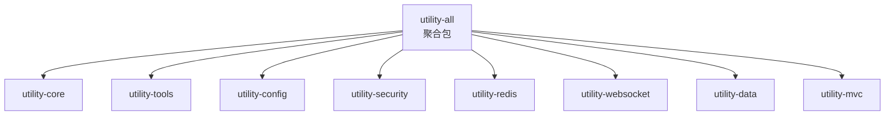

# utility-all 聚合包

## 模块概述

`utility-all` 是 utility 框架的聚合包模块，将所有子模块的依赖统一打包引入。应用只需引入一个 `utility-all` 依赖，即可获得 utility 框架的全部能力，无需逐个引入子模块。该设计面向快速启动和向后兼容场景。

| 属性 | 值 |
|------|------|
| **groupId** | `com.snz1`（继承自 parent `utility`） |
| **artifactId** | `utility-all` |
| **version** | `3.0.0-SNAPSHOT` |
| **parent** | `com.snz1:utility:3.0.0-SNAPSHOT` |
| **描述** | 聚合包：一站式引入所有子模块 |

## 引入的模块列表

`utility-all` 聚合了以下 8 个子模块：

| 模块 | 说明 | 文档 |
|------|------|------|
| `utility-core` | 核心接口契约、基础 Spring 支持 | [详情](./utility-core.md) |
| `utility-tools` | 通用工具类集合 | — |
| `utility-config` | 配置管理、多配置源支持 | — |
| `utility-security` | 安全认证、JWT、SSO 支持 | — |
| `utility-redis` | Redis 缓存、分布式锁 | [详情](./utility-redis.md) |
| `utility-websocket` | Socket.IO WebSocket 服务端 | [详情](./utility-websocket.md) |
| `utility-data` | 数据访问、DAO 支持 | — |
| `utility-mvc` | Web MVC 增强、全局错误处理 | [详情](./utility-mvc.md) |



## 使用方式

### Maven 依赖引入

在项目的 `pom.xml` 中添加以下依赖，即可获得全部子模块能力：

```xml
<dependency>
    <groupId>com.snz1</groupId>
    <artifactId>utility-all</artifactId>
    <version>3.0.0-SNAPSHOT</version>
</dependency>
```

::: tip 版本管理
`utility-all` 的版本由 parent `utility` BOM 统一管理。如果项目已继承 `utility` 作为 parent，则无需显式指定 `<version>`：

```xml
<dependency>
    <groupId>com.snz1</groupId>
    <artifactId>utility-all</artifactId>
    <!-- 版本由 parent BOM 管理 -->
</dependency>
```
:::

### 启用注解一览

引入 `utility-all` 后，根据需要选择启用注解：

```java
@EnableWebMvc           // MVC 增强
@EnableAutoCaching      // Redis 缓存
@EnableSocketServer     // WebSocket 服务端
// ... 其他启用注解按需添加
@SpringBootApplication
public class MyApplication {
    public static void main(String[] args) {
        SpringApplication.run(MyApplication.class, args);
    }
}
```

## 注意事项

### 按需引入 vs 全量引入

| 场景 | 推荐方式 | 说明 |
|------|----------|------|
| **快速原型 / 新项目启动** | `utility-all` 全量引入 | 减少依赖管理成本，快速搭建 |
| **生产环境 / 微服务** | 按需引入子模块 | 减少不必要的依赖和启动开销 |
| **仅需缓存能力** | `utility-redis` + `utility-core` | 避免引入 WebSocket 等无关模块 |
| **仅需 MVC 增强** | `utility-mvc` + `utility-core` | 轻量级 Web 层增强 |

::: warning 选择建议
- **全量引入**：适合单体应用、快速原型、需要全部能力的场景。优点是简单省心；缺点是引入了可能不需要的依赖（如 Redis、WebSocket），增加了 JAR 包体积和启动时间。
- **按需引入**：适合微服务架构、对启动速度和包体积有要求的场景。只引入实际需要的子模块，按需启用对应注解即可。
:::

### 向后兼容

`utility-all` 保证向后兼容，当框架版本升级时，新增子模块会自动加入聚合包，已有模块的 API 保持稳定。应用代码无需修改即可享受新版本能力。

### 依赖冲突排查

全量引入可能带来传递依赖冲突。如遇 `NoSuchMethodError` 或 `ClassNotFoundException`，建议：

1. 使用 `mvn dependency:tree` 检查依赖树
2. 排除冲突的传递依赖
3. 或改为按需引入子模块，减少依赖面

## 版本信息

| 属性 | 值 |
|------|------|
| **当前版本** | `3.0.0-SNAPSHOT` |
| **Parent** | `com.snz1:utility:3.0.0-SNAPSHOT` |
| **聚合模块数** | 8 |
| **包前缀** | `com.snz1` |
