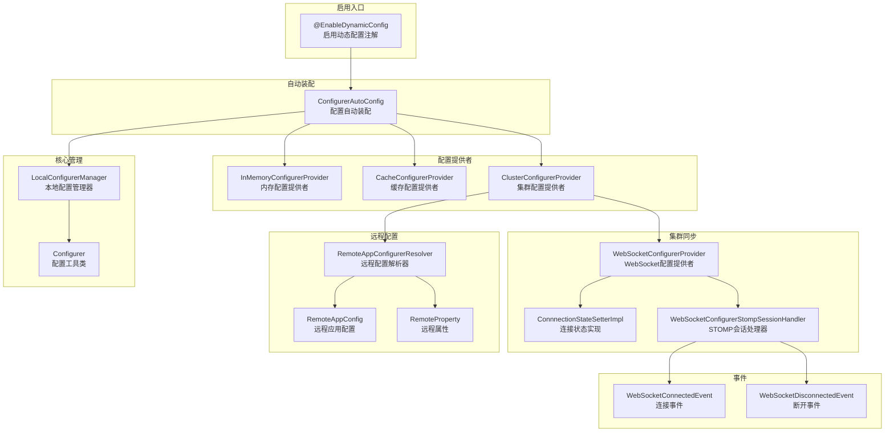
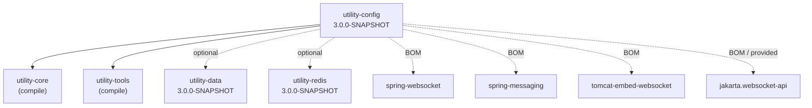
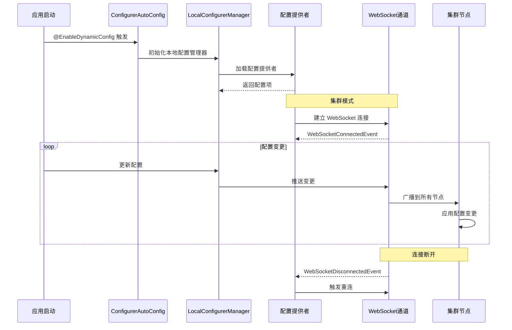

# 动态配置模块 utility-config

## 模块概述

`utility-config` 是 utility 框架的动态配置模块，提供**配置管理、集群同步、远程配置**三大核心能力。通过 `@EnableDynamicConfig` 注解一键启用，支持内存、缓存、集群三种配置提供者，并基于 WebSocket 实现集群间配置的实时推送与同步。

| 属性 | 值 |
|------|------|
| **GroupId** | `com.snz1` |
| **ArtifactId** | `utility-config` |
| **Version** | `3.0.0-SNAPSHOT` |
| **Parent** | `com.snz1:utility:3.0.0-SNAPSHOT` |
| **定位** | 动态配置模块：配置管理、集群同步、远程配置 |

## 架构设计



### 配置提供者体系

模块支持三种配置提供者，按场景灵活选择：

| 提供者 | 实现类 | 适用场景 | 特点 |
|--------|--------|----------|------|
| **内存配置** | `InMemoryConfigurerProvider` | 单机应用、开发测试 | 基于本地内存，零外部依赖 |
| **缓存配置** | `CacheConfigurerProvider` | 分布式缓存场景 | 依赖 `utility-redis`，支持缓存读写 |
| **集群配置** | `ClusterConfigurerProvider` | 集群环境、多节点同步 | 基于 WebSocket 推送，实时同步 |

### 集群同步机制

集群配置同步基于 WebSocket + STOMP 协议实现：

1. **连接建立**：`ConnnectionStateSetterImpl` 管理连接状态，连接成功后触发 `WebSocketConnectedEvent`
2. **会话处理**：`WebSocketConfigurerStompSessionHandler` 处理 STOMP 会话消息
3. **状态感知**：连接断开时触发 `WebSocketDisconnectedEvent`，支持重连逻辑
4. **配置推送**：配置变更通过 WebSocket 通道实时推送到集群中的所有节点

## 源码结构

模块共包含 **17** 个 Java 文件，包前缀为 `com.snz1`。

### 类职责一览

| 包名 | 类名 | 职责 |
|------|------|------|
| `com.snz1.annotation` | `EnableDynamicConfig` | 启用动态配置注解，模块入口 |
| `com.snz1.provider` | `CacheConfigurerProvider` | 缓存配置提供者，基于 Redis 实现配置读写 |
| `com.snz1.provider` | `ClusterConfigurerProvider` | 集群配置提供者，协调集群间配置同步 |
| `com.snz1.provider` | `ClusterSyncConfig` | 集群同步配置，定义同步策略参数 |
| `com.snz1.provider` | `ConfigurerAutoConfig` | 配置自动装配类，Spring Boot 自动配置入口 |
| `com.snz1.provider` | `InMemoryConfigurerProvider` | 内存配置提供者，基于本地内存管理配置 |
| `com.snz1.provider` | `LocalConfigurerManager` | 本地配置管理器，统一管理本地配置生命周期 |
| `com.snz1.provider` | `RemoteConnnectionStateSetter` | 远程连接状态设置器，定义连接状态接口 |
| `com.snz1.provider.remote` | `RemoteAppConfig` | 远程应用配置，封装远程应用信息 |
| `com.snz1.provider.remote` | `RemoteAppConfigurerResolver` | 远程配置解析器，解析远程配置源 |
| `com.snz1.provider.remote` | `RemoteProperty` | 远程属性，封装单个远程配置属性 |
| `com.snz1.provider.websocket` | `ConnnectionStateSetterImpl` | WebSocket 连接状态实现，管理连接生命周期 |
| `com.snz1.provider.websocket` | `WebSocketConfigurerProvider` | WebSocket 配置提供者，建立集群通信通道 |
| `com.snz1.provider.websocket` | `WebSocketConfigurerStompSessionHandler` | STOMP 会话处理器，处理集群消息帧 |
| `com.snz1.provider.websocket` | `WebSocketConnectedEvent` | 连接成功事件，连接建立后发布 |
| `com.snz1.provider.websocket` | `WebSocketDisconnectedEvent` | 连接断开事件，连接关闭后发布 |
| `com.snz1.utils` | `Configurer` | 配置工具类，提供配置读写便捷方法 |

### 包结构树

```
com.snz1
├── annotation
│   └── EnableDynamicConfig
├── provider
│   ├── CacheConfigurerProvider
│   ├── ClusterConfigurerProvider
│   ├── ClusterSyncConfig
│   ├── ConfigurerAutoConfig
│   ├── InMemoryConfigurerProvider
│   ├── LocalConfigurerManager
│   ├── RemoteConnnectionStateSetter
│   ├── remote
│   │   ├── RemoteAppConfig
│   │   ├── RemoteAppConfigurerResolver
│   │   └── RemoteProperty
│   └── websocket
│       ├── ConnnectionStateSetterImpl
│       ├── WebSocketConfigurerProvider
│       ├── WebSocketConfigurerStompSessionHandler
│       ├── WebSocketConnectedEvent
│       └── WebSocketDisconnectedEvent
└── utils
    └── Configurer
```

## 依赖关系

### 核心依赖

| 依赖 | Scope | 说明 |
|------|-------|------|
| `com.snz1:utility-core:3.0.0-SNAPSHOT` | compile | 框架核心模块 |
| `com.snz1:utility-tools:3.0.0-SNAPSHOT` | compile | 框架工具集 |

### WebSocket 依赖（BOM 管理）

| 依赖 | Scope | 说明 |
|------|-------|------|
| `org.springframework:spring-websocket` | BOM | Spring WebSocket 支持 |
| `org.springframework:spring-messaging` | BOM | Spring 消息处理 |
| `org.apache.tomcat.embed:tomcat-embed-websocket` | BOM | Tomcat 内嵌 WebSocket |
| `jakarta.websocket:jakarta.websocket-api` | BOM / provided | Jakarta WebSocket API |

### 可选依赖

| 依赖 | Scope | 说明 |
|------|-------|------|
| `com.snz1:utility-data:3.0.0-SNAPSHOT` | compile (optional) | 数据模块，按需引入 |
| `com.snz1:utility-redis:3.0.0-SNAPSHOT` | compile (optional) | Redis 模块，缓存配置场景需要 |

::: tip 可选依赖说明
`utility-data` 和 `utility-redis` 为 optional 依赖，仅在需要使用缓存配置提供者（`CacheConfigurerProvider`）时引入。如果仅使用内存配置或集群配置，无需引入这两个依赖。
:::

### 依赖关系图



## 快速开始

### 1. 引入依赖

在 `pom.xml` 中添加以下依赖：

```xml
<dependency>
    <groupId>com.snz1</groupId>
    <artifactId>utility-config</artifactId>
    <version>3.0.0-SNAPSHOT</version>
</dependency>
```

如果需要使用缓存配置提供者，额外引入 Redis 模块：

```xml
<dependency>
    <groupId>com.snz1</groupId>
    <artifactId>utility-redis</artifactId>
    <version>3.0.0-SNAPSHOT</version>
</dependency>
```

### 2. 启用动态配置

在 Spring Boot 启动类上添加 `@EnableDynamicConfig` 注解：

```java
import com.snz1.annotation.EnableDynamicConfig;
import org.springframework.boot.SpringApplication;
import org.springframework.boot.autoconfigure.SpringBootApplication;

@SpringBootApplication
@EnableDynamicConfig
public class Application {

    public static void main(String[] args) {
        SpringApplication.run(Application.class, args);
    }
}
```

### 3. 使用配置工具类

通过 `Configurer` 工具类便捷地读写配置：

```java
import com.snz1.utils.Configurer;

// 读取配置
String value = Configurer.get("app.config.key");

// 写入配置
Configurer.set("app.config.key", "new-value");

// 读取所有配置
Configurer.getAll();
```

### 4. 集群同步配置

在集群环境下，配置变更会通过 WebSocket 自动同步到所有节点。可通过 `ClusterSyncConfig` 自定义同步策略：

```yaml
# application.yml
snz1:
  config:
    cluster:
      sync:
        enabled: true
        # WebSocket 连接地址
        endpoint: ws://localhost:8080/ws/config
```

## 配置流程



## 关键设计说明

### EnableDynamicConfig 注解

`@EnableDynamicConfig` 是模块的统一入口注解，触发 `ConfigurerAutoConfig` 自动装配。该注解通常与 `@SpringBootApplication` 配合使用，启动后自动注册所有配置提供者和管理器。

### 三种配置提供者

模块采用策略模式，通过统一的提供者接口管理不同来源的配置：

- **InMemoryConfigurerProvider**：最轻量的实现，配置存储在本地内存中，适合单机应用和开发测试环境。无外部依赖，开箱即用。
- **CacheConfigurerProvider**：基于 Redis 缓存实现配置读写，适合分布式场景下的共享配置管理。需要引入 `utility-redis` 依赖。
- **ClusterConfigurerProvider**：基于 WebSocket 推送实现集群间配置实时同步，确保所有节点配置一致性。配合 `WebSocketConfigurerProvider` 建立 STOMP 通信通道。

### 远程配置体系

远程配置通过 `RemoteAppConfigurerResolver` 解析远程配置源，封装为 `RemoteAppConfig` 和 `RemoteProperty` 对象，支持从远程服务动态拉取配置并集成到本地配置体系中。

### 事件驱动机制

模块定义了两个核心事件，支持事件驱动的业务逻辑扩展：

| 事件 | 触发时机 | 典型用途 |
|------|----------|----------|
| `WebSocketConnectedEvent` | WebSocket 连接成功 | 初始化集群同步、拉取最新配置 |
| `WebSocketDisconnectedEvent` | WebSocket 连接断开 | 触发重连、切换降级策略 |

```java
import com.snz1.provider.websocket.WebSocketConnectedEvent;
import com.snz1.provider.websocket.WebSocketDisconnectedEvent;
import org.springframework.context.event.EventListener;
import org.springframework.stereotype.Component;

@Component
public class ClusterConfigEventListener {

    @EventListener
    public void onConnected(WebSocketConnectedEvent event) {
        // 连接成功，拉取最新集群配置
        System.out.println("集群连接成功，开始同步配置");
    }

    @EventListener
    public void onDisconnected(WebSocketDisconnectedEvent event) {
        // 连接断开，启动降级策略
        System.out.println("集群连接断开，启用本地配置");
    }
}
```
