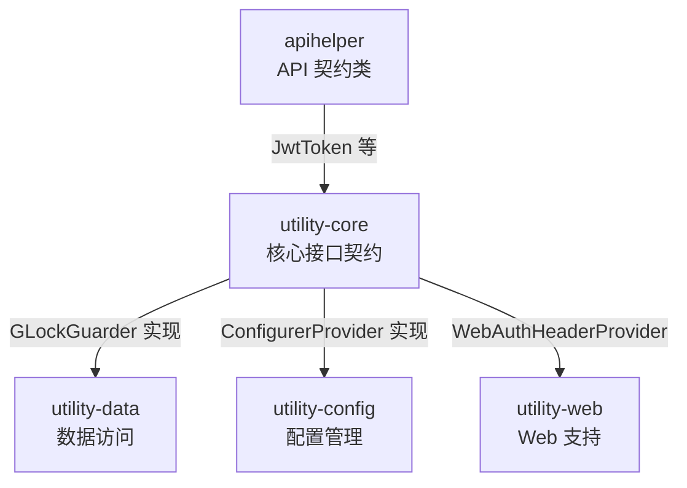

# utility-core 核心模块

## 模块概述

`utility-core` 是 utility 框架的核心模块，定义了框架级的接口契约与基础 Spring 支持。它为上层模块（如 `utility-data`、`utility-config` 等）提供统一的抽象接口，是整个 utility 生态的基础依赖。

| 属性 | 值 |
|------|------|
| **groupId** | `com.snz1`（继承自 parent `utility`） |
| **artifactId** | `utility-core` |
| **version** | `3.0.0-SNAPSHOT` |
| **parent** | `com.snz1:utility:3.0.0-SNAPSHOT` |
| **描述** | 核心模块：接口契约、基础 Spring 支持 |

## 模块依赖

### Spring 及第三方依赖

以下依赖通过 parent BOM 统一管理版本：

| 依赖 | 说明 |
|------|------|
| `spring-boot-starter` | Spring Boot 基础 Starter |
| `spring-web` | Spring Web 框架，提供 Web 层基础支持 |
| `commons-lang3` | Apache Commons Lang3 工具库 |
| `jackson-annotations` | Jackson 序列化注解 |

### 项目内依赖

| 依赖 | Scope | 说明 |
|------|--------|------|
| `com.snz1.gateway:apihelper:3.0.0-SNAPSHOT` | `compile` | 提供 `JwtToken` 等 API 契约类 |
| `io.swagger.core.v3:swagger-annotations:2.2.52` | `provided` | OpenAPI / Swagger 注解支持 |

## 源码结构

模块共包含 **10 个 Java 文件**，包前缀为 `com.snz1`，按功能职责分布在 5 个包中。

### 类职责一览

| 包名 | 类名 | 职责 |
|------|------|------|
| `com.snz1.concurrent` | `GLock` | 分布式锁接口 |
| `com.snz1.concurrent` | `GLockGuarder` | 锁守卫接口 |
| `com.snz1.concurrent` | `LocalLockGuarder` | 本地锁守卫实现 |
| `com.snz1.provider` | `ConfigListener` | 配置变更监听器接口 |
| `com.snz1.provider` | `ConfigurerManager` | 配置管理器接口 |
| `com.snz1.provider` | `ConfigurerProvider` | 配置提供者接口 |
| `com.snz1.provider` | `SysProperty` | 系统属性定义 |
| `com.snz1.provider` | `WebAuthHeaderProvider` | Web 认证头提供者接口 |
| `com.snz1.spring` | `DefaultAppConfig` | 默认 Spring 应用配置 |
| `com.snz1.utils` | `ContainerHelper` | 容器工具类 |

### 包结构树

```
com.snz1
├── concurrent          # 并发与分布式锁
│   ├── GLock               (接口)
│   ├── GLockGuarder        (接口)
│   └── LocalLockGuarder    (实现)
├── provider            # 配置与提供者
│   ├── ConfigListener      (接口)
│   ├── ConfigurerManager   (接口)
│   ├── ConfigurerProvider  (接口)
│   ├── SysProperty         (类)
│   └── WebAuthHeaderProvider (接口)
├── spring              # Spring 支持
│   └── DefaultAppConfig     (配置类)
└── utils               # 工具类
    └── ContainerHelper     (工具类)
```

## 关键设计

### 1. 分布式锁抽象（concurrent 包）

`GLock` 与 `GLockGuarder` 定义了框架统一的分布式锁抽象接口：

- **`GLock`**：描述一个分布式锁的基本行为契约。
- **`GLockGuarder`**：锁守卫接口，负责锁的获取、释放与生命周期管理。
- **`LocalLockGuarder`**：基于本地 JVM 的锁守卫实现，适用于单机场景。

::: tip 扩展实现
`utility-data` 模块中提供了 `DaoGLockGuarder` 实现，基于数据库实现分布式锁守卫，适用于多节点部署场景。
:::

### 2. 配置体系核心接口（provider 包）

`ConfigurerProvider` 与 `ConfigurerManager` 是 utility 配置体系的核心抽象：

- **`ConfigurerProvider`**：配置提供者接口，定义配置的读取与提供方式。
- **`ConfigurerManager`**：配置管理器接口，负责管理多个配置提供者及配置的统一调度。
- **`ConfigListener`**：配置变更监听器接口，当配置发生变更时触发回调。
- **`SysProperty`**：系统属性定义类，集中管理框架级系统属性常量。

::: tip 扩展实现
`utility-config` 模块提供了 `ConfigurerProvider` 和 `ConfigurerManager` 的多种实现，支持从不同配置源（如 Nacos、本地文件等）加载配置。
:::

### 3. Web 认证支持（WebAuthHeaderProvider）

`WebAuthHeaderProvider` 接口为 Web 层提供认证头信息，使得上层模块可以在请求处理过程中统一获取和传递认证信息。

### 4. API 契约类来源（apihelper 依赖）

模块通过 `com.snz1.gateway:apihelper` 依赖引入 `JwtToken` 等 API 契约类，这些类定义了网关与微服务之间的认证与令牌传递契约。

### 5. Spring 应用配置（spring 包）

`DefaultAppConfig` 提供框架默认的 Spring 应用配置，为基于 utility 框架构建的应用提供开箱即用的基础 Bean 定义。

## 使用方式

### Maven 依赖引入

在项目的 `pom.xml` 中添加以下依赖：

```xml
<dependency>
    <groupId>com.snz1</groupId>
    <artifactId>utility-core</artifactId>
    <version>3.0.0-SNAPSHOT</version>
</dependency>
```

::: warning 版本管理建议
`utility-core` 的版本由 parent `utility` BOM 统一管理。如果项目已继承 `utility` 作为 parent，则无需在子模块中显式指定 `<version>`，直接使用 BOM 管理的版本即可：

```xml
<dependency>
    <groupId>com.snz1</groupId>
    <artifactId>utility-core</artifactId>
    <!-- 版本由 parent BOM 管理 -->
</dependency>
```
:::

### 典型使用场景

#### 使用分布式锁

```java
import com.snz1.concurrent.GLockGuarder;

public class OrderService {

    private final GLockGuarder lockGuarder;

    public OrderService(GLockGuarder lockGuarder) {
        this.lockGuarder = lockGuarder;
    }

    public void processOrder(String orderId) {
        GLock lock = lockGuarder.acquire("order:lock:" + orderId);
        try {
            // 执行业务逻辑
            doProcess(orderId);
        } finally {
            lockGuarder.release(lock);
        }
    }
}
```

#### 实现配置变更监听

```java
import com.snz1.provider.ConfigListener;
import com.snz1.provider.SysProperty;

public class CustomConfigListener implements ConfigListener {

    @Override
    public void onConfigChange(String key, String oldValue, String newValue) {
        if (SysProperty.SOME_PROPERTY.equals(key)) {
            // 响应配置变更
            refreshCache(newValue);
        }
    }

    private void refreshCache(String value) {
        // 刷新缓存逻辑
    }
}
```

#### 实现 Web 认证头提供者

```java
import com.snz1.provider.WebAuthHeaderProvider;

public class CustomAuthHeaderProvider implements WebAuthHeaderProvider {

    @Override
    public String getAuthHeader() {
        // 返回认证头信息，如 JWT Token
        return "Bearer " + getTokenFromContext();
    }

    private String getTokenFromContext() {
        // 从请求上下文中获取 Token
        return "...";
    }
}
```

## 模块关系图



## 版本信息

| 属性 | 值 |
|------|------|
| **当前版本** | `3.0.0-SNAPSHOT` |
| **Parent** | `com.snz1:utility:3.0.0-SNAPSHOT` |
| **Java 文件数** | 10 |
| **包前缀** | `com.snz1` |
