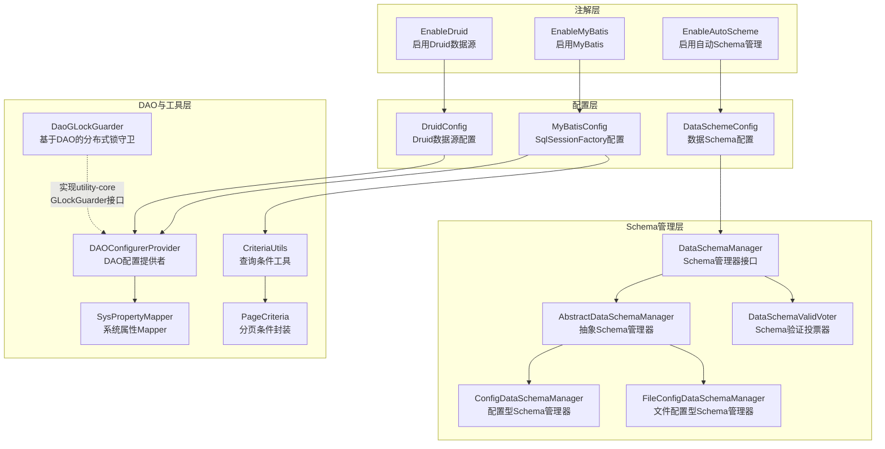
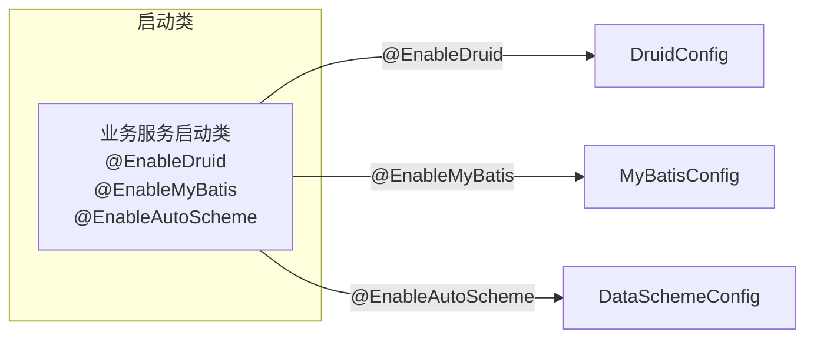
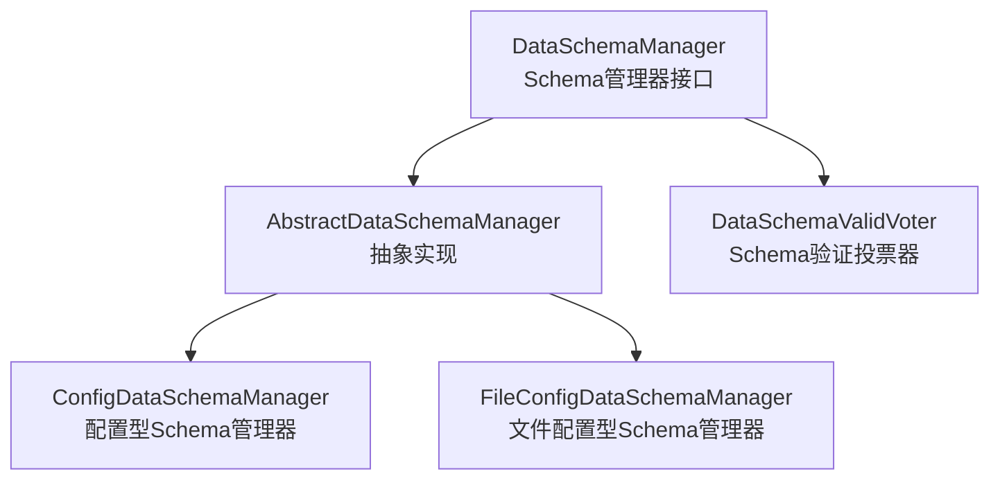

# utility-data 数据库模块

## 基本信息

| 属性 | 值 |
|------|------|
| **GroupId** | `com.snz1`（继承自 parent `utility`） |
| **ArtifactId** | `utility-data` |
| **Version** | `3.0.0-SNAPSHOT` |
| **Parent** | `com.snz1:utility:3.0.0-SNAPSHOT` |
| **描述** | 数据库模块：数据源配置、MyBatis、数据库版本管理 |

## 模块概述

`utility-data` 是 utility 框架的数据层模块，提供数据库数据源配置、MyBatis 集成、数据库 Schema 版本管理等核心能力。该模块采用 **三注解驱动** 的设计模式，通过声明式注解即可启用数据层各组件，同时保持对底层组件的精细控制。

## 依赖关系

| 依赖 | 版本 | Scope | 说明 |
|------|------|-------|------|
| `com.snz1:utility-core` | `3.0.0-SNAPSHOT` | compile | 核心模块，提供 GLockGuarder 接口等基础能力 |
| `com.snz1:utility-tools` | `3.0.0-SNAPSHOT` | compile | 工具模块 |
| `org.springframework:spring-jdbc` | BOM 管理 | — | Spring JDBC 支持 |
| `com.alibaba:druid` | `1.2.28` | compile | Druid 数据源（原生包，非 starter） |
| `org.mybatis:mybatis` | `3.5.16` | compile | MyBatis 核心 |
| `org.mybatis:mybatis-spring` | `3.0.4` | compile | MyBatis 与 Spring 集成 |

## 架构设计



## 源码结构

模块共包含 **16 个 Java 文件**，包前缀为 `com.snz1`。

### 类职责一览

| 包名 | 类名 | 职责 |
|------|------|------|
| `com.snz1.annotation` | `EnableAutoScheme` | 启用自动 Schema 管理 |
| `com.snz1.annotation` | `EnableDruid` | 启用 Druid 数据源 |
| `com.snz1.annotation` | `EnableMyBatis` | 启用 MyBatis |
| `com.snz1.concurrent` | `DaoGLockGuarder` | 基于 DAO 的分布式锁守卫 |
| `com.snz1.dao` | `CriteriaUtils` | 查询条件工具 |
| `com.snz1.dao` | `PageCriteria` | 分页条件封装 |
| `com.snz1.provider.dao` | `DAOConfigurerProvider` | DAO 配置提供者 |
| `com.snz1.provider.dao` | `SysPropertyMapper` | 系统属性 Mapper |
| `com.snz1.scheme` | `AbstractDataSchemaManager` | 抽象 Schema 管理器 |
| `com.snz1.scheme` | `ConfigDataSchemaManager` | 配置型 Schema 管理器 |
| `com.snz1.scheme` | `DataSchemaManager` | Schema 管理器接口 |
| `com.snz1.scheme` | `DataSchemaValidVoter` | Schema 验证投票器 |
| `com.snz1.scheme` | `FileConfigDataSchemaManager` | 文件配置型 Schema 管理器 |
| `com.snz1.spring` | `DataSchemeConfig` | 数据 Schema 配置 |
| `com.snz1.spring` | `DruidConfig` | Druid 数据源配置 |
| `com.snz1.spring` | `MyBatisConfig` | MyBatis 配置 |

## 关键设计

### 1. 三注解驱动

模块通过三个注解实现声明式数据层启用，业务服务只需在启动类上标注对应注解即可按需引入各组件：

- **`@EnableDruid`** — 启用 Druid 数据源，激活 `DruidConfig` 配置类
- **`@EnableMyBatis`** — 启用 MyBatis，激活 `MyBatisConfig` 配置类手动配置 `SqlSessionFactory`
- **`@EnableAutoScheme`** — 启用自动 Schema 管理，激活 `DataSchemeConfig` 配置类



### 2. Druid 原生包配置

`utility-data` 直接使用 `com.alibaba:druid:1.2.28` 原生包，而非 `druid-spring-boot-3-starter`。`DruidConfig` 类手动配置数据源，提供更精细的控制能力：

- 手动创建 `DruidDataSource` 并注入 Spring 容器
- 可自定义连接池参数（初始大小、最大连接数、最小空闲等）
- 支持配置监控统计过滤器

### 3. MyBatis 手动配置

`utility-data` 直接声明 `mybatis:3.5.16` 和 `mybatis-spring:3.0.4`，而非使用 `mybatis-spring-boot-starter`。`MyBatisConfig` 手动配置 `SqlSessionFactory`：

- 手动创建 `SqlSessionFactoryBean` 并设置数据源
- 支持自定义 Mapper 扫描路径
- 支持自定义类型别名包和插件配置

### 4. PageCriteria 分页查询

`PageCriteria` 封装分页查询条件，配合 `CriteriaUtils` 使用，提供统一的分页查询参数构建能力：

- 封装页码、每页条数等分页参数
- 与 `CriteriaUtils` 配合构建查询条件
- 支持排序条件设置

### 5. DataSchemaManager 数据库版本管理

`DataSchemaManager` 提供数据库 Schema 版本管理能力，支持两种实现方式：



- **`ConfigDataSchemaManager`** — 基于配置信息的 Schema 管理
- **`FileConfigDataSchemaManager`** — 基于文件配置的 Schema 管理
- **`DataSchemaValidVoter`** — Schema 验证投票器，参与版本校验流程

### 6. DaoGLockGuarder 分布式锁

`DaoGLockGuarder` 实现 `utility-core` 中定义的 `GLockGuarder` 接口，提供基于数据库的分布式锁能力：

- 通过数据库表记录实现分布式锁
- 与 `SysPropertyMapper` 配合读写锁状态
- 兼容 `utility-core` 的 `GLockGuarder` 接口规范

## 使用方式

### Maven 依赖引入

```xml
<dependency>
    <groupId>com.snz1</groupId>
    <artifactId>utility-data</artifactId>
    <version>3.0.0-SNAPSHOT</version>
</dependency>
```

### 启用数据层组件

在业务服务的启动类上标注所需注解：

```java
@EnableDruid        // 启用 Druid 数据源
@EnableMyBatis      // 启用 MyBatis
@EnableAutoScheme   // 启用自动 Schema 管理
@SpringBootApplication
public class MyApplication {
    public static void main(String[] args) {
        SpringApplication.run(MyApplication.class, args);
    }
}
```

### 分页查询示例

```java
// 构建分页查询条件
PageCriteria pageCriteria = new PageCriteria();
pageCriteria.setPageNum(1);
pageCriteria.setPageSize(20);

// 配合 CriteriaUtils 构建查询条件
// CriteriaUtils 提供条件构建工具方法
```

## 注意事项

### Starter vs 原生包

`utility-data` 在依赖声明上与 `spring-boot3-app` 父 POM 存在关键差异，使用时需特别注意：

| 组件 | spring-boot3-app 父 POM | utility-data 直接声明 |
|------|--------------------------|----------------------|
| **Druid** | `druid-spring-boot-3-starter:1.2.28` | `druid:1.2.28`（原生包） |
| **MyBatis** | `mybatis-spring-boot-starter:3.0.5` | `mybatis:3.5.16` + `mybatis-spring:3.0.4` |

**核心区别说明：**

1. **Druid**：`utility-data` 使用 `druid` 原生包而非 `druid-spring-boot-3-starter`，通过 `DruidConfig` 手动配置数据源，避免 starter 的自动配置行为，获得更精细的控制能力。

2. **MyBatis**：`utility-data` 使用 `mybatis` + `mybatis-spring` 原生包而非 `mybatis-spring-boot-starter`，通过 `MyBatisConfig` 手动配置 `SqlSessionFactory`，避免 starter 的自动扫描和自动配置。

3. **业务服务推荐做法**：业务服务通常通过 `spring-boot3-app` 父 POM 引入 `mybatis-spring-boot-starter`，`utility-data` 提供底层配置类供需要手动控制的场景使用。两者可以共存，但需注意配置优先级和潜在的 Bean 覆盖问题。

4. **版本一致性**：当业务服务同时使用父 POM 管理的 starter 和 `utility-data` 的原生包时，需关注 Druid 和 MyBatis 的版本一致性，避免因版本差异导致兼容性问题。
