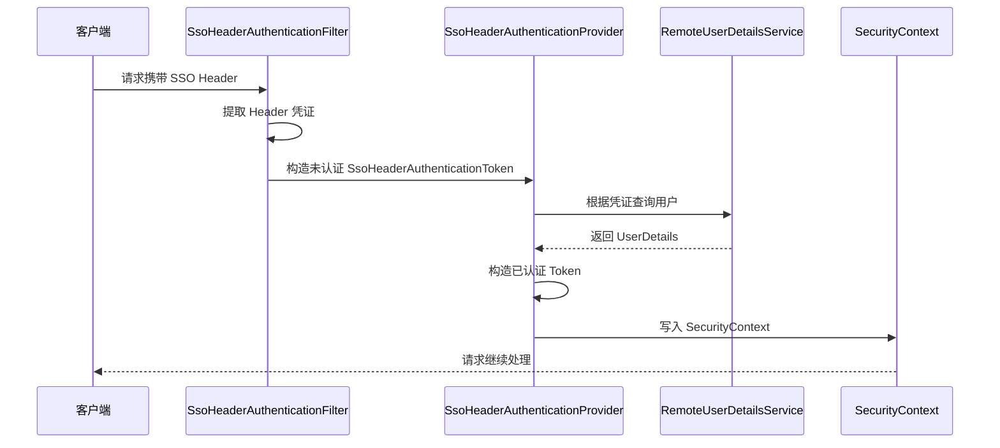
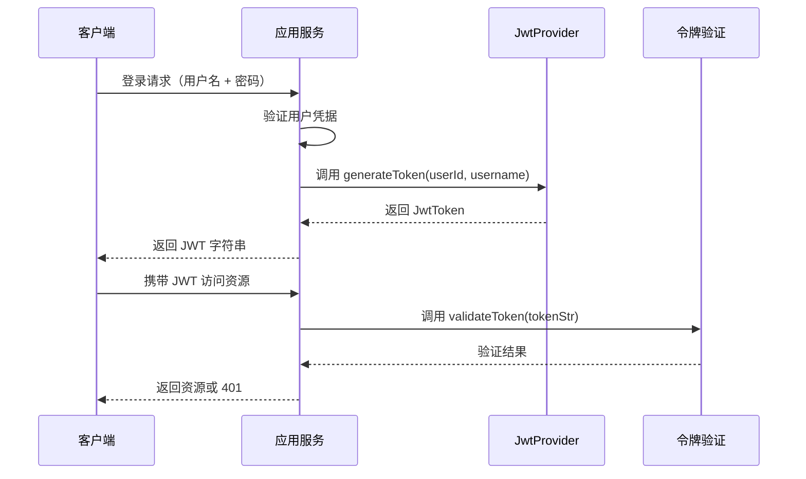
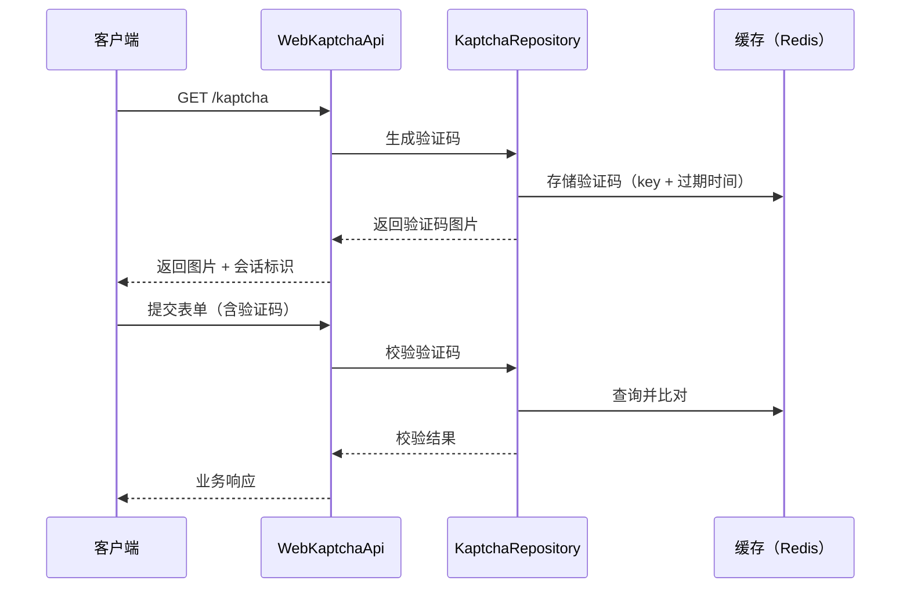
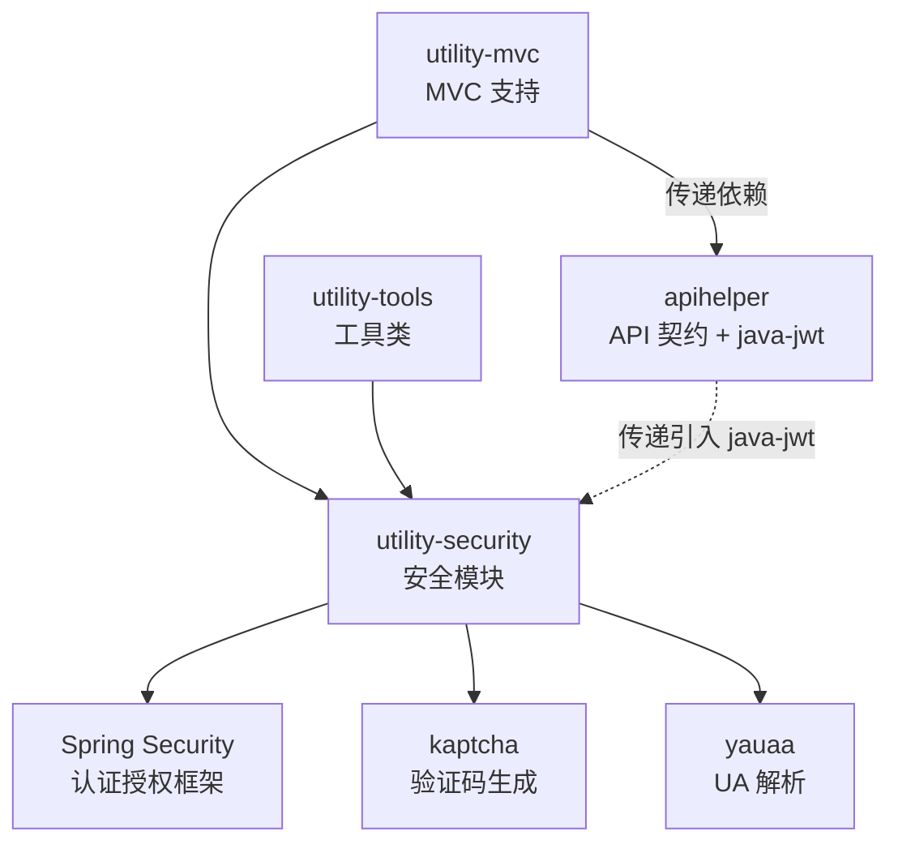

# utility-security 安全模块

## 模块概述

`utility-security` 是 utility 框架的安全模块，基于 Spring Security 构建，提供 JWT 令牌管理、SSO 单点登录、OAuth 认证、验证码等安全能力的统一封装。模块通过注解驱动的配置方式，使业务服务能够快速集成安全认证体系，同时保持与 utility 框架其他模块的无缝协作。

| 属性 | 值 |
|------|------|
| **groupId** | `com.snz1`（继承自 parent `utility`） |
| **artifactId** | `utility-security` |
| **version** | `3.0.0-SNAPSHOT` |
| **parent** | `com.snz1:utility:3.0.0-SNAPSHOT` |
| **描述** | 安全模块：Spring Security、JWT、OAuth、SSO |

## 模块依赖

### 项目内依赖

| 依赖 | Scope | 说明 |
|------|--------|------|
| `com.snz1:utility-mvc:3.0.0-SNAPSHOT` | `compile` | MVC 层支持，提供 Web 基础设施与 apihelper 传递依赖 |
| `com.snz1:utility-tools:3.0.0-SNAPSHOT` | `compile` | 通用工具类支持 |

### BOM 管理依赖

以下依赖版本由 parent BOM 统一管理，无需在子模块中声明版本号：

| 依赖 | Scope | 说明 |
|------|--------|------|
| `commons-codec:commons-codec` | BOM 管理 | 编解码工具库 |
| `org.springframework.security:spring-security-core` | BOM 管理 | Spring Security 核心 |
| `org.springframework.security:spring-security-web` | BOM 管理 | Spring Security Web 集成 |
| `org.springframework.security:spring-security-config` | BOM 管理 | Spring Security 配置支持 |
| `org.springframework.security:spring-security-taglibs` | BOM 管理 | Spring Security 标签库 |
| `org.springframework.session:spring-session-core` | BOM 管理 | Spring Session 支持 |

### 显式声明依赖

| 依赖 | Scope | 说明 |
|------|--------|------|
| `io.swagger.core.v3:swagger-annotations:2.2.52` | `provided` | OpenAPI / Swagger 注解支持 |
| `nl.basjes.parse.useragent:yauaa:7.28.1` | `compile` | User-Agent 解析库 |
| `com.github.axet:kaptcha:0.0.9` | `compile` | 图形验证码生成库 |

::: warning JWT 传递依赖路径
`com.auth0:java-jwt:4.5.2` 并未在本模块的 `pom.xml` 中直接声明，而是通过 `utility-mvc` → `apihelper` 的传递依赖路径引入。如果项目中单独使用 JWT 功能，请确保该传递依赖路径完整可用，否则可能导致 `ClassNotFoundException`。

传递链路：

```text
utility-security
  └── utility-mvc (compile)
        └── com.snz1.gateway:apihelper (compile)
              └── com.auth0:java-jwt:4.5.2 (compile)
```
:::

## 源码结构

模块共包含 **38 个 Java 文件**，包前缀为 `com.snz1`，按功能职责分布在 7 个子包中。

### 包结构树

```
com.snz1
├── annotation              # 注解驱动配置
│   ├── EnableSecurity          (启用安全)
│   └── EnableWebSso            (启用 Web SSO)
├── jwt                     # JWT 令牌体系
│   ├── JwtConfig               (配置注册)
│   ├── JwtProperties           (配置属性)
│   ├── JwtProvider             (接口)
│   ├── JwtProviderImpl         (实现)
│   └── JwtToken               (令牌封装)
├── spring                  # Spring Security 配置
│   ├── AuthorizeAccess         (授权访问)
│   ├── CsrfRequestMather       (CSRF 请求匹配)
│   ├── RemoteUserConfig        (远程用户配置)
│   └── WebSecurityConfig       (核心安全配置)
├── utils                   # 工具类
│   └── ContextUtils           (上下文工具)
├── web                     # Web 层支持
│   ├── JsonApiExceptionHandlerImpl (JSON API 异常处理)
│   └── KaptchaRepository         (验证码存储接口)
├── web.api                 # Web API 接口
│   └── WebKaptchaApi           (验证码 API)
└── web.security            # 核心安全实现（21 个类）
    ├── AbstractUserDetailsService          (用户详情服务抽象)
    ├── AccessToken                         (访问令牌)
    ├── AccessTokenException                (令牌异常)
    ├── AccessTokenManager                  (令牌管理器接口)
    ├── AjaxAuthenticationFailureHandler    (AJAX 认证失败处理)
    ├── AjaxAuthenticationSuccessHandler    (AJAX 认证成功处理)
    ├── CachedKaptchaRepository             (缓存验证码实现)
    ├── CheckProxySignatureFilter          (代理签名校验过滤器)
    ├── JsonAuthenticationEntryPoint       (JSON 认证入口点)
    ├── JsonLogoutSuccessHandler           (JSON 登出成功处理)
    ├── OAuthUserAuthenticationToken        (OAuth 认证令牌)
    ├── OAuthUserDetailsAuthenticationProvider (OAuth 认证提供者)
    ├── RedirectLogoutSuccessHandler        (重定向登出处理)
    ├── RemoteUserDetailsService            (远程用户详情服务)
    ├── RemoteUserResolver                  (远程用户解析器)
    ├── RequestContextAccessTokenManager    (请求上下文令牌管理)
    ├── SecurityContextFreemarkSupportFilter (安全上下文过滤器)
    ├── SsoHeaderAuthenticationFilter       (SSO Header 认证过滤器)
    ├── SsoHeaderAuthenticationProvider     (SSO Header 认证提供者)
    ├── SsoHeaderAuthenticationToken        (SSO Header 认证令牌)
    ├── User                                (用户模型接口)
    ├── UserDetails                         (用户详情接口)
    └── WebLoginUrlAuthenticationEntryPoint (Web 登录 URL 入口点)
```

### 类职责一览

#### annotation 包

| 类名 | 职责 |
|------|------|
| `EnableSecurity` | 启用安全模块，触发 Spring Security 自动配置 |
| `EnableWebSso` | 启用 Web SSO 单点登录支持 |

#### jwt 包

| 类名 | 职责 |
|------|------|
| `JwtConfig` | JWT 配置注册类，将 JwtProvider 等组件注册到 Spring 容器 |
| `JwtProperties` | JWT 配置属性类，绑定 `utility.jwt.*` 前缀配置 |
| `JwtProvider` | JWT 提供者接口，定义令牌的生成与解析契约 |
| `JwtProviderImpl` | JwtProvider 默认实现，基于 `com.auth0:java-jwt` 完成令牌签发与验证 |
| `JwtToken` | JWT 令牌封装类，承载令牌的元信息与载荷内容 |

#### spring 包

| 类名 | 职责 |
|------|------|
| `AuthorizeAccess` | 自定义授权访问注解支持 |
| `CsrfRequestMather` | CSRF 请求匹配器，定制 CSRF 保护策略 |
| `RemoteUserConfig` | 远程用户配置，注册远程用户解析相关 Bean |
| `WebSecurityConfig` | 核心 Spring Security 配置类，组装过滤器链与安全规则 |

#### utils 包

| 类名 | 职责 |
|------|------|
| `ContextUtils` | 安全上下文工具类，提供从 SecurityContext 获取当前用户等便捷方法 |

#### web 包

| 类名 | 职责 |
|------|------|
| `JsonApiExceptionHandlerImpl` | JSON API 异常处理器实现，统一安全相关异常的 JSON 响应格式 |
| `KaptchaRepository` | 验证码存储接口，定义验证码的存取与校验契约 |

#### web.api 包

| 类名 | 职责 |
|------|------|
| `WebKaptchaApi` | 验证码 REST API，提供验证码生成与校验端点 |

#### web.security 包（核心）

| 类名 | 职责 |
|------|------|
| `AbstractUserDetailsService` | 用户详情服务抽象基类，封装通用用户加载逻辑 |
| `AccessToken` | 访问令牌模型，封装令牌值与过期信息 |
| `AccessTokenException` | 访问令牌异常 |
| `AccessTokenManager` | 访问令牌管理器接口，定义令牌的创建、刷新与销毁 |
| `AjaxAuthenticationFailureHandler` | AJAX 请求认证失败的 JSON 响应处理器 |
| `AjaxAuthenticationSuccessHandler` | AJAX 请求认证成功的 JSON 响应处理器 |
| `CachedKaptchaRepository` | 基于缓存的验证码存储实现 |
| `CheckProxySignatureFilter` | 代理请求签名校验过滤器，防止非法代理转发 |
| `JsonAuthenticationEntryPoint` | 未认证请求的 JSON 响应入口点 |
| `JsonLogoutSuccessHandler` | 登出成功的 JSON 响应处理器 |
| `OAuthUserAuthenticationToken` | OAuth 用户认证令牌，承载 OAuth 授权信息 |
| `OAuthUserDetailsAuthenticationProvider` | OAuth 用户认证提供者，对接外部 OAuth 服务 |
| `RedirectLogoutSuccessHandler` | 登出成功后重定向处理器 |
| `RemoteUserDetailsService` | 远程用户详情服务，从远程服务加载用户信息 |
| `RemoteUserResolver` | 远程用户解析器，解析请求中的用户标识并获取用户信息 |
| `RequestContextAccessTokenManager` | 基于请求上下文的访问令牌管理器实现 |
| `SecurityContextFreemarkSupportFilter` | 安全上下文 Freemarker 支持过滤器，将安全信息注入模板上下文 |
| `SsoHeaderAuthenticationFilter` | SSO Header 认证过滤器，从请求头提取 SSO 令牌并触发认证 |
| `SsoHeaderAuthenticationProvider` | SSO Header 认证提供者，校验 SSO 令牌并加载用户 |
| `SsoHeaderAuthenticationToken` | SSO Header 认证令牌，承载 Header 中的 SSO 凭证 |
| `User` | 用户模型接口，定义用户基本信息契约 |
| `UserDetails` | 用户详情接口，扩展 Spring Security 的 UserDetails 概念 |
| `WebLoginUrlAuthenticationEntryPoint` | Web 登录 URL 认证入口点，未认证时重定向到登录页 |

## 关键设计

### 1. JWT 令牌体系

JWT 体系由四个核心组件构成，形成配置 → 提供者 → 令牌的完整链路：

- **`JwtProperties`**：绑定 `utility.jwt.*` 配置前缀，管理密钥、过期时间、签发者等参数。
- **`JwtProvider`**（接口）：定义 `generateToken`、`validateToken`、`parseToken` 等令牌操作契约。
- **`JwtProviderImpl`**（实现）：基于 `com.auth0:java-jwt` 库实现令牌签发与验证逻辑。
- **`JwtToken`**：封装令牌的字符串值、过期时间、声明等信息，在业务层传递使用。
- **`JwtConfig`**：条件化配置类，将上述组件注册到 Spring 容器。

```java
import com.snz1.jwt.JwtProvider;
import com.snz1.jwt.JwtToken;

@Service
public class TokenService {

    private final JwtProvider jwtProvider;

    public TokenService(JwtProvider jwtProvider) {
        this.jwtProvider = jwtProvider;
    }

    public String issueToken(String userId, String username) {
        JwtToken token = jwtProvider.generateToken(userId, username);
        return token.getToken();
    }

    public boolean validate(String tokenStr) {
        return jwtProvider.validateToken(tokenStr);
    }
}
```

### 2. SSO 单点登录

SSO 认证采用 Filter → Provider → Token 三件套模式，通过 HTTP Header 传递 SSO 凭证：

- **`SsoHeaderAuthenticationFilter`**：拦截请求，从指定 Header 中提取 SSO 凭证，构造 `SsoHeaderAuthenticationToken`。
- **`SsoHeaderAuthenticationProvider`**：接收未认证的 Token，校验凭证有效性，通过 `RemoteUserDetailsService` 加载用户信息，返回已认证的 Token。
- **`SsoHeaderAuthenticationToken`**：承载 SSO 凭证与认证状态的令牌对象。

通过 `@EnableWebSso` 注解可一键启用 SSO 支持，自动注册相关 Filter 和 Provider。

### 3. OAuth 认证

OAuth 认证通过以下组件对接外部 OAuth 服务：

- **`OAuthUserAuthenticationToken`**：封装 OAuth 授权后的用户认证信息。
- **`OAuthUserDetailsAuthenticationProvider`**：对接外部 OAuth Provider，使用授权码或访问令牌换取用户信息，完成认证流程。

### 4. AccessToken 管理

AccessToken 体系提供统一的访问令牌管理抽象：

- **`AccessTokenManager`**（接口）：定义令牌的创建、刷新、销毁与查询契约。
- **`RequestContextAccessTokenManager`**（实现）：基于当前请求上下文管理令牌，从请求头或参数中提取并缓存令牌。
- **`AccessToken`**：令牌模型，封装令牌值、过期时间等元数据。
- **`AccessTokenException`**：令牌相关异常，统一错误处理。

### 5. 验证码体系

验证码功能由三个组件协作完成：

- **`KaptchaRepository`**（接口）：定义验证码的生成、存储与校验契约。
- **`CachedKaptchaRepository`**（实现）：基于缓存（如 Redis）的验证码存储实现。
- **`WebKaptchaApi`**：REST API 端点，提供验证码图片生成与校验接口。

底层使用 `com.github.axet:kaptcha` 库生成图形验证码。

### 6. 用户模型设计

`User` 和 `UserDetails` 是安全模块的核心用户模型接口：

- **`User`**：定义用户基本信息（ID、用户名、昵称等）的契约。
- **`UserDetails`**：扩展用户详情，包含角色、权限等安全相关信息。

::: warning sc-client-api 依赖排除
当项目引入 `sc-client-api` 时，需要排除 `utility-security` 的运行时依赖，仅保留 `User` 接口供客户端使用：

```xml
<dependency>
    <groupId>com.snz1</groupId>
    <artifactId>sc-client-api</artifactId>
    <version>3.0.0-SNAPSHOT</version>
    <exclusions>
        <exclusion>
            <groupId>com.snz1</groupId>
            <artifactId>utility-security</artifactId>
        </exclusion>
    </exclusions>
</dependency>
```

这样客户端可以引用 `User` 接口进行类型定义，但不会引入完整的 Spring Security 运行时栈。
:::

### 7. Spring Security 配置

`WebSecurityConfig` 是模块的核心配置类，负责：

- 组装 SecurityFilterChain 过滤器链
- 配置 CSRF 保护策略（通过 `CsrfRequestMather`）
- 注册认证入口点（`JsonAuthenticationEntryPoint` / `WebLoginUrlAuthenticationEntryPoint`）
- 配置登出处理器（`JsonLogoutSuccessHandler` / `RedirectLogoutSuccessHandler`）
- 集成 SSO 过滤器与 OAuth 认证提供者
- 配置代理签名校验（`CheckProxySignatureFilter`）

## 认证流程

### SSO Header 认证流程



### JWT 令牌签发与验证流程



### 验证码生成与校验流程



## 使用方式

### Maven 依赖引入

在项目的 `pom.xml` 中添加以下依赖：

```xml
<dependency>
    <groupId>com.snz1</groupId>
    <artifactId>utility-security</artifactId>
    <version>3.0.0-SNAPSHOT</version>
</dependency>
```

::: tip 版本管理建议
`utility-security` 的版本由 parent `utility` BOM 统一管理。如果项目已继承 `utility` 作为 parent，则无需在子模块中显式指定 `<version>`：

```xml
<dependency>
    <groupId>com.snz1</groupId>
    <artifactId>utility-security</artifactId>
    <!-- 版本由 parent BOM 管理 -->
</dependency>
```
:::

### 启用安全模块

在 Spring Boot 启动类上添加 `@EnableSecurity` 注解即可启用安全模块的自动配置：

```java
import com.snz1.annotation.EnableSecurity;
import org.springframework.boot.SpringApplication;
import org.springframework.boot.autoconfigure.SpringBootApplication;

@SpringBootApplication
@EnableSecurity
public class MyApplication {
    public static void main(String[] args) {
        SpringApplication.run(MyApplication.class, args);
    }
}
```

### 启用 SSO 单点登录

如需启用 SSO 支持，添加 `@EnableWebSso` 注解：

```java
import com.snz1.annotation.EnableSecurity;
import com.snz1.annotation.EnableWebSso;
import org.springframework.boot.SpringApplication;
import org.springframework.boot.autoconfigure.SpringBootApplication;

@SpringBootApplication
@EnableSecurity
@EnableWebSso
public class MyApplication {
    public static void main(String[] args) {
        SpringApplication.run(MyApplication.class, args);
    }
}
```

### JWT 配置

在 `application.yml` 中配置 JWT 参数：

```yaml
utility:
  jwt:
    secret: "your-secret-key-at-least-256-bits-long"
    issuer: "my-application"
    expire-minutes: 120
```

### 获取当前登录用户

通过 `ContextUtils` 获取当前认证用户信息：

```java
import com.snz1.utils.ContextUtils;
import com.snz1.web.security.User;

public class OrderService {

    public void createOrder(OrderDTO dto) {
        User currentUser = ContextUtils.getCurrentUser();
        dto.setCreateBy(currentUser.getUsername());
        // 业务逻辑...
    }
}
```

### 自定义用户详情服务

继承 `AbstractUserDetailsService` 实现自定义用户加载逻辑：

```java
import com.snz1.web.security.AbstractUserDetailsService;
import org.springframework.stereotype.Component;

@Component
public class CustomUserDetailsService extends AbstractUserDetailsService {

    @Override
    public UserDetails loadUserByUsername(String username) {
        // 从数据库或远程服务加载用户
        User user = userService.findByUsername(username);
        if (user == null) {
            throw new UsernameNotFoundException("用户不存在: " + username);
        }
        return user;
    }
}
```

## 模块关系图



## 注意事项

### 1. JWT 传递依赖路径

`com.auth0:java-jwt` 不在本模块直接声明，通过 `utility-mvc → apihelper` 传递引入。若项目单独使用 JWT 功能（不引入 `utility-mvc`），需显式添加：

```xml
<dependency>
    <groupId>com.auth0</groupId>
    <artifactId>java-jwt</artifactId>
    <version>4.5.2</version>
</dependency>
```

### 2. sc-client-api 依赖排除

`sc-client-api` 引入时会传递 `utility-security`，客户端场景下应排除安全模块的运行时依赖，仅保留 `User` 接口。详见上文[用户模型设计](#_6-用户模型设计)章节。

### 3. Spring Session 集成

模块声明了 `spring-session-core` 依赖（BOM 管理），如需使用分布式 Session（如 Redis Session），需额外引入对应的 Session 实现依赖：

```xml
<dependency>
    <groupId>org.springframework.session</groupId>
    <artifactId>spring-session-data-redis</artifactId>
</dependency>
```

### 4. 验证码缓存存储

`CachedKaptchaRepository` 依赖缓存基础设施（如 Redis）。如项目中未配置缓存，验证码功能将无法正常工作。请确保已引入 `utility-redis` 或等效的缓存支持。

### 5. 代理签名校验

`CheckProxySignatureFilter` 用于校验经过代理转发的请求签名，防止非法请求绕过网关直接访问服务。生产环境建议启用此过滤器并正确配置代理签名密钥。

## 版本信息

| 属性 | 值 |
|------|------|
| **当前版本** | `3.0.0-SNAPSHOT` |
| **Parent** | `com.snz1:utility:3.0.0-SNAPSHOT` |
| **Java 文件数** | 38 |
| **包前缀** | `com.snz1` |
