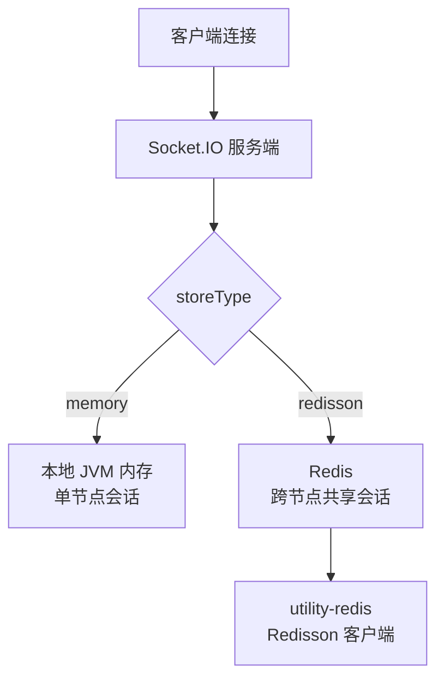

# utility-websocket WebSocket 模块

## 模块概述

`utility-websocket` 是 utility 框架的实时通信模块，基于 Socket.IO 提供 WebSocket 服务端能力。模块支持自动配置，可根据应用需求灵活配置线程模型、心跳超时等参数，并提供 Redisson 和 Memory 两种会话存储模式以适配不同部署场景。

| 属性 | 值 |
|------|------|
| **groupId** | `com.snz1`（继承自 parent `utility`） |
| **artifactId** | `utility-websocket` |
| **version** | `3.0.0-SNAPSHOT` |
| **parent** | `com.snz1:utility:3.0.0-SNAPSHOT` |
| **描述** | WebSocket 模块：Socket.IO 服务端、实时通信 |

## 核心类

### WebSocketAutoConfig

WebSocket 自动配置类，标注 `@AutoConfiguration`，负责创建和装配 Socket.IO 服务端实例。根据 `app.websocket.*` 配置项自动初始化服务参数，包括端口、线程池、心跳超时等。

### JacksonJsonSupportEx

JSON 序列化支持扩展类，基于 Jackson 实现 Socket.IO 消息的 JSON 编解码。该类扩展了 Socket.IO 默认的 JSON 支持，使其与 Spring 生态中的 Jackson `ObjectMapper` 无缝集成，保证序列化行为一致性。

## @EnableSocketServer 注解

`@EnableSocketServer` 是模块提供的启用注解，标注在应用主类或配置类上，用于一键启动 WebSocket 服务端：

```java
@EnableSocketServer
@SpringBootApplication
public class MyApplication {
    public static void main(String[] args) {
        SpringApplication.run(MyApplication.class, args);
    }
}
```

该注解会触发 `WebSocketAutoConfig` 的自动装配，启动 Socket.IO 服务端监听指定端口。

## 配置项

所有配置项以 `app.websocket` 为前缀：

| 配置项 | 默认值 | 说明 |
|--------|--------|------|
| `app.websocket.port` | — | WebSocket 服务监听端口（必填） |
| `app.websocket.bossThreads` | 0（自动） | Boss 线程数，接收新连接 |
| `app.websocket.workerThreads` | 0（自动） | Worker 线程数，处理 I/O 读写 |
| `app.websocket.pingTimeout` | 60000 | Ping 超时时间（毫秒） |
| `app.websocket.pongTimeout` | 60000 | Pong 超时时间（毫秒） |
| `app.websocket.storeType` | `memory` | 会话存储模式：`memory` 或 `redisson` |

### 完整配置示例

```yaml
app:
  websocket:
    port: 9092
    bossThreads: 1
    workerThreads: 8
    pingTimeout: 60000
    pongTimeout: 60000
    storeType: redisson
```

## 两种存储模式

模块支持两种会话存储模式，适配不同的部署架构：

### Memory 模式（默认）

- 会话数据存储在本地 JVM 内存中
- 适用于单节点部署
- 无外部依赖，启动即用
- **限制**：不支持多节点间会话共享

### Redisson 模式

- 会话数据存储在 Redis 中，通过 Redisson 客户端访问
- 适用于多节点集群部署
- 支持跨节点会话共享和消息广播
- **前提**：需要引入 `utility-redis` 模块并配置 Redis 连接

::: tip 模式选择建议
- **单节点部署**：使用 `memory` 模式，零外部依赖
- **多节点集群部署**：使用 `redisson` 模式，确保会话一致性和消息广播
:::



## 模块依赖

### 项目内依赖

| 依赖 | Scope | 说明 |
|------|--------|------|
| `utility-core` | `compile` | 基础接口契约 |
| `utility-redis` | `provided`（可选） | Redisson 存储模式所需，仅在 `storeType=redisson` 时需要 |

### 第三方依赖

| 依赖 | 说明 |
|------|------|
| `netty-transport` | Socket.IO 底层网络通信 |
| `jackson-databind` | JSON 序列化支持 |

## 使用方式

### Maven 依赖引入

```xml
<dependency>
    <groupId>com.snz1</groupId>
    <artifactId>utility-websocket</artifactId>
    <version>3.0.0-SNAPSHOT</version>
</dependency>
```

::: warning 版本管理建议
`utility-websocket` 的版本由 parent `utility` BOM 统一管理。如果项目已继承 `utility` 作为 parent，则无需在子模块中显式指定 `<version>`。
:::

### 典型使用场景

#### 启动 WebSocket 服务端

```java
@EnableSocketServer
@SpringBootApplication
public class ChatApplication {
    public static void main(String[] args) {
        SpringApplication.run(ChatApplication.class, args);
    }
}
```

```yaml
app:
  websocket:
    port: 9092
    storeType: redisson
```

#### 处理客户端消息

```java
import com.corundumstudio.socketio.SocketIOServer;
import com.corundumstudio.socketio.listener.DataListener;

@org.springframework.stereotype.Component
public class ChatMessageHandler {

    private final SocketIOServer server;

    public ChatMessageHandler(SocketIOServer server) {
        this.server = server;
        server.addEventListener("chat_message", ChatMessage.class, (client, data, ackSender) -> {
            // 广播消息给所有客户端
            server.getBroadcastOperations().sendEvent("chat_message", data);
        });
    }
}
```

## 版本信息

| 属性 | 值 |
|------|------|
| **当前版本** | `3.0.0-SNAPSHOT` |
| **Parent** | `com.snz1:utility:3.0.0-SNAPSHOT` |
| **底层框架** | Socket.IO (Netty) |
| **包前缀** | `com.snz1` |
