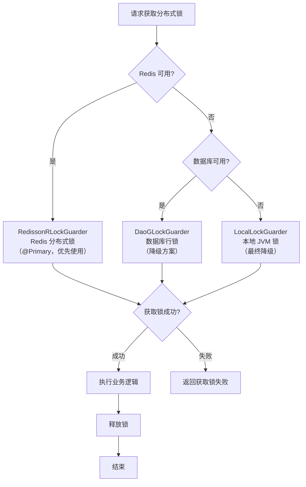

# 缓存与分布式锁指南

本文以实战视角，详细介绍如何使用 `utility-redis` 模块实现 Redis 缓存集成、Spring Cache 注解化缓存和分布式锁三级降级机制。

---

## 模块说明

`utility-redis` 基于 Redisson 构建，提供了以下核心能力：

| 能力 | 核心组件 | 说明 |
|------|----------|------|
| Redisson 连接管理 | `RedissonAutoConfiguration` | 单机/哨兵/集群三种模式自动配置 |
| Spring Cache 集成 | `@EnableAutoCaching` | `@Cacheable` / `@CacheEvict` 注解化缓存 |
| 分布式锁 | `GLockGuarder` | 三级降级：Redis → 数据库 → 本地 |
| 缓存工具 | `RedisCacheUtils` | 直接操作 Redis 的便捷工具类 |

> **提示**：`utility-redis` 依赖 Redisson 客户端，不使用 Lettuce / Jedis。引入后自动替换 Spring Boot 默认的 Redis 客户端。

---

## Redisson 配置

框架支持三种 Redis 部署模式：单机、哨兵和集群。通过 `spring.data.redis.*` 配置项进行管理。

### 单机模式

```yaml
spring:
  data:
    redis:
      host: 127.0.0.1
      port: 6379
      password: your-password
      database: 0
      timeout: 3000ms
      ssl:
        enabled: false
```

| 配置项 | 默认值 | 说明 |
|--------|--------|------|
| `spring.data.redis.host` | `127.0.0.1` | Redis 服务器地址 |
| `spring.data.redis.port` | `6379` | Redis 服务器端口 |
| `spring.data.redis.password` | 空 | Redis 认证密码 |
| `spring.data.redis.database` | `0` | 数据库索引 |
| `spring.data.redis.timeout` | `3000ms` | 连接超时时间 |
| `spring.data.redis.ssl.enabled` | `false` | 是否启用 SSL |

### 哨兵模式

```yaml
spring:
  data:
    redis:
      password: your-password
      sentinel:
        master: mymaster                          # 哨兵集群名称
        nodes:                                     # 哨兵节点列表
          - 192.168.1.101:26379
          - 192.168.1.102:26379
          - 192.168.1.103:26379
      database: 0
      timeout: 3000ms
```

| 配置项 | 默认值 | 说明 |
|--------|--------|------|
| `spring.data.redis.sentinel.master` | 无（必填） | 哨兵集群名称 |
| `spring.data.redis.sentinel.nodes` | 无（必填） | 哨兵节点列表，格式 `host:port` |
| `spring.data.redis.sentinel.password` | 空 | 哨兵节点认证密码 |

> **提示**：哨兵模式下，`spring.data.redis.password` 是 Redis 节点的密码，`spring.data.redis.sentinel.password` 是哨兵节点的密码，两者可能不同。

### 集群模式

```yaml
spring:
  data:
    redis:
      password: your-password
      cluster:
        nodes:                                     # 集群节点列表
          - 192.168.1.101:6379
          - 192.168.1.102:6379
          - 192.168.1.103:6379
          - 192.168.1.104:6379
          - 192.168.1.105:6379
          - 192.168.1.106:6379
        max-redirects: 3                           # 最大重定向次数
      timeout: 3000ms
```

| 配置项 | 默认值 | 说明 |
|--------|--------|------|
| `spring.data.redis.cluster.nodes` | 无（必填） | 集群节点列表，格式 `host:port` |
| `spring.data.redis.cluster.max-redirects` | `3` | 节点重定向最大次数 |

### 连接池配置（通用）

```yaml
spring:
  data:
    redis:
      # 连接池配置（基于 Redisson）
      pool:
        size: 64              # 连接池大小
        min-idle: 10           # 最小空闲连接数
        max-idle: 20           # 最大空闲连接数
        timeout: 3000          # 连接超时（毫秒）
        idle-timeout: 10000    # 空闲连接超时（毫秒）
        ping-connection: 30000 # 连接健康检查间隔（毫秒）
```

| 配置项 | 默认值 | 说明 |
|--------|--------|------|
| `spring.data.redis.pool.size` | `64` | 连接池最大连接数 |
| `spring.data.redis.pool.min-idle` | `10` | 最小空闲连接数 |
| `spring.data.redis.pool.max-idle` | `20` | 最大空闲连接数 |
| `spring.data.redis.pool.timeout` | `3000` | 连接超时（毫秒） |
| `spring.data.redis.pool.idle-timeout` | `10000` | 空闲连接超时（毫秒） |
| `spring.data.redis.pool.ping-connection` | `30000` | 健康检查间隔（毫秒） |

---

## Spring Cache 集成

### 启用缓存

在启动类上添加 `@EnableAutoCaching` 注解即可启用 Spring Cache 集成：

```java
import com.snz1.annotation.EnableAutoCaching;

@EnableAutoCaching
@SpringBootApplication
public class Application {
    public static void main(String[] args) {
        SpringApplication.run(Application.class, args);
    }
}
```

> **提示**：`@EnableAutoCaching` 等价于 `@EnableCaching` + 框架自动配置的 RedisCacheManager。引入后无需手动配置 CacheManager Bean。

### @Cacheable 使用

```java
@Service
public class UserService {

    @Autowired
    private UserMapper userMapper;

    /**
     * 查询用户：结果缓存到 Redis，key 为 "user::{id}"
     */
    @Cacheable(value = "user", key = "#id")
    public User getUserById(String id) {
        return userMapper.selectById(id);
    }

    /**
     * 查询用户列表：结果缓存，key 为 "userList::{pageNum}_{pageSize}"
     */
    @Cacheable(value = "userList", key = "#pageNum + '_' + #pageSize")
    public List<User> getUserList(int pageNum, int pageSize) {
        return userMapper.selectList(pageNum, pageSize);
    }

    /**
     * 条件缓存：仅当参数非空时缓存
     */
    @Cacheable(value = "user", key = "#username", condition = "#username != null")
    public User getUserByUsername(String username) {
        return userMapper.selectByUsername(username);
    }
}
```

### @CacheEvict 使用

```java
@Service
public class UserService {

    /**
     * 更新用户：清除单个用户缓存
     */
    @CacheEvict(value = "user", key = "#user.id")
    public void updateUser(User user) {
        userMapper.update(user);
    }

    /**
     * 删除用户：清除单个用户缓存
     */
    @CacheEvict(value = "user", key = "#id")
    public void deleteUser(String id) {
        userMapper.deleteById(id);
    }

    /**
     * 批量操作：清除 user 缓存空间下的所有缓存
     */
    @CacheEvict(value = "user", allEntries = true)
    public void batchUpdateUsers(List<User> users) {
        userMapper.batchUpdate(users);
    }
}
```

### @CachePut 使用

```java
@Service
public class UserService {

    /**
     * 创建用户：将结果直接写入缓存（不查缓存，但写入缓存）
     */
    @CachePut(value = "user", key = "#result.id")
    public User createUser(UserDTO dto) {
        User user = new User();
        user.setId(IdUtil.uuid());
        user.setUsername(dto.getUsername());
        userMapper.insert(user);
        return user;
    }
}
```

### 缓存注解对比

| 注解 | 作用 | 是否查缓存 | 是否写缓存 | 典型场景 |
|------|------|-----------|-----------|----------|
| `@Cacheable` | 查询方法 | ✅ 先查缓存 | ✅ 未命中时写入 | 读操作 |
| `@CachePut` | 写入方法 | ❌ 不查缓存 | ✅ 写入缓存 | 新增/更新后刷新缓存 |
| `@CacheEvict` | 删除方法 | ❌ 不查缓存 | ✅ 清除缓存 | 删除/更新后清除旧缓存 |

> **提示**：`@Cacheable` 和 `@CachePut` 不要同时用在同一个方法上，会导致缓存行为混乱。

### 缓存配置

```yaml
spring:
  cache:
    type: redis
    redis:
      time-to-live: 3600000        # 缓存默认过期时间（毫秒），默认 1 小时
      cache-null-values: false     # 是否缓存 null 值
      key-prefix: ""               # 缓存 key 前缀
      use-key-prefix: true         # 是否启用 key 前缀
```

| 配置项 | 默认值 | 说明 |
|--------|--------|------|
| `spring.cache.type` | `redis` | 缓存类型 |
| `spring.cache.redis.time-to-live` | `3600000`（1小时） | 缓存默认过期时间（毫秒） |
| `spring.cache.redis.cache-null-values` | `false` | 是否缓存 null 值 |
| `spring.cache.redis.key-prefix` | 空 | 缓存 key 前缀 |
| `spring.cache.redis.use-key-prefix` | `true` | 是否启用 key 前缀 |

---

## 分布式锁三级降级机制

### 架构设计

框架的分布式锁采用三级降级机制，确保在 Redis 不可用时系统仍能正常运行：



### 三级实现对比

| 级别 | 实现类 | 依赖 | 适用场景 | 特点 |
|------|--------|------|----------|------|
| 一级 | `RedissonRLockGuarder` | Redis | 正常运行环境 | 高性能，跨 JVM 互斥，支持超时、可重入 |
| 二级 | `DaoGLockGuarder` | 数据库 | Redis 故障 | 中等性能，跨 JVM 互斥，基于数据库行锁 |
| 三级 | `LocalLockGuarder` | JVM 内存 | Redis + 数据库均故障 | 低性能，仅 JVM 内互斥，最终兜底 |

> **提示**：降级是自动的。框架通过 `@Primary` 和 `@ConditionalOnMissingBean` 机制自动选择可用的最高级别锁实现。

### GLockGuarder 接口

```java
public interface GLockGuarder {

    /**
     * 尝试获取锁（非阻塞）
     * @param lockKey 锁的 key
     * @return true 表示获取成功
     */
    boolean tryLock(String lockKey);

    /**
     * 尝试获取锁（带超时）
     * @param lockKey 锁的 key
     * @param waitTime 最大等待时间
     * @param unit 时间单位
     * @return true 表示获取成功
     */
    boolean tryLock(String lockKey, long waitTime, TimeUnit unit);

    /**
     * 尝试获取锁（带等待和自动释放超时）
     * @param lockKey 锁的 key
     * @param waitTime 最大等待时间
     * @param leaseTime 持有锁的最大时间（自动释放）
     * @param unit 时间单位
     * @return true 表示获取成功
     */
    boolean tryLock(String lockKey, long waitTime, long leaseTime, TimeUnit unit);

    /**
     * 释放锁
     * @param lockKey 锁的 key
     */
    void unlock(String lockKey);

    /**
     * 判断锁是否被持有
     * @param lockKey 锁的 key
     * @return true 表示锁被持有
     */
    boolean isLocked(String lockKey);
}
```

### RedissonRLockGuarder（一级 — Redis）

基于 Redisson 的 `RLock` 实现，标注了 `@Primary`，在 Redis 可用时优先使用：

```java
@Primary
public class RedissonRLockGuarder implements GLockGuarder {

    private final RedissonClient redissonClient;

    @Override
    public boolean tryLock(String lockKey) {
        RLock lock = redissonClient.getLock(lockKey);
        return lock.tryLock();
    }

    @Override
    public boolean tryLock(String lockKey, long waitTime, TimeUnit unit) {
        RLock lock = redissonClient.getLock(lockKey);
        return lock.tryLock(waitTime, unit);
    }

    @Override
    public boolean tryLock(String lockKey, long waitTime, long leaseTime, TimeUnit unit) {
        RLock lock = redissonClient.getLock(lockKey);
        return lock.tryLock(waitTime, leaseTime, unit);
    }

    @Override
    public void unlock(String lockKey) {
        RLock lock = redissonClient.getLock(lockKey);
        if (lock.isHeldByCurrentThread()) {
            lock.unlock();
        }
    }

    @Override
    public boolean isLocked(String lockKey) {
        RLock lock = redissonClient.getLock(lockKey);
        return lock.isLocked();
    }
}
```

> **提示**：Redisson 的 `RLock` 支持可重入、自动续期和公平锁等高级特性。

### DaoGLockGuarder（二级 — 数据库）

基于数据库行锁实现，当 Redis 不可用时自动降级使用：

```java
public class DaoGLockGuarder implements GLockGuarder {

    private final JdbcTemplate jdbcTemplate;

    @Override
    public boolean tryLock(String lockKey) {
        // 通过 INSERT INTO glock(key, owner, expire_time) 实现互斥
        try {
            jdbcTemplate.update(
                "INSERT INTO glock(lock_key, owner, expire_time) VALUES(?, ?, ?)",
                lockKey, generateOwner(), new Date(System.currentTimeMillis() + 30000)
            );
            return true;
        } catch (DuplicateKeyException e) {
            return false;
        }
    }

    @Override
    public void unlock(String lockKey) {
        // 删除锁记录
        jdbcTemplate.update(
            "DELETE FROM glock WHERE lock_key = ? AND owner = ?",
            lockKey, getCurrentOwner()
        );
    }

    // ... 其他方法实现
}
```

> **提示**：数据库锁依赖一张 `glock` 表，框架在启动时会自动检测并创建（需配合 `@EnableAutoScheme`）。

### LocalLockGuarder（三级 — 本地）

基于 JVM 内 `ConcurrentHashMap` + `ReentrantLock` 实现，作为最终兜底方案：

```java
public class LocalLockGuarder implements GLockGuarder {

    private final ConcurrentHashMap<String, ReentrantLock> lockMap = new ConcurrentHashMap<>();

    @Override
    public boolean tryLock(String lockKey) {
        ReentrantLock lock = lockMap.computeIfAbsent(lockKey, k -> new ReentrantLock());
        return lock.tryLock();
    }

    @Override
    public boolean tryLock(String lockKey, long waitTime, TimeUnit unit) {
        ReentrantLock lock = lockMap.computeIfAbsent(lockKey, k -> new ReentrantLock());
        try {
            return lock.tryLock(waitTime, unit);
        } catch (InterruptedException e) {
            Thread.currentThread().interrupt();
            return false;
        }
    }

    @Override
    public void unlock(String lockKey) {
        ReentrantLock lock = lockMap.get(lockKey);
        if (lock != null && lock.isHeldByCurrentThread()) {
            lock.unlock();
        }
    }

    // ... 其他方法实现
}
```

> **警告**：`LocalLockGuarder` 仅提供 JVM 内互斥，无法跨实例保证一致性。仅在 Redis 和数据库均不可用时作为兜底使用。

---

## 配置项速查表

### Redis 连接配置

| 配置项 | 默认值 | 说明 |
|--------|--------|------|
| `spring.data.redis.host` | `127.0.0.1` | Redis 地址（单机模式） |
| `spring.data.redis.port` | `6379` | Redis 端口（单机模式） |
| `spring.data.redis.password` | 空 | Redis 密码 |
| `spring.data.redis.database` | `0` | 数据库索引 |
| `spring.data.redis.timeout` | `3000ms` | 连接超时 |
| `spring.data.redis.sentinel.master` | 空 | 哨兵集群名称（哨兵模式） |
| `spring.data.redis.sentinel.nodes` | 空 | 哨兵节点列表（哨兵模式） |
| `spring.data.redis.cluster.nodes` | 空 | 集群节点列表（集群模式） |
| `spring.data.redis.cluster.max-redirects` | `3` | 最大重定向次数（集群模式） |

### 连接池配置

| 配置项 | 默认值 | 说明 |
|--------|--------|------|
| `spring.data.redis.pool.size` | `64` | 连接池最大连接数 |
| `spring.data.redis.pool.min-idle` | `10` | 最小空闲连接数 |
| `spring.data.redis.pool.max-idle` | `20` | 最大空闲连接数 |
| `spring.data.redis.pool.timeout` | `3000` | 连接超时（毫秒） |
| `spring.data.redis.pool.idle-timeout` | `10000` | 空闲连接超时（毫秒） |

### 缓存配置

| 配置项 | 默认值 | 说明 |
|--------|--------|------|
| `spring.cache.type` | `redis` | 缓存类型 |
| `spring.cache.redis.time-to-live` | `3600000` | 缓存默认过期时间（毫秒） |
| `spring.cache.redis.cache-null-values` | `false` | 是否缓存 null 值 |
| `spring.cache.redis.use-key-prefix` | `true` | 是否使用 key 前缀 |

### 分布式锁配置

| 配置项 | 默认值 | 说明 |
|--------|--------|------|
| `app.lock.default-wait-time` | `3000` | 默认获取锁等待时间（毫秒） |
| `app.lock.default-lease-time` | `30000` | 默认持有锁时间（毫秒） |
| `app.lock.fallback-enabled` | `true` | 是否启用降级机制 |

---

## 使用示例

### 完整启动类

```java
import com.snz1.annotation.*;

@EnableWebMvc
@EnableDruid
@EnableMyBatis
@EnableAutoCaching
@SpringBootApplication
public class Application {
    public static void main(String[] args) {
        SpringApplication.run(Application.class, args);
    }
}
```

### 完整配置

```yaml
spring:
  data:
    redis:
      host: 127.0.0.1
      port: 6379
      password: ${REDIS_PASSWORD:}
      database: 0
      timeout: 3000ms
      pool:
        size: 64
        min-idle: 10
        max-idle: 20
  cache:
    type: redis
    redis:
      time-to-live: 3600000
      cache-null-values: false

app:
  lock:
    default-wait-time: 3000
    default-lease-time: 30000
    fallback-enabled: true
```

### 缓存使用示例

```java
@Service
public class ProductService {

    @Autowired
    private ProductMapper productMapper;

    // 缓存查询结果
    @Cacheable(value = "product", key = "#id")
    public Product getProduct(String id) {
        return productMapper.selectById(id);
    }

    // 更新后清除缓存
    @CacheEvict(value = "product", key = "#product.id")
    public void updateProduct(Product product) {
        productMapper.update(product);
    }

    // 删除后清除缓存
    @CacheEvict(value = "product", key = "#id")
    public void deleteProduct(String id) {
        productMapper.deleteById(id);
    }
}
```

### 分布式锁使用示例

```java
@Service
public class OrderService {

    @Autowired
    private GLockGuarder lockGuarder;

    /**
     * 下单操作：使用分布式锁防止并发下单
     */
    public Order createOrder(String userId, String productId) {
        String lockKey = "order:create:" + userId + ":" + productId;

        // 尝试获取锁，最多等待 3 秒
        boolean locked = lockGuarder.tryLock(lockKey, 3000, 30000, TimeUnit.MILLISECONDS);
        if (!locked) {
            throw new RuntimeException("系统繁忙，请稍后重试");
        }

        try {
            // 执行业务逻辑
            Product product = productService.getProduct(productId);
            if (product.getStock() <= 0) {
                throw new RuntimeException("库存不足");
            }

            Order order = new Order();
            order.setId(IdUtil.uuid());
            order.setUserId(userId);
            order.setProductId(productId);
            order.setAmount(product.getPrice());
            orderMapper.insert(order);

            product.setStock(product.getStock() - 1);
            productMapper.update(product);

            return order;
        } finally {
            // 确保释放锁
            lockGuarder.unlock(lockKey);
        }
    }

    /**
     * 定时任务：使用分布式锁防止多实例重复执行
     */
    @Scheduled(cron = "0 */5 * * * ?")
    public void scheduledTask() {
        String lockKey = "task:sync:data";
        if (lockGuarder.tryLock(lockKey)) {
            try {
                // 执行定时同步逻辑
                dataSyncService.syncData();
            } finally {
                lockGuarder.unlock(lockKey);
            }
        }
    }
}
```

### 缓存 + 分布式锁组合使用

```java
@Service
public class StockService {

    @Autowired
    private GLockGuarder lockGuarder;

    @Autowired
    private StockMapper stockMapper;

    /**
     * 扣减库存：先查缓存，缓存未命中加锁查数据库
     */
    public int getStock(String productId) {
        // 1. 先查缓存（通过 @Cacheable 注解实现，这里演示手动方式）
        String lockKey = "stock:lock:" + productId;

        if (lockGuarder.tryLock(lockKey, 1000, TimeUnit.MILLISECONDS)) {
            try {
                // 2. 获取锁后再次检查（双重检查）
                Stock stock = stockMapper.selectByProductId(productId);
                return stock != null ? stock.getQuantity() : 0;
            } finally {
                lockGuarder.unlock(lockKey);
            }
        }
        return 0;
    }
}
```

---

## 常见问题

### Q: 启动报错 "Cannot connect to Redis"

请按以下步骤排查：

1. 确认 Redis 服务已启动：`redis-cli ping` 返回 `PONG`
2. 检查 `spring.data.redis.host` 和 `spring.data.redis.port` 是否正确
3. 如果 Redis 有密码，确认 `spring.data.redis.password` 已配置
4. 检查网络连通性：`telnet <host> <port>`
5. 如果使用 Docker，确认端口映射正确

### Q: 缓存不生效（每次都查数据库）

常见原因：

| 可能原因 | 解决方案 |
|----------|----------|
| 未添加 `@EnableAutoCaching` | 在启动类上添加注解 |
| 方法不是 `public` | Spring AOP 代理要求方法必须是 `public` |
| 同类内部调用 | 同类内部方法调用不走代理，需通过 `AopContext.currentProxy()` 或拆分到不同 Service |
| `key` 表达式错误 | 检查 SpEL 表达式是否正确引用了参数 |
| `condition` 条件不满足 | 检查 `condition` 表达式是否导致跳过缓存 |

### Q: 分布式锁降级到本地锁了

这通常意味着 Redis 不可用。请检查：

1. Redis 连接是否正常
2. Redisson 客户端是否正确初始化
3. 查看 `RedissonRLockGuarder` 的日志是否有连接异常

> **警告**：本地锁无法跨 JVM 互斥，如果应用是多实例部署，在降级期间可能出现并发问题。建议尽快恢复 Redis。

### Q: @Cacheable 和 @CachePut 同时使用导致缓存不一致

`@Cacheable` 会先查缓存，如果命中则直接返回，不执行方法体。`@CachePut` 会先执行方法体，再将结果写入缓存。两者同时使用会导致：

- `@Cacheable` 命中缓存 → 方法不执行 → `@CachePut` 不触发 → 缓存无法更新

**解决方案**：将查询和更新拆分到不同方法：

```java
// ✅ 正确：拆分方法
@Cacheable(value = "user", key = "#id")
public User getUser(String id) { ... }

@CachePut(value = "user", key = "#result.id")
public User updateUser(User user) { ... }

// ❌ 错误：同一方法同时使用
@Cacheable(value = "user", key = "#id")
@CachePut(value = "user", key = "#result.id")
public User getOrInitUser(String id) { ... }
```

### Q: Redis 哨兵模式下主节点切换后连接失败

Redisson 默认会自动处理哨兵主节点切换。如果持续失败，检查：

1. 哨兵节点列表是否完整（至少 3 个哨兵节点）
2. 哨兵配置的 `quorum` 值是否合理（建议 `(n/2)+1`）
3. 网络分区是否导致脑裂

### Q: 如何监控缓存命中率

可以通过 Redis 命令查看缓存 key 数量：

```bash
# 查看所有缓存 key
redis-cli --scan --pattern "*"

# 查看某个缓存空间的 key 数量
redis-cli --scan --pattern "user::*" | wc -l

# 查看缓存 key 的 TTL
redis-cli TTL "user::123"
```

> **提示**：建议在生产环境中集成 Prometheus + Grafana 监控 Redis 指标，包括缓存命中率、内存使用量和连接数。
