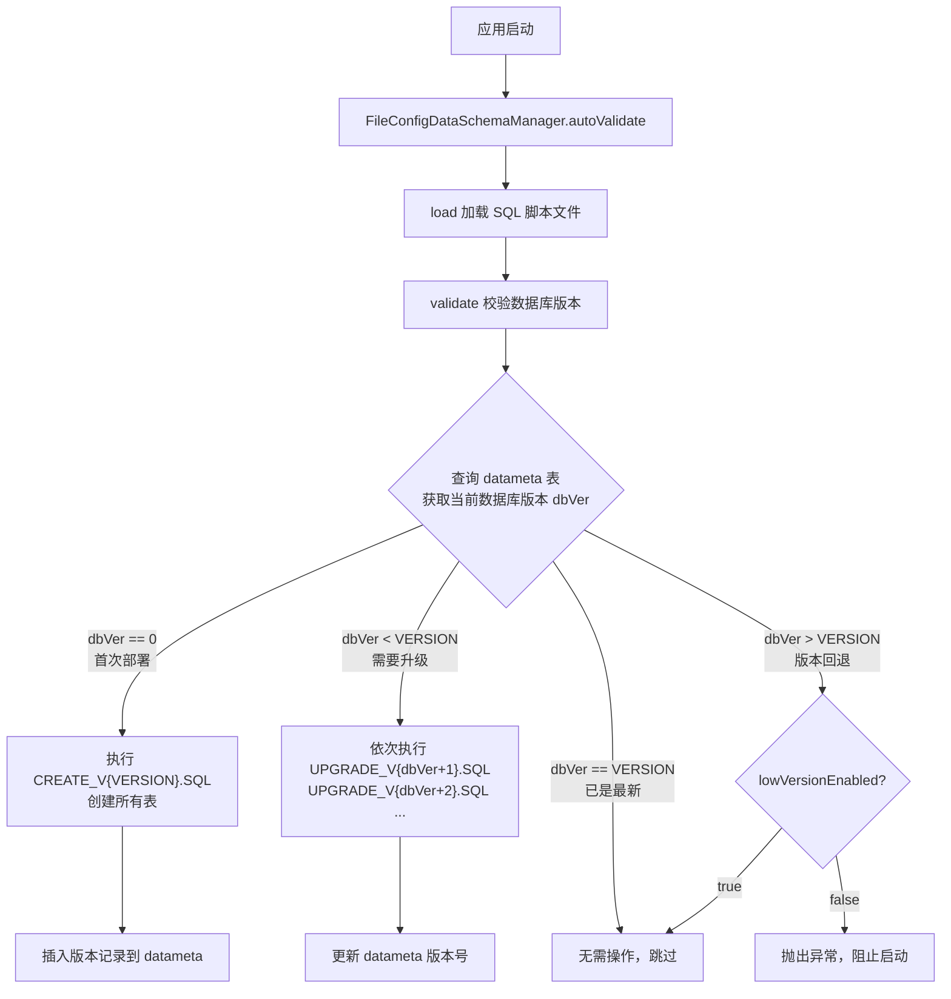

# 数据库自动升级建表指南

本文以实战视角，手把手教你如何使用 `utility-data` 模块的 `@EnableAutoScheme` 注解，实现应用启动时**自动建表、自动升级表结构**。

---

## 它解决了什么问题

在没有自动 Schema 管理之前，你需要：

1. 手动在数据库里执行建表 SQL
2. 每次表结构变更后，手动编写升级脚本并通知运维执行
3. 多环境部署时反复执行同样的 SQL

`@EnableAutoScheme` 的核心能力是：**应用启动时自动检测数据库版本，首次启动自动建表，后续启动自动执行增量升级脚本**。

---

## 快速开始（5 步完成）

### 第 1 步：引入依赖

确保你的项目已继承 `spring-boot3-app` 父 POM，并在 `pom.xml` 中引入 `utility-data`：

```xml
<dependency>
    <groupId>com.snz1</groupId>
    <artifactId>utility-data</artifactId>
    <version>3.0.0-SNAPSHOT</version>
</dependency>
```

### 第 2 步：在启动类上添加注解

```java
@EnableDruid        // 启用 Druid 数据源
@EnableMyBatis       // 启用 MyBatis
@com.snz1.annotation.EnableAutoScheme  // 启用自动建表/升级
@SpringBootApplication
public class MyApplication {
    public static void main(String[] args) {
        SpringApplication.run(MyApplication.class, args);
    }
}
```

### 第 3 步：配置 application.properties

```properties
# 数据源配置（Spring Boot 标准配置）
spring.datasource.driver-class-name=org.postgresql.Driver
spring.datasource.url=jdbc:postgresql://localhost:5432/mydb
spring.datasource.username=postgres
spring.datasource.password=123456

# ===== 自动 Schema 管理配置 =====
# 应用名称（用于在 datameta 表中区分不同应用的版本）
spring.datascheme.name=${spring.application.name}
# SQL 脚本目录（classpath 下的相对路径，默认就是 classpath:sql/）
spring.datascheme.url=classpath:sql/
# 是否允许清除表结构（默认 false，生产环境强烈建议保持 false）
spring.datascheme.drop-enabled=false
# 是否允许低版本运行（应用版本 < 数据库版本时是否放行，默认 true）
spring.datascheme.low-version-enabled=true
```

### 第 4 步：创建 SQL 脚本目录

在 `src/main/resources/sql/` 目录下创建以下文件：

```
src/main/resources/sql/
├── VERSION                        # 当前版本号（纯数字，如 1）
├── DATAMETA_CREATE_SCHEMA.SQL     # 创建版本元数据表的 SQL
├── DATAMETA_INSERT_VERSION.SQL     # 插入版本记录的 SQL
├── DATAMETA_SELECT_VERSION.SQL     # 查询版本号的 SQL
├── DATAMETA_UPGRADE_VERSION.SQL   # 更新版本号的 SQL
├── DATAMETA_DELETE_VERSION.SQL     # 删除版本记录的 SQL
├── CREATE_V1.SQL                  # V1 版本的完整建表 SQL
├── UPGRADE_V2.SQL                 # 从 V1 升级到 V2 的增量 SQL（如有）
├── UPGRADE_V3.SQL                 # 从 V2 升级到 V3 的增量 SQL（如有）
└── DROP_V1.SQL                    # 可选：清除表结构的 SQL（drop-enabled=true 时使用）
```

### 第 5 步：编写 SQL 文件内容

#### VERSION（版本号文件）

文件内容只有一个数字，表示当前数据库脚本的版本：

```
1
```

#### DATAMETA_CREATE_SCHEMA.SQL（创建元数据表）

框架会在数据库中创建一张 `datameta` 表来记录各应用的数据库版本：

```sql
create table datameta(app varchar(38),ver INT4);

alter table datameta
   add constraint PK_DATAMETA primary key (app);
```

> 如果你使用 MySQL 或 Oracle，请按对应方言调整 SQL。

#### DATAMETA_INSERT_VERSION.SQL（插入版本记录）

```sql
insert into datameta(app, ver) values(?, ?)
```

> `?` 是 PreparedStatement 参数占位符，框架会自动填充 `appName` 和 `version`，**不要修改此 SQL**。

#### DATAMETA_SELECT_VERSION.SQL（查询版本号）

```sql
select ver from datameta where app = ?
```

#### DATAMETA_UPGRADE_VERSION.SQL（更新版本号）

```sql
update datameta set ver = ? where app = ?
```

#### DATAMETA_DELETE_VERSION.SQL（删除版本记录）

```sql
delete from datameta where app = ?
```

#### CREATE_V1.SQL（你的建表 SQL）

这是你自己业务表的建表语句，按你的数据库方言编写。以 PostgreSQL 为例：

```sql
create table my_user (
   id                   VARCHAR(32)          not null,
   username             VARCHAR(100)         not null,
   email                VARCHAR(200)         null,
   create_time          TIMESTAMP            null,
   constraint PK_MY_USER primary key (id)
);

comment on table my_user is '用户表';
comment on column my_user.id is '主键ID';
comment on column my_user.username is '用户名';
comment on column my_user.email is '邮箱';
```

**SQL 语句之间用分号 `;` 分隔**，框架会按分号拆分为多条 SQL 逐条执行。

---

## 运行机制详解

### 启动时的执行流程



### 关键设计点

| 机制 | 说明 |
|------|------|
| **版本元数据表** | 所有版本信息存储在 `datameta` 表中，以 `app` 名称为主键，不同应用的版本互不干扰 |
| **事务安全** | 建表和升级操作都在数据库事务中执行，失败时自动回滚 |
| **幂等性** | `validate()` 方法使用 `synchronized` 和 `isValid()` 标志位，确保同一应用生命周期内只执行一次 |
| **SQL 拆分** | SQL 文件按分号 `;` 拆分为多条语句逐条执行；支持 `--` 单行注释和 `/* */` 多行注释 |
| **条件执行** | 支持 `$IF$IGN$` 前缀语法实现条件跳过（见下文） |

---

## 版本升级实战

### 场景：从 V1 升级到 V2

假设你已经在 V1 版本创建了 `my_user` 表，现在需要增加一张 `my_order` 表。

#### 1. 修改 VERSION 文件

```
2
```

#### 2. 创建 UPGRADE_V2.SQL

```sql
create table my_order (
   id                   VARCHAR(32)          not null,
   user_id              VARCHAR(32)          null,
   amount               DECIMAL(10,2)        null,
   create_time          TIMESTAMP            null,
   constraint PK_MY_ORDER primary key (id)
);

comment on table my_order is '订单表';
```

#### 3. 更新 CREATE_V2.SQL（可选但推荐）

将 `CREATE_V2.SQL` 更新为包含所有表的完整建表脚本（V1 的表 + V2 新增的表），用于全新部署场景。

> **重要**：`CREATE_V{VERSION}.SQL` 是全新部署时执行的脚本，必须包含当前版本的所有表。`UPGRADE_V{N}.SQL` 是增量升级脚本，只包含从 V{N-1} 到 V{N} 的变更。

#### 4. 启动应用

应用启动后，框架检测到数据库版本为 1，当前脚本版本为 2，自动执行 `UPGRADE_V2.SQL`，然后将 `datameta` 表中的版本号更新为 2。

### 多版本连续升级

如果数据库当前是 V1，脚本版本是 V3，框架会依次执行：

1. `UPGRADE_V2.SQL`（V1 → V2）
2. `UPGRADE_V3.SQL`（V2 → V3）

然后更新版本号为 3。

---

## 高级特性

### 条件执行语法 `$IF$IGN$`

SQL 文件中支持条件跳过语法。格式为：

```sql
$IF$IGN$2$SELECT EXISTS(SELECT 1 FROM information_schema.tables WHERE table_name = 'some_table');
CREATE TABLE some_table (...);
CREATE INDEX ...;
```

**执行逻辑**：
1. 执行 `$IF$IGN$2$` 后面的 SQL 查询
2. 如果查询结果第一行第一列为 `true`，则跳过后续 2 条 SQL
3. 如果为 `false`，正常执行后续 SQL

> 这在"表可能已存在"的场景下很有用，避免重复建表报错。

### DROP 脚本（清除表结构）

当 `spring.datascheme.drop-enabled=true` 时，可以创建 `DROP_V{VERSION}.SQL` 文件，框架在执行 `dropSchema()` 时会执行这些 SQL。

```sql
-- DROP_V1.SQL
drop table if exists my_user;
drop table if exists my_order;
```

> **警告**：`drop-enabled=true` 会删除所有表数据，仅限开发/测试环境使用！

### 自定义 Schema 管理器

如果文件配置方式不满足需求，可以实现 `DataSchemaManager` 接口或继承 `AbstractDataSchemaManager`：

```java
public class MySchemaManager extends AbstractDataSchemaManager {

    public MySchemaManager() {
        super("my-app", 1);  // 应用名, 版本号
    }

    @Override
    protected String resolveSelectDataMetaVersionSQL() {
        return "select ver from datameta where app = ?";
    }

    @Override
    protected String resolveUpgradeDataMetaVersionSQL() {
        return "update datameta set ver = ? where app = ?";
    }

    @Override
    protected String resolveCreateDataMetaSchemaSQL() {
        return "create table datameta(app varchar(38),ver INT4)";
    }

    @Override
    protected String resolveInsertDataMetaVersionSQL() {
        return "insert into datameta(app, ver) values(?, ?)";
    }

    @Override
    protected String resolveDeleteDataMetaVersionSQL() {
        return "delete from datameta where app = ?";
    }

    @Override
    protected void onCreate(Connection sqlConn) throws Exception {
        // 首次部署时执行建表
    }

    @Override
    protected void onUpgrade(Connection sqlConn, int oldVersion, int newVersion) throws Exception {
        // 版本升级时执行
    }

    @Override
    protected void onDropSchema(Connection sqlConn) throws Exception {
        // 清除表结构时执行
    }
}
```

然后注册为 Bean，替代默认的 `FileConfigDataSchemaManager`：

```java
@Bean
public DataSchemaManager mySchemaManager(DataSourceProperties props) {
    MySchemaManager mgr = new MySchemaManager();
    mgr.setJdbcDriver(props.getDriverClassName());
    mgr.setJdbcURL(props.getUrl());
    mgr.setJdbcUser(props.getUsername());
    mgr.setJdbcPassword(props.getPassword());
    return mgr;
}
```

> 注册自定义 Bean 后，框架的 `@ConditionalOnMissingBean` 机制会跳过默认实现。

---

## 配置项速查表

| 配置项 | 默认值 | 说明 |
|--------|--------|------|
| `spring.datascheme.name` | 无（必填） | 应用名称，作为 datameta 表的主键 |
| `spring.datascheme.url` | `classpath:sql/` | SQL 脚本目录路径 |
| `spring.datascheme.drop-enabled` | `false` | 是否允许清除表结构 |
| `spring.datascheme.low-version-enabled` | `true` | 应用版本低于数据库版本时是否允许启动 |

---

## SQL 文件命名规则

| 文件名 | 用途 | 必需 |
|--------|------|------|
| `VERSION` | 当前版本号（纯整数） | ✅ |
| `DATAMETA_CREATE_SCHEMA.SQL` | 创建 datameta 元数据表 | ✅ |
| `DATAMETA_INSERT_VERSION.SQL` | 插入版本记录 | ✅ |
| `DATAMETA_SELECT_VERSION.SQL` | 查询当前版本 | ✅ |
| `DATAMETA_UPGRADE_VERSION.SQL` | 更新版本号 | ✅ |
| `DATAMETA_DELETE_VERSION.SQL` | 删除版本记录 | ✅ |
| `CREATE_V{N}.SQL` | V{N} 版本的完整建表脚本 | ✅ |
| `UPGRADE_V{N}.SQL` | 从 V{N-1} 升级到 V{N} 的增量脚本 | 仅多版本时 |
| `DROP_V{N}.SQL` | 清除表结构脚本 | 可选 |

> 文件名**必须大写**，扩展名为 `.SQL`（不是 `.sql`）。

---

## 常见问题

### Q: 启动报错 "不允许清除数据结构!"

`spring.datascheme.drop-enabled` 默认为 `false`。如果你需要执行 `dropSchema()`，设置为 `true`。但**生产环境不要开启**。

### Q: 启动报错 "应用所需的数据库版本(Vx)低于数据库实际版本(Vy)"

数据库版本比脚本版本高，说明有人手动修改了数据库或部署了更高版本。解决方案：
1. 如果是预期的（如回滚版本），设置 `spring.datascheme.low-version-enabled=true`
2. 如果不是预期的，检查数据库 `datameta` 表中的版本记录

### Q: SQL 文件修改后不生效

`FileConfigDataSchemaManager` 在 `@PostConstruct` 阶段加载 SQL 文件到内存，修改后需要**重启应用**才能生效。

### Q: 多个微服务共用一个数据库怎么办

每个服务通过 `spring.datascheme.name` 配置不同的应用名称，`datameta` 表以 `app` 字段为主键，各服务的版本管理互不影响。

### Q: SQL 语句中有分号怎么办

分号 `;` 是 SQL 语句的分隔符。如果你的 SQL 中需要包含分号（如存储过程），需要调整 `sqlBatchSplitter`，或者将存储过程逻辑拆分到单独的 SQL 文件中。

### Q: 支持 MySQL / Oracle 吗

支持。框架通过 JDBC 直接执行 SQL，不依赖特定数据库方言。你只需要：
1. 确保 `DATAMETA_*.SQL` 文件使用对应数据库的语法
2. 确保 `CREATE_V*.SQL` 和 `UPGRADE_V*.SQL` 使用对应数据库的语法

---

## 完整示例目录参考

以 `dashserv` 服务为例（PostgreSQL），实际目录结构：

```
src/main/resources/sql/
├── VERSION                        # 内容: 17
├── DATAMETA_CREATE_SCHEMA.SQL     # 创建 datameta 表
├── DATAMETA_INSERT_VERSION.SQL    # insert into datameta(app, ver) values(?, ?)
├── DATAMETA_SELECT_VERSION.SQL    # select ver from datameta where app = ?
├── DATAMETA_UPGRADE_VERSION.SQL   # update datameta set ver = ? where app = ?
├── DATAMETA_DELETE_VERSION.SQL    # delete from datameta where app = ?
├── CREATE_V16.SQL                 # V16 完整建表脚本
├── CREATE_V17.SQL                 # V17 完整建表脚本（当前版本）
├── UPGRADE_V2.SQL                 # V1→V2 升级
├── UPGRADE_V3.SQL                 # V2→V3 升级
├── ...
├── UPGRADE_V16.SQL                # V15→V16 升级
└── UPGRADE_V17.SQL                # V16→V17 升级
```

对应配置：

```properties
spring.application.name=dashserv
spring.datascheme.name=${spring.application.name}
spring.datascheme.url=classpath:sql/
spring.datascheme.drop-enabled=false
spring.datascheme.low-version-enabled=true
```

启动类：

```java
@EnableDruid
@EnableMyBatis
@com.snz1.annotation.EnableAutoScheme  // 启用自动构建数据库
@SpringBootApplication
public class Application {
    public static void main(String[] args) {
        SpringApplication.run(Application.class, args);
    }
}
```
