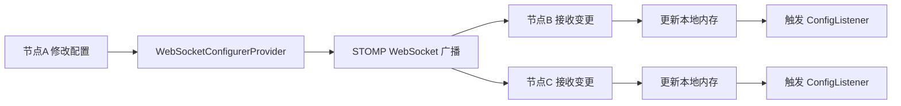
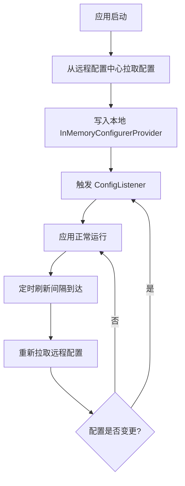

# 动态配置管理指南

本文以实战视角，详细介绍如何使用 `utility-config` 模块实现**配置管理、集群同步、远程配置**三大能力，让你的应用在运行时动态读取和修改配置，并支持跨节点同步。

---

## 它解决了什么问题

在传统的 Spring Boot 应用中，配置通常以 `application.properties` 或 `application.yml` 的形式静态加载，存在以下痛点：

1. **修改配置需要重启应用**——无法在运行时动态调整参数
2. **多节点配置不一致**——集群环境下，修改一个节点的配置不会自动同步到其他节点
3. **缺乏配置变更感知**——业务代码无法在配置发生变化时自动做出响应

`utility-config` 模块通过 `@EnableDynamicConfig` 注解提供了一套完整的动态配置解决方案：

| 能力 | 说明 |
|------|------|
| **配置管理** | 通过 `Configurer` 静态门面读取和修改配置项 |
| **集群同步** | 基于 STOMP WebSocket 实现多节点配置实时同步 |
| **远程配置中心** | 支持从远程配置服务拉取配置，实现集中化管理 |

---

## 快速开始

### 第 1 步：引入依赖

确保你的项目已继承 `spring-boot3-app` 父 POM，并在 `pom.xml` 中引入 `utility-config`：

```xml
<dependency>
    <groupId>com.snz1</groupId>
    <artifactId>utility-config</artifactId>
    <version>3.0.0-SNAPSHOT</version>
</dependency>
```

### 第 2 步：在启动类上添加注解

```java
@EnableDynamicConfig
@SpringBootApplication
public class MyApplication {
    public static void main(String[] args) {
        SpringApplication.run(MyApplication.class, args);
    }
}
```

> `@EnableDynamicConfig` 会自动注册配置管理所需的所有 Bean，包括 `ConfigurerProvider` 链和 `ConfigListener` 机制。

### 第 3 步：配置 application.properties

```properties
# ===== 动态配置基本配置 =====
# 是否启用远程配置中心（默认 false）
app.config.enabled=false
# 远程配置服务地址（启用远程配置时必填）
app.config.endpoint=http://config-center:8080
# 应用名称（用于远程配置中心区分不同应用）
app.config.app-name=${spring.application.name}
# 配置刷新间隔（毫秒，默认 30000）
app.config.refresh-interval=30000

# ===== JWT 配置（框架内置） =====
app.config.jwt.secret=your-jwt-secret-key
app.config.jwt.expiration=3600
app.config.jwt.issuer=snz1
```

### 第 4 步：在业务代码中使用

```java
@RestController
@RequestMapping("/api/user")
public class UserController {

    @GetMapping("/timeout")
    public String getTimeout() {
        // 通过 Configurer 静态门面读取配置
        String timeout = Configurer.getProperty("app.user.timeout", "3000");
        return "当前超时时间: " + timeout + "ms";
    }

    @PostMapping("/timeout")
    public String updateTimeout(@RequestParam String value) {
        // 动态修改配置
        Configurer.setProperty("app.user.timeout", value);
        return "超时时间已更新为: " + value + "ms";
    }
}
```

---

## 核心组件

### @EnableDynamicConfig 注解

`@EnableDynamicConfig` 是动态配置的入口注解，它通过 `@Import` 导入自动配置类，完成以下工作：

| 注册内容 | 说明 |
|---------|------|
| `Configurer` | 静态门面类，提供 `getProperty` / `setProperty` 等方法 |
| `ConfigurerProvider` 链 | 配置提供者链，按优先级依次查找配置 |
| `ConfigListener` 容器 | 配置变更监听器容器，配置变更时通知所有监听器 |

```java
@Target(ElementType.TYPE)
@Retention(RetentionPolicy.RUNTIME)
@Documented
@Import(DynamicConfigAutoConfiguration.class)
public @interface EnableDynamicConfig {
}
```

### Configurer 静态门面

`Configurer` 是整个配置模块的统一入口，所有配置的读写操作都通过它完成。它内部委托给 `ConfigurerProvider` 链执行实际的配置查找和修改。

```java
public class Configurer {

    // 读取配置（带默认值）
    public static String getProperty(String key, String defaultValue);

    // 读取配置（无默认值，返回 null 表示不存在）
    public static String getProperty(String key);

    // 设置配置
    public static void setProperty(String key, String value);

    // 添加配置变更监听器
    public static void addAppConfigListener(ConfigListener listener);

    // 移除配置变更监听器
    public static void removeAppConfigListener(ConfigListener listener);
}
```

> `Configurer` 是静态门面，可以在任何地方直接调用，无需注入。但请确保 `@EnableDynamicConfig` 已启用，否则会抛出 `IllegalStateException`。

---

## 三种配置提供者

`utility-config` 内置三种 `ConfigurerProvider` 实现，按优先级从高到低排列：

### 1. InMemoryConfigurerProvider（内存配置）

最基础的配置提供者，将配置存储在内存中的 `ConcurrentHashMap`。所有通过 `Configurer.setProperty()` 修改的配置默认写入此处。

```java
// 直接设置配置，默认写入内存
Configurer.setProperty("app.user.timeout", "5000");

// 读取配置
String value = Configurer.getProperty("app.user.timeout", "3000");
```

| 特性 | 说明 |
|------|------|
| **存储介质** | `ConcurrentHashMap`（JVM 内存） |
| **持久化** | 无，应用重启后丢失 |
| **集群同步** | 不支持（需配合 WebSocketConfigurerProvider） |
| **适用场景** | 单机应用、临时配置变更、开发调试 |

### 2. CacheConfigurerProvider（Redis 缓存）

基于 Redis 的配置缓存提供者。配置变更时自动写入 Redis，其他节点从 Redis 读取。适合需要配置持久化但不需要实时推送的场景。

```properties
# 启用 Redis 缓存配置提供者
app.config.cache.enabled=true
app.config.cache.redis-prefix=app:config
```

| 特性 | 说明 |
|------|------|
| **存储介质** | Redis |
| **持久化** | 是，应用重启后配置不丢失 |
| **集群同步** | 延迟同步（依赖 Redis 轮询或刷新间隔） |
| **适用场景** | 集群环境、需要配置持久化 |

### 3. WebSocketConfigurerProvider（STOMP WebSocket 集群同步）

基于 STOMP WebSocket 协议的实时配置同步提供者。当某个节点修改配置后，通过 WebSocket 广播到所有订阅节点，实现毫秒级实时同步。

```properties
# 启用 WebSocket 集群同步
app.config.websocket.enabled=true
app.config.websocket.endpoint=/ws/config
app.config.websocket.destination=/topic/config
```



| 特性 | 说明 |
|------|------|
| **存储介质** | 内存 + WebSocket 广播 |
| **持久化** | 无（需配合 CacheConfigurerProvider） |
| **集群同步** | 实时同步（毫秒级） |
| **适用场景** | 集群环境、需要实时配置推送 |

### 提供者优先级

当多个提供者同时启用时，配置查找按以下优先级进行（从高到低）：

| 优先级 | 提供者 | 说明 |
|--------|--------|------|
| 1 | `InMemoryConfigurerProvider` | 优先从内存读取，保证最新修改即时生效 |
| 2 | `CacheConfigurerProvider` | 内存未命中时从 Redis 读取 |
| 3 | `WebSocketConfigurerProvider` | 通过 WebSocket 接收其他节点的配置变更 |

> 配置写入时，会同时写入内存和 Redis，并通过 WebSocket 广播到其他节点。

---

## 远程配置中心

当 `app.config.enabled=true` 时，应用启动时会从远程配置中心拉取配置，并定期刷新。

### 工作流程



### 配置项

```properties
# 启用远程配置中心
app.config.enabled=true
# 远程配置服务地址
app.config.endpoint=http://config-center:8080
# 应用名称
app.config.app-name=${spring.application.name}
# 配置刷新间隔（毫秒）
app.config.refresh-interval=30000
# 连接超时（毫秒）
app.config.connect-timeout=5000
# 读取超时（毫秒）
app.config.read-timeout=10000
```

> 远程配置中心返回的配置格式为 `key-value` 键值对，框架会将其全部写入 `InMemoryConfigurerProvider`，覆盖本地默认值。

---

## 配置变更监听

### ConfigListener 接口

当配置项发生变化时，框架会通知所有注册的 `ConfigListener`。你可以实现该接口来响应配置变更。

```java
public interface ConfigListener {
    /**
     * 配置变更回调
     * @param key   配置键
     * @param oldValue 旧值
     * @param newValue 新值
     */
    void onConfigChange(String key, String oldValue, String newValue);
}
```

### 使用示例

```java
@Component
public class MyConfigListener implements ConfigListener {

    @Override
    public void onConfigChange(String key, String oldValue, String newValue) {
        if ("app.user.timeout".equals(key)) {
            System.out.println("用户超时配置变更: " + oldValue + " -> " + newValue);
            // 重新初始化相关组件
            refreshTimeoutConfig(newValue);
        }
    }

    private void refreshTimeoutConfig(String value) {
        // 业务逻辑：更新超时配置
    }
}
```

你也可以通过 `Configurer` 静态门面动态注册监听器：

```java
Configurer.addAppConfigListener((key, oldVal, newVal) -> {
    System.out.println("配置变更: " + key + " = " + newVal);
});
```

> Spring Bean 中实现的 `ConfigListener` 会被自动注册，无需手动调用 `addAppConfigListener`。

---

## 配置项速查表

### app.config.* 基础配置

| 配置项 | 默认值 | 说明 |
|--------|--------|------|
| `app.config.enabled` | `false` | 是否启用远程配置中心 |
| `app.config.endpoint` | 无 | 远程配置服务地址 |
| `app.config.app-name` | `${spring.application.name}` | 应用名称 |
| `app.config.refresh-interval` | `30000` | 配置刷新间隔（毫秒） |
| `app.config.connect-timeout` | `5000` | 连接超时（毫秒） |
| `app.config.read-timeout` | `10000` | 读取超时（毫秒） |
| `app.config.cache.enabled` | `false` | 是否启用 Redis 缓存配置提供者 |
| `app.config.cache.redis-prefix` | `app:config` | Redis 配置键前缀 |
| `app.config.websocket.enabled` | `false` | 是否启用 WebSocket 集群同步 |
| `app.config.websocket.endpoint` | `/ws/config` | WebSocket 端点路径 |
| `app.config.websocket.destination` | `/topic/config` | STOMP 消息目标地址 |

### app.config.jwt.* JWT 配置

| 配置项 | 默认值 | 说明 |
|--------|--------|------|
| `app.config.jwt.secret` | 无（必填） | JWT 签名密钥 |
| `app.config.jwt.expiration` | `3600` | JWT 过期时间（秒） |
| `app.config.jwt.issuer` | `snz1` | JWT 签发者 |

---

## 完整使用示例

### 场景：动态调整线程池大小

```java
@Configuration
public class ThreadPoolConfig {

    private ThreadPoolExecutor executor;

    @PostConstruct
    public void init() {
        int coreSize = Integer.parseInt(
            Configurer.getProperty("app.thread.core-size", "10")
        );
        int maxSize = Integer.parseInt(
            Configurer.getProperty("app.thread.max-size", "50")
        );
        executor = new ThreadPoolExecutor(coreSize, maxSize,
            60L, TimeUnit.SECONDS, new LinkedBlockingQueue<>(100));
    }

    @Bean
    public ConfigListener threadPoolConfigListener() {
        return (key, oldVal, newVal) -> {
            if ("app.thread.core-size".equals(key)) {
                executor.setCorePoolSize(Integer.parseInt(newVal));
                System.out.println("核心线程数已调整为: " + newVal);
            }
            if ("app.thread.max-size".equals(key)) {
                executor.setMaximumPoolSize(Integer.parseInt(newVal));
                System.out.println("最大线程数已调整为: " + newVal);
            }
        };
    }
}
```

### 场景：动态控制功能开关

```java
@RestController
@RequestMapping("/api/feature")
public class FeatureController {

    @GetMapping("/status")
    public Map<String, Object> getFeatureStatus() {
        Map<String, Object> result = new HashMap<>();
        result.put("newDashboard",
            Configurer.getProperty("app.feature.new-dashboard", "false"));
        result.put("darkMode",
            Configurer.getProperty("app.feature.dark-mode", "false"));
        return result;
    }

    @PostMapping("/toggle")
    public String toggleFeature(
            @RequestParam String feature,
            @RequestParam boolean enabled) {
        String key = "app.feature." + feature;
        Configurer.setProperty(key, String.valueOf(enabled));
        return "功能 " + feature + " 已" + (enabled ? "开启" : "关闭");
    }
}
```

---

## 常见问题

### Q: 修改配置后其他节点没有同步

检查以下几点：
1. 是否启用了 `app.config.websocket.enabled=true`
2. 所有节点是否连接到同一个 WebSocket 端点
3. 如果使用 Redis 缓存模式，检查 Redis 连接是否正常
4. 检查 `app.config.refresh-interval` 是否设置过小导致刷新风暴

### Q: 远程配置中心拉取失败导致启动报错

远程配置中心不可用时，框架会使用本地默认配置启动，不会阻止应用启动。但如果你需要强制要求远程配置可用，可以设置 `app.config.fail-fast=true`。

### Q: ConfigListener 没有收到变更通知

1. 确认 `@EnableDynamicConfig` 已添加到启动类
2. 确认监听器已注册为 Spring Bean 或通过 `Configurer.addAppConfigListener()` 注册
3. 确认配置变更确实通过 `Configurer.setProperty()` 修改，直接修改 `application.properties` 不会触发监听

### Q: Redis 和 WebSocket 模式应该选哪个

| 维度 | Redis 模式 | WebSocket 模式 |
|------|-----------|----------------|
| 实时性 | 秒级延迟 | 毫秒级实时 |
| 持久化 | 支持 | 不支持 |
| 复杂度 | 低（依赖 Redis） | 中（需维护 WebSocket 连接） |
| 推荐场景 | 配置不频繁变更 | 配置频繁变更、需实时感知 |

> 生产环境建议同时启用两者：Redis 保证持久化，WebSocket 保证实时性。

### Q: 配置项的命名规范是什么

推荐使用 `app.{模块}.{子模块}.{属性}` 的层级命名方式，例如：
- `app.user.timeout`
- `app.feature.new-dashboard`
- `app.thread.core-size`
