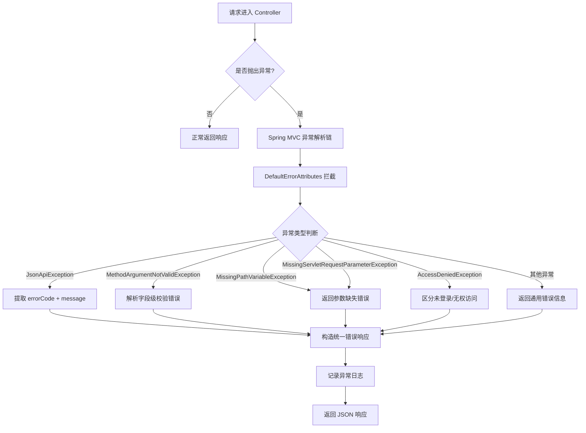
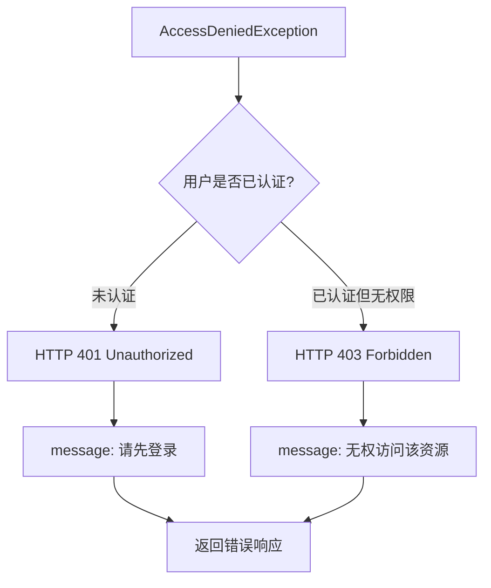

# 全局异常处理指南

本文以实战视角，详细介绍如何使用 `utility-mvc` 模块实现**统一的全局异常处理**，包括错误响应格式、业务异常体系、数据校验异常、参数缺失异常、权限异常等场景。

---

## 它解决了什么问题

在没有统一异常处理之前，每个 Controller 方法都需要手动 `try-catch` 并构造错误响应，存在以下痛点：

1. **错误响应格式不统一**——不同接口返回不同的错误结构，前端难以统一处理
2. **异常处理代码重复**——每个 Controller 方法都要写相似的异常处理逻辑
3. **错误信息泄露**——直接返回堆栈信息可能暴露系统内部细节
4. **缺乏错误码体系**——前端无法根据错误码做差异化处理

`utility-mvc` 模块通过 `DefaultErrorAttributes` 核心类提供了一套完整的全局异常处理方案：

| 能力 | 说明 |
|------|------|
| **统一错误响应格式** | 所有异常统一返回 `{error_id, message, code, fields}` 结构 |
| **业务异常体系** | 通过 `JsonApiException` 携带错误码，实现语义化异常 |
| **校验异常处理** | 自动解析 `MethodArgumentNotValidException`，返回字段级错误 |
| **权限异常处理** | 区分未登录（401）和无权访问（403） |

---

## 核心组件

### DefaultErrorAttributes

`DefaultErrorAttributes` 是全局异常处理的核心类，它同时实现了：

- `ErrorAttributes`（Spring Boot 错误属性接口，**最高优先级**）
- `HandlerExceptionResolver`（Spring MVC 异常解析器）

这意味着无论是 Spring Boot 的错误页面转发，还是 Spring MVC 的 `@ExceptionHandler` 机制，异常最终都会汇聚到 `DefaultErrorAttributes` 进行统一处理。



> `DefaultErrorAttributes` 注册了 `@Order(Ordered.HIGHEST_PRECEDENCE)`，确保它在所有其他 `ErrorAttributes` 和 `HandlerExceptionResolver` 之前执行。

---

## 错误响应格式

所有异常最终都会被转换为以下统一的 JSON 响应格式：

```json
{
    "error_id": "a1b2c3d4-e5f6-7890-abcd-ef1234567890",
    "message": "数据格式不正确",
    "code": 1003,
    "fields": [
        {
            "field": "email",
            "message": "邮箱格式不正确"
        }
    ]
}
```

| 字段 | 类型 | 说明 |
|------|------|------|
| `error_id` | `String` | 错误唯一标识（UUID），用于日志追踪 |
| `message` | `String` | 错误描述信息，面向用户可读 |
| `code` | `Integer` | 错误码，用于程序化判断（见错误码定义） |
| `fields` | `Array` | 字段级错误列表（仅校验异常时填充） |

> `error_id` 会同时写入日志，方便通过日志系统快速定位完整的错误堆栈和请求上下文。

---

## 业务异常体系

### JsonApiException

`JsonApiException` 是所有业务异常的基类，它携带 `errorCode` 字段，用于在错误响应中返回语义化的错误码。

```java
public class JsonApiException extends RuntimeException {

    private final int errorCode;

    public JsonApiException(int errorCode, String message) {
        super(message);
        this.errorCode = errorCode;
    }

    public JsonApiException(int errorCode, String message, Throwable cause) {
        super(message, cause);
        this.errorCode = errorCode;
    }

    public int getErrorCode() {
        return errorCode;
    }
}
```

### ErrorCodes 错误码定义

框架预定义了以下错误码：

| 错误码常量 | 数值 | 说明 |
|-----------|------|------|
| `ErrorCodes.InvalidData` | `1000` | 数据无效（通用） |
| `ErrorCodes.DataTooShort` | `1001` | 数据过短 |
| `ErrorCodes.DataTooLarge` | `1002` | 数据过大 |
| `ErrorCodes.InvalidFormat` | `1003` | 格式不正确 |
| `ErrorCodes.InvalidType` | `1004` | 类型不正确 |

```java
public class ErrorCodes {
    public static final int InvalidData   = 1000;
    public static final int DataTooShort   = 1001;
    public static final int DataTooLarge   = 1002;
    public static final int InvalidFormat  = 1003;
    public static final int InvalidType    = 1004;
}
```

### 使用示例

```java
@RestController
@RequestMapping("/api/user")
public class UserController {

    @PostMapping("/register")
    public User register(@RequestBody RegisterRequest req) {
        // 用户名长度校验
        if (req.getUsername().length() < 3) {
            throw new JsonApiException(
                ErrorCodes.DataTooShort,
                "用户名长度不能少于3个字符"
            );
        }
        // 用户名长度上限
        if (req.getUsername().length() > 50) {
            throw new JsonApiException(
                ErrorCodes.DataTooLarge,
                "用户名长度不能超过50个字符"
            );
        }
        // 邮箱格式校验
        if (!req.getEmail().matches("^[^@]+@[^@]+$")) {
            throw new JsonApiException(
                ErrorCodes.InvalidFormat,
                "邮箱格式不正确"
            );
        }
        return userService.register(req);
    }
}
```

调用方收到的错误响应：

```json
{
    "error_id": "f8e7d6c5-b4a3-2109-fedc-ba9876543210",
    "message": "用户名长度不能少于3个字符",
    "code": 1001,
    "fields": null
}
```

---

## 数据校验异常处理

当使用 `@Valid` 或 `@Validated` 注解触发的 `MethodArgumentNotValidException`，框架会自动解析为字段级错误：

```java
public class RegisterRequest {

    @NotBlank(message = "用户名不能为空")
    @Size(min = 3, max = 50, message = "用户名长度必须在3-50个字符之间")
    private String username;

    @NotBlank(message = "邮箱不能为空")
    @Email(message = "邮箱格式不正确")
    private String email;

    @NotBlank(message = "密码不能为空")
    @Size(min = 6, max = 20, message = "密码长度必须在6-20个字符之间")
    private String password;

    // getters & setters
}
```

```java
@PostMapping("/register")
public User register(@Valid @RequestBody RegisterRequest req) {
    return userService.register(req);
}
```

当校验失败时，返回的响应：

```json
{
    "error_id": "a1b2c3d4-e5f6-7890-abcd-ef1234567890",
    "message": "数据校验失败",
    "code": 1000,
    "fields": [
        {
            "field": "username",
            "message": "用户名长度必须在3-50个字符之间"
        },
        {
            "field": "email",
            "message": "邮箱格式不正确"
        }
    ]
}
```

| 校验注解 | 对应异常 | 处理方式 |
|---------|---------|---------|
| `@NotBlank` / `@NotEmpty` / `@NotNull` | `MethodArgumentNotValidException` | 提取字段名 + message |
| `@Size` / `@Length` | `MethodArgumentNotValidException` | 提取字段名 + message |
| `@Pattern` / `@Email` | `MethodArgumentNotValidException` | 提取字段名 + message |
| `@Min` / `@Max` | `MethodArgumentNotValidException` | 提取字段名 + message |

> 框架会遍历 `BindingResult` 中的所有 `FieldError`，将它们全部放入 `fields` 数组，前端可以一次性展示所有校验错误。

---

## 参数缺失异常处理

### MissingPathVariableException

当 URL 路径变量缺失时，框架返回错误码 `1000`（InvalidData）：

```java
@GetMapping("/user/{id}")
public User getUser(@PathVariable Long id) {
    return userService.getById(id);
}
```

如果请求 `/api/user/`（缺少 `id`），返回：

```json
{
    "error_id": "c3d4e5f6-7890-abcd-ef12-345678901234",
    "message": "缺少路径参数: id",
    "code": 1000,
    "fields": null
}
```

### MissingServletRequestParameterException

当请求参数缺失时，框架同样返回错误码 `1000`：

```java
@GetMapping("/user/search")
public List<User> search(@RequestParam String keyword) {
    return userService.search(keyword);
}
```

如果请求 `/api/user/search`（缺少 `keyword`），返回：

```json
{
    "error_id": "d4e5f678-90ab-cdef-1234-567890123456",
    "message": "缺少请求参数: keyword",
    "code": 1000,
    "fields": null
}
```

| 异常类型 | 触发场景 | 错误码 | HTTP 状态码 |
|---------|---------|--------|------------|
| `MissingPathVariableException` | URL 路径变量缺失 | `1000` | `400` |
| `MissingServletRequestParameterException` | 请求参数缺失 | `1000` | `400` |

---

## 权限异常处理

框架对 `AccessDeniedException` 进行了细分处理，区分**未登录**和**无权访问**两种场景：



```java
@GetMapping("/admin/users")
@PreAuthorize("hasRole('ADMIN')")
public List<User> listAllUsers() {
    return userService.listAll();
}
```

| 场景 | HTTP 状态码 | message | 说明 |
|------|------------|---------|------|
| 未登录访问受保护资源 | `401` | `请先登录` | 用户未携带有效的认证信息 |
| 已登录但权限不足 | `403` | `无权访问该资源` | 用户已认证，但角色/权限不满足要求 |

> 框架通过检查 SecurityContext 中是否存在认证信息来区分这两种场景。如果你的项目未使用 Spring Security，需要自行在 `DefaultErrorAttributes` 中调整判断逻辑。

---

## 异常日志格式

每当异常发生时，框架会记录详细的日志信息，便于问题排查：

```
[ERROR] [2026-09-15 10:05:45] [http-nio-8080-exec-1] [DefaultErrorAttributes]
  Error ID: a1b2c3d4-e5f6-7890-abcd-ef1234567890
  Request URI: /api/user/register
  Remote Addr: 192.168.1.100
  Request Params: {"username":"ab","email":"invalid"}
  Exception: com.snz1.JsonApiException: 用户名长度不能少于3个字符
  Stack Trace:
    com.snz1.JsonApiException: 用户名长度不能少于3个字符
        at com.example.controller.UserController.register(UserController.java:25)
        at sun.reflect.NativeMethodAccessorImpl.invoke0(Native Method)
        ...
```

| 日志字段 | 说明 |
|---------|------|
| `Error ID` | 错误唯一标识，与响应中的 `error_id` 一致 |
| `Request URI` | 请求地址 |
| `Remote Addr` | 来源 IP |
| `Request Params` | 请求参数（JSON 格式） |
| `Exception` | 异常类名和消息 |
| `Stack Trace` | 完整错误堆栈 |

> `error_id` 是连接前端报错和后端日志的桥梁。前端展示 `error_id`，运维通过 `error_id` 在日志系统中检索即可找到完整的错误上下文。

---

## 自定义异常使用示例

### 场景一：自定义业务异常

```java
// 1. 定义业务错误码
public class AppErrorCodes {
    public static final int UserNotFound     = 2001;
    public static final int UserDisabled    = 2002;
    public static final int DuplicateEmail  = 2003;
}

// 2. 在业务代码中抛出
@Service
public class UserService {

    public User login(String email, String password) {
        User user = userMapper.findByEmail(email);
        if (user == null) {
            throw new JsonApiException(
                AppErrorCodes.UserNotFound,
                "用户不存在: " + email
            );
        }
        if (user.isDisabled()) {
            throw new JsonApiException(
                AppErrorCodes.UserDisabled,
                "用户已被禁用，请联系管理员"
            );
        }
        return user;
    }
}
```

### 场景二：自定义异常处理器

如果你需要对特定异常做额外处理（如发送告警），可以扩展 `DefaultErrorAttributes`：

```java
@Component
@Order(Ordered.HIGHEST_PRECEDENCE + 1)  // 低于 DefaultErrorAttributes
public class CustomErrorAttributes extends DefaultErrorAttributes {

    @Override
    public Map<String, Object> getErrorAttributes(
            WebRequest webRequest, ErrorAttributeOptions options) {
        Map<String, Object> attrs = super.getErrorAttributes(webRequest, options);

        Throwable error = super.getError(webRequest);
        if (error instanceof JsonApiException) {
            int code = ((JsonApiException) error).getErrorCode();
            // 对特定错误码发送告警
            if (code >= 2000) {
                alertService.sendAlert(
                    "业务异常: " + error.getMessage(),
                    "Error Code: " + code
                );
            }
        }

        return attrs;
    }
}
```

> 自定义处理器继承 `DefaultErrorAttributes` 并设置稍低的优先级，可以复用框架的全部异常处理逻辑，仅添加扩展行为。

### 场景三：全局异常处理与 @RestControllerAdvice 配合

```java
@RestControllerAdvice
public class GlobalExceptionHandler {

    // 处理业务异常
    @ExceptionHandler(JsonApiException.class)
    public ResponseEntity<Map<String, Object>> handleJsonApi(JsonApiException ex) {
        Map<String, Object> body = new LinkedHashMap<>();
        body.put("error_id", UUID.randomUUID().toString());
        body.put("message", ex.getMessage());
        body.put("code", ex.getErrorCode());
        body.put("fields", null);
        return ResponseEntity.badRequest().body(body);
    }

    // 处理其他未捕获异常
    @ExceptionHandler(Exception.class)
    public ResponseEntity<Map<String, Object>> handleOther(Exception ex) {
        Map<String, Object> body = new LinkedHashMap<>();
        body.put("error_id", UUID.randomUUID().toString());
        body.put("message", "服务器内部错误");
        body.put("code", 500);
        body.put("fields", null);
        return ResponseEntity.internalServerError().body(body);
    }
}
```

> 通常情况下，`DefaultErrorAttributes` 已经覆盖了所有异常处理场景，无需额外编写 `@RestControllerAdvice`。只有在需要额外逻辑（如告警、审计）时才扩展。

---

## 常见问题

### Q: 错误响应中 message 是否安全暴露给前端

`JsonApiException` 的 `message` 是开发者手动指定的，通常是面向用户的可读信息，可以安全返回。但其他未预期的异常（如 `NullPointerException`）的 message 可能包含系统路径等敏感信息，框架会将其替换为通用错误信息 `"服务器内部错误"`，仅在后端日志中保留完整堆栈。

### Q: 如何自定义错误响应格式

继承 `DefaultErrorAttributes` 并重写 `getErrorAttributes` 方法，在 `super` 返回的基础上添加或修改字段。确保设置 `@Order(Ordered.HIGHEST_PRECEDENCE)` 以覆盖默认实现。

### Q: error_id 在日志中找不到

1. 确认日志级别设置为 `ERROR` 或更低
2. 检查日志框架配置是否正确输出了 `DefaultErrorAttributes` 的日志
3. 如果使用了自定义日志过滤，确保没有过滤掉该类的日志

### Q: 校验异常的 fields 为空

1. 确认 Controller 方法参数上添加了 `@Valid` 或 `@Validated` 注解
2. 确认 DTO 类的字段上添加了校验注解（如 `@NotBlank`、`@Size`）
3. 确认 `spring-boot-starter-validation` 依赖已引入

### Q: AccessDeniedException 返回 500 而不是 401/403

1. 确认 `utility-mvc` 依赖已正确引入
2. 确认 `DefaultErrorAttributes` 已被注册（检查 `@EnableMvc` 或自动配置是否生效）
3. 如果使用了 Spring Security，检查 `SecurityFilterChain` 是否在 `DefaultErrorAttributes` 之前拦截了异常
