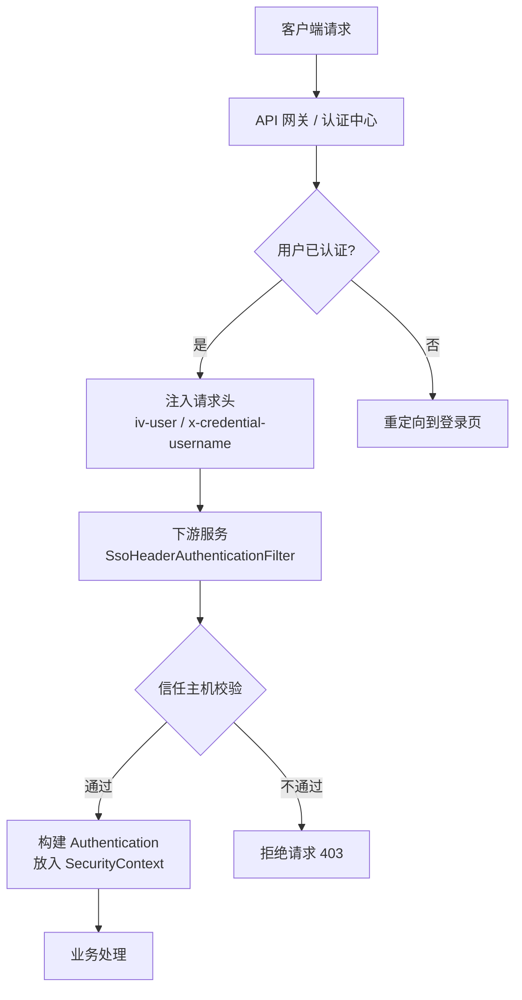
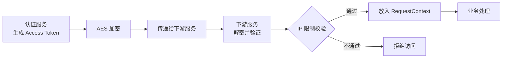
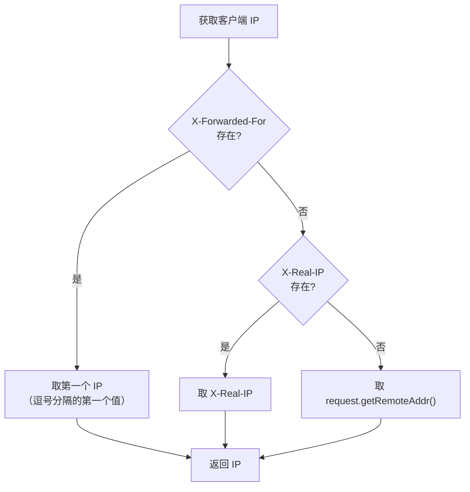

# 安全认证与 SSO 单点登录指南

本文以实战视角，详细介绍如何使用 `utility-security` 模块实现 JWT 令牌管理、SSO 单点登录认证和 Access Token 加密管理。

---

## 模块说明

`utility-security` 基于 Spring Security 构建，提供了以下核心能力：

| 能力 | 核心组件 | 说明 |
|------|----------|------|
| JWT 令牌管理 | `JwtProvider` | 令牌签发、验证、刷新 |
| SSO 请求头认证 | `SsoHeaderAuthenticationFilter` | 通过请求头传递用户身份 |
| Access Token 管理 | `RequestContextAccessTokenManager` | AES 加密的访问令牌 |
| 安全上下文工具 | `ContextUtils` | 获取登录用户、客户端 IP、UserAgent |
| 验证码 | `KaptchaIntegration` | 图形验证码生成与校验 |

> **提示**：`utility-security` 依赖 Spring Security，引入后自动配置安全过滤链。如需自定义安全策略，可覆盖对应 Bean。

---

## JWT 令牌管理

### 配置项

JWT 令牌通过 `app.jwt` 配置项进行管理：

```yaml
app:
  jwt:
    token:
      name: Authorization          # 令牌在请求头中的名称
    private_key: your-secret-key    # JWT 签名密钥
    live_time: 7200                 # 令牌有效期（秒），默认 7200 = 2小时
```

| 配置项 | 默认值 | 说明 |
|--------|--------|------|
| `app.jwt.token.name` | `Authorization` | JWT 令牌在 HTTP 请求头中的字段名 |
| `app.jwt.private_key` | 无（必填） | JWT 签名密钥，建议使用 256 位随机字符串 |
| `app.jwt.live_time` | `7200` | 令牌有效期，单位秒 |

> **警告**：`app.jwt.private_key` 是令牌安全的核心，生产环境务必使用高强度密钥，并通过环境变量注入，不要硬编码在配置文件中。

### JwtProvider 接口

框架提供了 `JwtProvider` 接口用于令牌的签发与验证：

```java
public interface JwtProvider {

    /**
     * 签发 JWT 令牌
     * @param subject 主题（通常是用户ID）
     * @param claims 自定义声明
     * @return JWT 令牌字符串
     */
    String createToken(String subject, Map<String, Object> claims);

    /**
     * 验证并解析 JWT 令牌
     * @param token JWT 令牌字符串
     * @return 解析后的 Claims
     */
    Claims parseToken(String token);

    /**
     * 判断令牌是否过期
     * @param token JWT 令牌字符串
     * @return true 表示已过期
     */
    boolean isTokenExpired(String token);
}
```

### 使用示例

```java
@RestController
@RequestMapping("/api/auth")
public class AuthController {

    @Autowired
    private JwtProvider jwtProvider;

    @PostMapping("/login")
    public Map<String, Object> login(@RequestBody LoginDTO loginDTO) {
        // 1. 验证用户名密码（省略具体逻辑）
        User user = userService.authenticate(loginDTO);

        // 2. 签发 JWT 令牌
        Map<String, Object> claims = new HashMap<>();
        claims.put("username", user.getUsername());
        claims.put("roles", user.getRoles());
        String token = jwtProvider.createToken(user.getId(), claims);

        // 3. 返回令牌
        Map<String, Object> result = new HashMap<>();
        result.put("token", token);
        result.put("expires_in", 7200);
        return result;
    }

    @GetMapping("/verify")
    public Map<String, Object> verifyToken(@RequestHeader("Authorization") String token) {
        Claims claims = jwtProvider.parseToken(token);
        Map<String, Object> result = new HashMap<>();
        result.put("subject", claims.getSubject());
        result.put("username", claims.get("username"));
        result.put("expired", jwtProvider.isTokenExpired(token));
        return result;
    }
}
```

---

## SSO 请求头认证机制

### 工作原理

SSO（单点登录）认证通过 `SsoHeaderAuthenticationFilter` 实现。当外部网关或认证中心完成用户认证后，通过 HTTP 请求头将用户身份传递给下游服务：



### 请求头字段

| 请求头字段 | 说明 | 示例 |
|-----------|------|------|
| `iv-user` | 用户标识（主用） | `iv-user: zhangsan` |
| `x-credential-username` | 用户名（备用） | `x-credential-username: zhangsan` |

> **提示**：`iv-user` 是主要认证头，`x-credential-username` 作为备用。两者至少存在一个即可完成认证。

### 信任主机配置

为防止伪造请求头攻击，`SsoHeaderAuthenticationFilter` 只信任配置的信任主机列表：

```yaml
app:
  security:
    sso:
      trusted-hosts:
        - 192.168.1.100      # API 网关 IP
        - 10.0.0.0/8         # 内网网段（CIDR）
        - 172.16.0.0/12      # Docker 网段
```

| 配置项 | 默认值 | 说明 |
|--------|--------|------|
| `app.security.sso.trusted-hosts` | 空 | 信任主机列表，支持 IP 和 CIDR 格式 |

> **警告**：不要将 `0.0.0.0/0` 加入信任列表，这会让所有来源的请求头都被信任，存在严重安全风险。

### @EnableWebSso 使用方式

```java
import com.snz1.annotation.EnableSecurity;
import com.snz1.annotation.EnableWebSso;

@EnableSecurity      // 启用 Spring Security 安全认证
@EnableWebSso        // 启用 SSO 请求头认证
@SpringBootApplication
public class Application {
    public static void main(String[] args) {
        SpringApplication.run(Application.class, args);
    }
}
```

> **提示**：`@EnableWebSso` 依赖 `@EnableSecurity`，请确保两个注解同时使用。

---

## Access Token 管理

### 工作机制

`RequestContextAccessTokenManager` 负责管理 Access Token 的生成、加密和验证。Access Token 用于在微服务间传递已认证的用户身份，采用 AES 加密保护：



### AES 加密配置

```yaml
app:
  security:
    access-token:
      aes-key: your-aes-256-bit-secret-key   # AES 加密密钥
      ip-restricted: true                     # 是否启用 IP 限制
```

| 配置项 | 默认值 | 说明 |
|--------|--------|------|
| `app.security.access-token.aes-key` | 无（必填） | AES 加密密钥，256 位 |
| `app.security.access-token.ip-restricted` | `true` | 是否启用 IP 限制校验 |

> **提示**：Access Token 的 AES 密钥需要在所有微服务之间保持一致，否则无法跨服务解密。

### 使用示例

```java
@RestController
@RequestMapping("/api")
public class ApiController {

    @Autowired
    private RequestContextAccessTokenManager tokenManager;

    @GetMapping("/token")
    public Map<String, Object> generateToken(HttpServletRequest request) {
        // 生成 Access Token
        String accessToken = tokenManager.generateToken(request);

        Map<String, Object> result = new HashMap<>();
        result.put("access_token", accessToken);
        return result;
    }

    @GetMapping("/protected")
    public Map<String, Object> protectedResource(
            @RequestHeader("X-Access-Token") String accessToken) {
        // 验证并解析 Access Token
        AccessToken token = tokenManager.parseToken(accessToken);

        Map<String, Object> result = new HashMap<>();
        result.put("user", token.getUser());
        result.put("client_ip", token.getClientIp());
        return result;
    }
}
```

---

## @EnableSecurity 和 @EnableWebSso 使用方式

### 最小安全配置

```java
import com.snz1.annotation.EnableSecurity;
import com.snz1.annotation.EnableWebSso;

@EnableSecurity
@SpringBootApplication
public class Application {
    public static void main(String[] args) {
        SpringApplication.run(Application.class, args);
    }
}
```

```yaml
app:
  jwt:
    private_key: ${JWT_SECRET:my-secret-key-256-bit-long-enough}
    live_time: 7200
```

### 完整安全配置（JWT + SSO + Access Token）

```java
import com.snz1.annotation.*;

@EnableWebMvc
@EnableDruid
@EnableMyBatis
@EnableSecurity
@EnableWebSso
@SpringBootApplication
public class Application {
    public static void main(String[] args) {
        SpringApplication.run(Application.class, args);
    }
}
```

```yaml
app:
  jwt:
    token:
      name: Authorization
    private_key: ${JWT_SECRET}
    live_time: 7200
  security:
    sso:
      trusted-hosts:
        - 192.168.1.0/24
    access-token:
      aes-key: ${AES_SECRET}
      ip-restricted: true

server:
  servlet:
    session:
      cookie:
        http-only: true
        secure: true
        same-site: strict

spring:
  kaptcha:
    text-producer:
      char-length: 4
      char-string: 0123456789
    image:
      width: 120
      height: 40
    noise:
      impl: com.google.code.kaptcha.impl.DefaultNoise
```

---

## 配置项速查表

### app.jwt.* — JWT 令牌配置

| 配置项 | 默认值 | 说明 |
|--------|--------|------|
| `app.jwt.token.name` | `Authorization` | 令牌在请求头中的字段名 |
| `app.jwt.private_key` | 无（必填） | JWT 签名密钥 |
| `app.jwt.live_time` | `7200` | 令牌有效期（秒） |

### server.servlet.session.cookie.* — Cookie 安全配置

| 配置项 | 默认值 | 说明 |
|--------|--------|------|
| `server.servlet.session.cookie.http-only` | `true` | 是否禁止 JavaScript 访问 Cookie |
| `server.servlet.session.cookie.secure` | `false` | 是否仅通过 HTTPS 传输 Cookie |
| `server.servlet.session.cookie.same-site` | `lax` | SameSite 策略：`strict` / `lax` / `none` |
| `server.servlet.session.cookie.max-age` | `-1`（浏览器会话） | Cookie 最大存活时间（秒） |
| `server.servlet.session.cookie.name` | `SESSION` | Cookie 名称 |

### spring.kaptcha.* — 验证码配置

| 配置项 | 默认值 | 说明 |
|--------|--------|------|
| `spring.kaptcha.text-producer.char-length` | `4` | 验证码字符长度 |
| `spring.kaptcha.text-producer.char-string` | `0123456789` | 验证码字符集 |
| `spring.kaptcha.image.width` | `120` | 验证码图片宽度（像素） |
| `spring.kaptcha.image.height` | `40` | 验证码图片高度（像素） |
| `spring.kaptcha.noise.impl` | `DefaultNoise` | 噪点实现类 |
| `spring.kaptcha.border` | `yes` | 是否显示边框 |
| `spring.kaptcha.border.color` | `black` | 边框颜色 |

> **提示**：生产环境建议将 `cookie.secure` 设为 `true`，`cookie.same-site` 设为 `strict`，以增强 Cookie 安全性。

---

## ContextUtils 工具类

`ContextUtils` 是框架提供的安全上下文工具类，封装了从 `SecurityContextHolder` 和 `HttpServletRequest` 中获取常用信息的便捷方法。

### 核心方法

| 方法 | 返回类型 | 说明 |
|------|----------|------|
| `ContextUtils.getLoginUser()` | `String` | 获取当前登录用户标识 |
| `ContextUtils.getClientIp()` | `String` | 获取客户端真实 IP（支持代理转发） |
| `ContextUtils.getUserAgent()` | `String` | 获取客户端 User-Agent |
| `ContextUtils.getRequest()` | `HttpServletRequest` | 获取当前请求对象 |
| `ContextUtils.getHeader(String name)` | `String` | 获取指定请求头的值 |

### 使用示例

```java
@RestController
@RequestMapping("/api")
public class UserController {

    @GetMapping("/me")
    public Map<String, Object> currentUser() {
        Map<String, Object> result = new HashMap<>();
        result.put("username", ContextUtils.getLoginUser());
        result.put("client_ip", ContextUtils.getClientIp());
        result.put("user_agent", ContextUtils.getUserAgent());
        return result;
    }

    @GetMapping("/audit")
    public Map<String, Object> auditLog() {
        String user = ContextUtils.getLoginUser();
        String ip = ContextUtils.getClientIp();

        // 记录审计日志
        auditService.log(user, ip, "访问审计接口");

        Map<String, Object> result = new HashMap<>();
        result.put("user", user);
        result.put("ip", ip);
        result.put("timestamp", System.currentTimeMillis());
        return result;
    }
}
```

### 客户端 IP 获取逻辑

`ContextUtils.getClientIp()` 按以下顺序获取真实客户端 IP：



> **提示**：如果你的应用部署在 Nginx / API 网关后面，确保网关正确设置了 `X-Forwarded-For` 或 `X-Real-IP` 请求头。

---

## 常见问题

### Q: 启动报错 "JWT private_key is not configured"

`app.jwt.private_key` 是必填配置项。请确保在 `application.yml` 中配置了该值，或通过环境变量注入：

```yaml
app:
  jwt:
    private_key: ${JWT_SECRET:your-default-key}
```

> **警告**：不要在代码中硬编码密钥，生产环境应通过环境变量或配置中心注入。

### Q: SSO 请求头认证不生效

请按以下步骤排查：

1. 确认启动类同时标注了 `@EnableSecurity` 和 `@EnableWebSso`
2. 检查 `app.security.sso.trusted-hosts` 是否包含了网关/代理的 IP
3. 确认请求头中包含 `iv-user` 或 `x-credential-username`
4. 查看日志中 `SsoHeaderAuthenticationFilter` 是否被调用

### Q: Access Token 解密失败

常见原因：

| 可能原因 | 解决方案 |
|----------|----------|
| AES 密钥不一致 | 确保所有微服务使用相同的 `app.security.access-token.aes-key` |
| 令牌过期 | 重新生成 Access Token |
| IP 限制不通过 | 检查 `ip-restricted` 配置和客户端 IP |
| 令牌被篡改 | 检查传输链路是否被中间人修改 |

### Q: 如何关闭安全认证进行调试

在开发环境中，可以通过以下方式临时关闭安全认证：

```yaml
app:
  security:
    enabled: false   # 临时关闭安全模块
```

> **警告**：此配置仅限开发环境使用，生产环境必须启用安全认证。

### Q: 如何自定义安全过滤链

可以实现 `SecurityFilterChain` Bean 并覆盖默认配置：

```java
@Configuration
public class SecurityConfig {

    @Bean
    public SecurityFilterChain filterChain(HttpSecurity http) throws Exception {
        http
            .csrf(csrf -> csrf.disable())
            .sessionManagement(session ->
                session.sessionCreationPolicy(SessionCreationPolicy.STATELESS))
            .authorizeHttpRequests(auth -> auth
                .requestMatchers("/api/public/**").permitAll()
                .requestMatchers("/api/**").authenticated()
                .anyRequest().permitAll()
            );

        // 添加 SSO 过滤器
        http.addFilterBefore(
            ssoHeaderAuthenticationFilter(),
            UsernamePasswordAuthenticationFilter.class
        );

        return http.build();
    }
}
```

> **提示**：覆盖默认 `SecurityFilterChain` 后，框架的自动配置将不再生效，请确保你理解 Spring Security 的配置机制。

### Q: Cookie 的 SameSite 设为 strict 后跨站请求被拒绝

`same-site: strict` 会阻止所有跨站请求携带 Cookie，包括从第三方网站链接跳转过来的 GET 请求。如果你的应用需要支持跨站场景（如 OAuth 回调），建议使用 `lax`：

```yaml
server:
  servlet:
    session:
      cookie:
        same-site: lax
```
