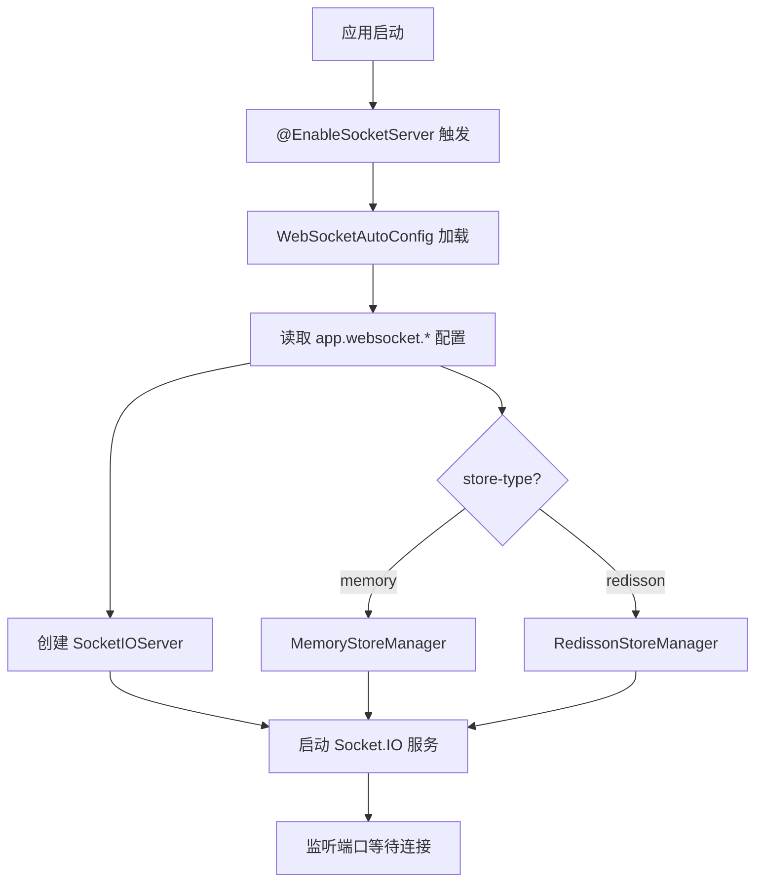
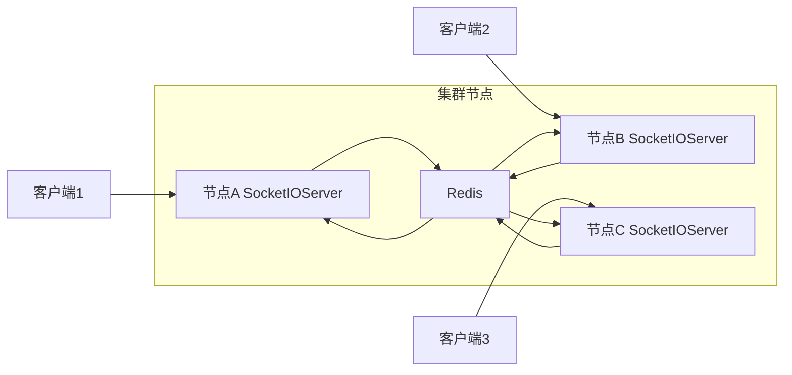

# WebSocket 实时通信指南

本文以实战视角，详细介绍如何使用 `utility-websocket` 模块基于 **Socket.IO** 协议实现实时双向通信，包括服务端启动、客户端连接、消息格式、集群存储模式等核心能力。

---

## 它解决了什么问题

在传统的 HTTP 请求-响应模型中，服务端无法主动向客户端推送消息，存在以下痛点：

1. **实时性差**——客户端只能通过轮询获取最新数据，延迟高且浪费带宽
2. **连接管理复杂**——需要自行实现 WebSocket 连接的建立、维护、断线重连
3. **集群环境困难**——多节点环境下，消息需要路由到正确的节点才能送达目标客户端

`utility-websocket` 模块基于 **Socket.IO** 协议提供了完整的实时通信方案：

| 能力 | 说明 |
|------|------|
| **自动配置** | `@EnableSocketServer` 一键启动 Socket.IO 服务 |
| **集群存储** | 支持 Redisson（集群）和 Memory（单机）两种存储模式 |
| **连接管理** | 自动处理连接、断开、心跳检测 |
| **消息广播** | 支持房间（Room）和命名空间（Namespace）的消息分发 |

---

## 快速开始

### 第 1 步：引入依赖

确保你的项目已继承 `spring-boot3-app` 父 POM，并在 `pom.xml` 中引入 `utility-websocket`：

```xml
<dependency>
    <groupId>com.snz1</groupId>
    <artifactId>utility-websocket</artifactId>
    <version>3.0.0-SNAPSHOT</version>
</dependency>
```

### 第 2 步：在启动类上添加注解

```java
@EnableSocketServer
@SpringBootApplication
public class MyApplication {
    public static void main(String[] args) {
        SpringApplication.run(MyApplication.class, args);
    }
}
```

> `@EnableSocketServer` 会触发 `WebSocketAutoConfig` 自动配置，创建 Socket.IO 服务实例并注册到 Spring 容器。

### 第 3 步：配置 application.properties

```properties
# ===== WebSocket 服务配置 =====
# Socket.IO 服务端口
app.websocket.port=9090
# Boss 线程数（接收连接）
app.websocket.boss-threads=1
# Worker 线程数（处理 IO 事件）
app.websocket.worker-threads=8
# 心跳超时（毫秒）
app.websocket.ping-timeout=25000
# Pong 超时（毫秒）
app.websocket.pong-timeout=25000
# 存储模式：redisson（集群）或 memory（单机）
app.websocket.store-type=memory
```

### 第 4 步：启动应用

应用启动后，Socket.IO 服务会在配置的端口上监听连接。客户端可以使用 Socket.IO 客户端库连接到 `ws://localhost:9090`。

---

## 核心组件

### @EnableSocketServer 注解

`@EnableSocketServer` 是 WebSocket 模块的入口注解，通过 `@Import` 导入 `WebSocketAutoConfig` 自动配置类。

```java
@Target(ElementType.TYPE)
@Retention(RetentionPolicy.RUNTIME)
@Documented
@Import(WebSocketAutoConfig.class)
public @interface EnableSocketServer {
}
```

### WebSocketAutoConfig 自动配置

`WebSocketAutoConfig` 负责以下 Bean 的创建和初始化：

| 注册内容 | 说明 |
|---------|------|
| `SocketIOServer` | Socket.IO 服务实例，管理所有客户端连接 |
| `StoreManager` | 存储管理器，根据 `store-type` 选择 Redisson 或 Memory |
| `SocketIONamespace` | 命名空间管理，支持多业务隔离 |



---

## 配置项速查表

### app.websocket.* 配置

| 配置项 | 默认值 | 说明 |
|--------|--------|------|
| `app.websocket.port` | `9090` | Socket.IO 服务监听端口 |
| `app.websocket.boss-threads` | `1` | Boss 线程数，负责接收新连接 |
| `app.websocket.worker-threads` | `8` | Worker 线程数，负责处理 IO 读写事件 |
| `app.websocket.ping-timeout` | `25000` | Ping 超时时间（毫秒），超时未收到 Ping 则断开连接 |
| `app.websocket.pong-timeout` | `25000` | Pong 超时时间（毫秒），超时未收到 Pong 则断开连接 |
| `app.websocket.store-type` | `memory` | 存储模式：`memory`（单机）或 `redisson`（集群） |

> 如果应用已配置 Redisson（引入了 `utility-redis` 并配置了 Redis 连接），建议使用 `redisson` 存储模式以支持集群。

---

## 两种存储模式

### Memory 模式（单机）

将所有客户端会话和房间信息存储在 JVM 内存中，适用于单节点部署。

```properties
app.websocket.store-type=memory
```

| 特性 | 说明 |
|------|------|
| **存储介质** | JVM 内存（`ConcurrentHashMap`） |
| **集群支持** | 不支持，多节点之间无法共享会话 |
| **性能** | 最高，无网络开销 |
| **适用场景** | 单机部署、开发测试环境 |

### Redisson 模式（集群）

基于 Redis 存储客户端会话和房间信息，适用于多节点集群部署。

```properties
app.websocket.store-type=redisson
```



| 特性 | 说明 |
|------|------|
| **存储介质** | Redis |
| **集群支持** | 支持，所有节点共享会话信息 |
| **性能** | 略低于 Memory（有 Redis 网络开销） |
| **适用场景** | 集群部署、生产环境 |

| 维度 | Memory 模式 | Redisson 模式 |
|------|------------|---------------|
| 集群支持 | 不支持 | 支持 |
| 持久化 | 不支持 | 不支持（会话信息，非消息持久化） |
| 性能 | 最高 | 略低 |
| 依赖 | 无 | 需要 Redis |
| 推荐场景 | 开发/测试 | 生产环境 |

> 生产环境建议使用 `redisson` 模式。当某个节点宕机时，其他节点可以通过 Redis 获取客户端会话信息，实现故障转移。

---

## 消息格式与事件

### 消息格式

Socket.IO 的消息基于事件（Event）机制，每条消息包含事件名和数据体：

```json
{
    "event": "chat_message",
    "data": {
        "from": "user_001",
        "to": "user_002",
        "content": "你好，请问在吗？",
        "timestamp": 1716120000000
    }
}
```

| 字段 | 类型 | 说明 |
|------|------|------|
| `event` | `String` | 事件名称，客户端通过该名称匹配处理函数 |
| `data` | `Object` | 事件数据，可以是任意 JSON 可序列化对象 |

### 服务端发送消息

```java
@Service
public class WebSocketMessageService {

    @Autowired
    private SocketIOServer socketIOServer;

    /**
     * 向指定客户端发送消息
     */
    public void sendToClient(String sessionId, String event, Object data) {
        SocketIOClient client = socketIOServer.getClient(
            UUID.fromString(sessionId)
        );
        if (client != null) {
            client.sendEvent(event, data);
        }
    }

    /**
     * 向房间内所有客户端广播消息
     */
    public void broadcastToRoom(String room, String event, Object data) {
        socketIOServer.getRoomOperations(room).sendEvent(event, data);
    }

    /**
     * 向所有已连接客户端广播消息
     */
    public void broadcastToAll(String event, Object data) {
        socketIOServer.getBroadcastOperations().sendEvent(event, data);
    }
}
```

### 服务端监听客户端消息

```java
@Component
public class WebSocketEventHandler {

    @OnConnect
    public void onConnect(SocketIOClient client) {
        String sessionId = client.getSessionId().toString();
        System.out.println("客户端连接: " + sessionId);
        // 将客户端加入默认房间
        client.joinRoom("global");
    }

    @OnDisconnect
    public void onDisconnect(SocketIOClient client) {
        String sessionId = client.getSessionId().toString();
        System.out.println("客户端断开: " + sessionId);
    }

    @OnEvent("chat_message")
    public void onChatMessage(SocketIOClient client, ChatMessage data,
                              AckRequest ackRequest) {
        System.out.println("收到消息: " + data.getContent());
        // 广播到房间
        socketIOServer.getRoomOperations("global")
            .sendEvent("chat_message", data);
        // 发送 ACK
        ackRequest.sendAckData("ok");
    }
}
```

---

## 客户端连接示例

### JavaScript 客户端（浏览器）

```html
<!DOCTYPE html>
<html>
<head>
    <meta charset="UTF-8">
    <title>WebSocket 示例</title>
    <script src="https://cdn.socket.io/4.7.5/socket.io.min.js"></script>
</head>
<body>
    <div id="messages"></div>
    <input id="input" type="text" placeholder="输入消息" />
    <button onclick="sendMessage()">发送</button>

    <script>
        // 连接 Socket.IO 服务
        const socket = io('ws://localhost:9090', {
            transports: ['websocket'],
            reconnection: true,
            reconnectionDelay: 1000,
            reconnectionAttempts: 5
        });

        // 连接成功
        socket.on('connect', () => {
            console.log('已连接, sessionId:', socket.id);
            document.getElementById('messages').innerHTML
                += '<p>已连接到服务器</p>';
        });

        // 监听聊天消息
        socket.on('chat_message', (data) => {
            document.getElementById('messages').innerHTML
                += '<p>' + data.from + ': ' + data.content + '</p>';
        });

        // 断开连接
        socket.on('disconnect', (reason) => {
            console.log('已断开, 原因:', reason);
        });

        // 发送消息
        function sendMessage() {
            const input = document.getElementById('input');
            socket.emit('chat_message', {
                from: 'browser_user',
                content: input.value,
                timestamp: Date.now()
            });
            input.value = '';
        }
    </script>
</body>
</html>
```

### Java 客户端

```java
import io.socket.client.IO;
import io.socket.client.Socket;
import io.socket.emitter.Emitter;

public class WebSocketClientExample {

    public static void main(String[] args) throws Exception {
        Socket socket = IO.socket("http://localhost:9090");

        // 连接成功
        socket.on(Socket.EVENT_CONNECT, new Emitter.Listener() {
            @Override
            public void call(Object... args) {
                System.out.println("已连接到服务器");
                socket.emit("chat_message", new HashMap<String, Object>() {{
                    put("from", "java_client");
                    put("content", "Hello from Java!");
                    put("timestamp", System.currentTimeMillis());
                }});
            }
        });

        // 监听消息
        socket.on("chat_message", new Emitter.Listener() {
            @Override
            public void call(Object... args) {
                System.out.println("收到消息: " + args[0]);
            }
        });

        socket.connect();
        Thread.sleep(60000);  // 保持连接 60 秒
        socket.disconnect();
    }
}
```

---

## 完整使用示例

### 场景：实时通知系统

```java
@RestController
@RequestMapping("/api/notify")
public class NotificationController {

    @Autowired
    private SocketIOServer socketIOServer;

    @Autowired
    private UserService userService;

    /**
     * 向指定用户发送通知
     */
    @PostMapping("/send")
    public String sendNotification(
            @RequestParam String userId,
            @RequestParam String title,
            @RequestParam String content) {

        // 将通知保存到数据库
        Notification notification = new Notification();
        notification.setUserId(userId);
        notification.setTitle(title);
        notification.setContent(content);
        notification.setRead(false);
        notification.setCreateTime(new Date());
        notificationService.save(notification);

        // 通过 WebSocket 实时推送
        String room = "user:" + userId;
        socketIOServer.getRoomOperations(room).sendEvent("notification", Map.of(
            "id", notification.getId(),
            "title", title,
            "content", content,
            "timestamp", System.currentTimeMillis()
        ));

        return "通知已发送";
    }
}
```

客户端监听通知事件：

```javascript
socket.on('notification', (data) => {
    showNotification(data.title, data.content);
});
```

### 场景：在线用户列表

```java
@Component
public class OnlineUserManager {

    @Autowired
    private SocketIOServer socketIOServer;

    private final Map<String, String> sessionUserMap = new ConcurrentHashMap<>();

    @OnConnect
    public void onConnect(SocketIOClient client) {
        String userId = client.getHandshakeData().getSingleUrlParam("userId");
        if (userId != null) {
            sessionUserMap.put(client.getSessionId().toString(), userId);
            client.joinRoom("user:" + userId);
            // 通知所有客户端更新在线列表
            socketIOServer.getBroadcastOperations().sendEvent(
                "user_online", Map.of("userId", userId)
            );
        }
    }

    @OnDisconnect
    public void onDisconnect(SocketIOClient client) {
        String sessionId = client.getSessionId().toString();
        String userId = sessionUserMap.remove(sessionId);
        if (userId != null) {
            socketIOServer.getBroadcastOperations().sendEvent(
                "user_offline", Map.of("userId", userId)
            );
        }
    }

    public List<String> getOnlineUsers() {
        return new ArrayList<>(sessionUserMap.values());
    }
}
```

---

## 常见问题

### Q: 客户端连接不上 WebSocket 服务

1. 确认 `app.websocket.port` 端口未被占用
2. 确认防火墙已放行该端口
3. 确认客户端使用的是 Socket.IO 客户端库（不是原生 WebSocket），Socket.IO 协议与原生 WebSocket 不兼容
4. 确认客户端连接地址格式正确：`ws://host:port` 或 `http://host:port`

### Q: 集群模式下消息丢失

1. 确认所有节点都使用 `app.websocket.store-type=redisson`
2. 确认所有节点连接到同一个 Redis 实例
3. 确认 Redisson 配置正确（检查 `utility-redis` 相关配置）
4. 检查房间名称是否一致（不同节点使用相同的 room 名称）

### Q: 心跳检测不起作用

1. 确认 `app.websocket.ping-timeout` 和 `app.websocket.pong-timeout` 设置合理（建议 25000 毫秒）
2. 确认客户端支持心跳响应（Socket.IO 客户端默认支持）
3. 如果客户端是自定义实现，需要手动响应 Ping 帧

### Q: Worker 线程数应该设置多少

| 部署规模 | 建议值 | 说明 |
|---------|--------|------|
| 开发/测试 | `2-4` | 足够处理少量连接 |
| 小型生产 | `8-16` | 处理数百到数千连接 |
| 大型生产 | `16-32` | 处理数千以上连接 |

> Worker 线程数不建议超过 CPU 核心数的 2 倍。如果连接数非常大，建议增加节点数而不是单节点线程数。

### Q: 如何在同一个应用中同时使用 HTTP 和 WebSocket

WebSocket 服务使用独立端口（默认 9090），与 HTTP 服务端口（如 8080）互不干扰。客户端通过 HTTP 端口访问 REST API，通过 WebSocket 端口建立实时连接。

```properties
# HTTP 服务端口
server.port=8080
# WebSocket 服务端口
app.websocket.port=9090
```
