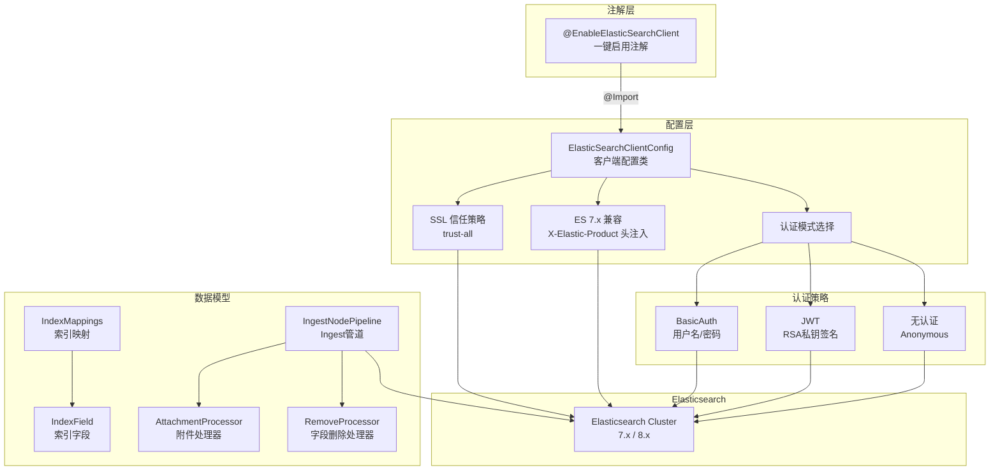
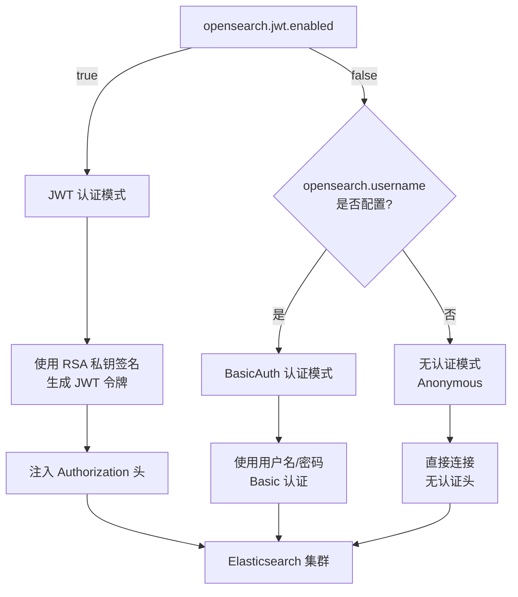

# Elasticsearch 客户端自动配置模块

## 基本信息

| 属性 | 值 |
|------|------|
| **GroupId** | `com.snz1`（继承自 parent `spring-boot3-app`） |
| **ArtifactId** | `elasticsearch-cli-autoconfigure` |
| **Version** | `3.0.0-SNAPSHOT` |
| **Parent** | `com.snz1:spring-boot3-app:3.0.0-SNAPSHOT` |
| **Java 版本** | 21 |
| **ES Java API Client** | 8.18.8 |
| **兼容服务端** | Elasticsearch 7.x 和 8.x |
| **描述** | Elasticsearch 客户端自动配置模块，基于官方 ES Java API Client，提供开箱即用的客户端与索引管理能力 |

## 模块概述

`elasticsearch-cli-autoconfigure` 是基于 Spring Boot 3 的 Elasticsearch 客户端自动配置模块。通过 `@EnableElasticSearchClient` 注解一键启用 ES 客户端，使用官方 **Elasticsearch Java API Client**（`co.elastic.clients`），支持 **无认证**、**Basic Auth（用户名/密码）** 和 **JWT（RSA 私钥签名）** 三种认证模式，并提供索引映射定义、Ingest 管道编排等数据模型抽象，实现声明式、零样板代码的 Elasticsearch 集成体验。

该模块是 `opensearch-cli-autoconfigure` 的替代方案，面向使用 Elasticsearch 集群的业务场景，配置项复用 `opensearch.*` 前缀，便于从 OpenSearch 无缝迁移到 Elasticsearch。

## 与 opensearch-cli 的对比

| 对比维度 | opensearch-cli-autoconfigure | elasticsearch-cli-autoconfigure |
|----------|-------------------------------|--------------------------------|
| **客户端类型** | `RestHighLevelClient`（旧版高级 REST 客户端） | `ElasticsearchClient`（官方新版 Java API Client） |
| **客户端包名** | `org.opensearch.client` | `co.elastic.clients` |
| **底层传输** | Apache HttpClient + OpenSearch RestClient | `RestClientTransport` + `JacksonJsonpMapper` |
| **服务端版本** | OpenSearch 2.x | Elasticsearch 7.x 和 8.x |
| **ES 7.x 兼容** | 不适用 | 通过 `X-Elastic-Product` 头注入实现兼容 |
| **配置前缀** | `opensearch.*` | `opensearch.*`（复用，便于迁移） |
| **数据模型包名** | `com.snz1.opensearch.data` | `com.snz1.elasticsearch.data` |
| **认证模式** | BasicAuth / JWT / 无认证 | BasicAuth / JWT / 无认证 |
| **SSL 策略** | trust-all | trust-all |
| **依赖管理** | spring-boot3-app BOM | spring-boot3-app BOM |

::: tip 迁移建议
从 OpenSearch 迁移到 Elasticsearch 时，只需将依赖从 `opensearch-cli-autoconfigure` 替换为 `elasticsearch-cli-autoconfigure`，将注解从 `@EnableOpenSerachClient` 替换为 `@EnableElasticSearchClient`，配置项无需修改。注入的 Bean 类型从 `RestHighLevelClient` 变为 `ElasticsearchClient`，业务代码需要适配新版 API。
:::

## 依赖关系

| 依赖 | 版本 | Scope | 说明 |
|------|------|-------|------|
| `com.snz1:utility-core` | 3.0.0-SNAPSHOT | compile | 内部核心工具库 |
| `co.elastic.clients:elasticsearch-java` | 8.18.8 | compile | Elasticsearch 官方 Java API Client |
| `jakarta.json:jakarta.json-api` | BOM 管理 | compile | JSON Processing API |
| `org.projectlombok:lombok` | BOM 管理 | provided | 编译期代码生成 |

::: tip 依赖管理
所有第三方依赖版本通过 `spring-boot3-app` 父 POM 的 BOM 统一管理，业务服务继承父 POM 后无需重复声明版本号。
:::

## 架构设计



## 配置项

所有配置项以 `opensearch.` 为前缀（与 opensearch-cli 复用），通过 `application.yml` 或 `application.properties` 声明。

| 配置项 | 默认值 | 说明 |
|--------|--------|------|
| `opensearch.cluster.name` | `opensearch` | 集群名称 |
| `opensearch.hosts` | `opensearch:9200` | 节点地址列表，逗号分隔多节点 |
| `opensearch.prefix` | — | 请求路径前缀 |
| `opensearch.username` | — | Basic 认证用户名 |
| `opensearch.password` | — | Basic 认证密码 |
| `opensearch.jwt.enabled` | `false` | 是否启用 JWT 认证 |
| `opensearch.jwt.token` | 继承 `app.jwt.token` | JWT 令牌 |
| `opensearch.jwt.private_key` | 继承 `app.jwt.private_key` | RSA 私钥（用于 JWT 签名） |
| `opensearch.jwt.live_time` | `1800` | JWT 有效时长（秒） |
| `opensearch.timeout` | `60000` | 请求超时时间（毫秒） |

::: tip JWT 配置继承
`opensearch.jwt.token` 和 `opensearch.jwt.private_key` 默认继承全局 `app.jwt.token` 和 `app.jwt.private_key` 配置。如果全局已配置 JWT 参数，启用 `opensearch.jwt.enabled=true` 即可自动复用，无需重复声明。
:::

::: warning 配置前缀说明
本模块复用 `opensearch.*` 配置前缀，而非 `elasticsearch.*`。这是为了便于业务服务从 OpenSearch 迁移到 Elasticsearch 时，无需修改任何配置文件。如果同一应用中同时引入了 opensearch-cli 和 elasticsearch-cli，请注意配置项会冲突，建议只保留其中一个模块。
:::

## 核心类说明

### EnableElasticSearchClient（注解）

一键启用 Elasticsearch 客户端自动配置的入口注解。标注在启动类或配置类上后，通过 `@Import` 导入 `ElasticSearchClientConfig`，自动创建 `ElasticsearchClient` Bean。

| 属性 | 值 |
|------|------|
| **@Target** | `TYPE` |
| **@Retention** | `RUNTIME` |
| **@Documented** | 是 |
| **@Import** | `ElasticSearchClientConfig.class` |

### ElasticSearchClientConfig（配置类）

核心配置类，负责创建和配置 `ElasticsearchClient` Bean。主要职责：

- **多节点连接**：解析 `opensearch.hosts` 配置项，支持逗号分隔的多节点地址
- **三种认证模式**：根据配置自动选择 BasicAuth、JWT 或无认证（Anonymous）
- **SSL 信任策略**：采用 trust-all 策略，简化内部集群的 SSL 证书管理
- **ES 7.x 兼容**：注入 `X-Elastic-Product` 请求头，确保与 ES 7.x 服务端兼容
- **传输层**：使用 `RestClientTransport` + `JacksonJsonpMapper` 构建底层传输
- **超时控制**：通过 `opensearch.timeout` 统一配置请求超时
- **静态工厂方法**：提供 `createElasticsearchClient(config)` 静态方法，支持编程式创建客户端

### 数据模型（com.snz1.elasticsearch.data）

模块提供一组数据模型类，与 opensearch-cli 的数据模型完全对称，用于声明式定义索引映射和 Ingest 管道：

| 类名 | 职责 |
|------|------|
| `IndexMappings` | 索引映射定义，包含 `Map<String, IndexField> properties` |
| `IndexField` | 索引字段定义，支持 type、analyzer、search_analyzer、index、嵌套 properties |
| `IngestNodePipeline` | Ingest 管道编排，支持多处理器链式添加/删除 |
| `IngestProcessor` | 处理器标记接口 |
| `AttachmentProcessor` | 附件处理器（ingest-attachment 插件），配置 base64 字段提取，PipelineId=`attachment` |
| `RemoveProcessor` | 字段删除处理器 |
| `Field` | 字段引用基础类 |

#### IndexField 工厂方法

`IndexField` 提供静态工厂方法，简化字段定义：

```java
// 指定类型
IndexField.of("keyword")

// 指定类型 + 分词器
IndexField.of("text", "ik_max_word")

// 指定类型 + 索引分词器 + 搜索分词器
IndexField.of("text", "ik_max_word", "ik_smart")
```

#### IngestNodePipeline 工厂方法

`IngestNodePipeline` 提供静态工厂方法创建管道实例：

```java
// 创建管道并添加处理器
IngestNodePipeline pipeline = IngestNodePipeline.of(
    "附件提取管道",
    new AttachmentProcessor("content_base64")
);
```

## 快速开始

### 1. 引入依赖

在业务服务的 `pom.xml` 中添加依赖：

```xml
<dependency>
    <groupId>com.snz1</groupId>
    <artifactId>elasticsearch-cli-autoconfigure</artifactId>
    <version>3.0.0-SNAPSHOT</version>
</dependency>
```

### 2. 启用 Elasticsearch 客户端

在启动类上标注 `@EnableElasticSearchClient` 注解：

```java
@EnableElasticSearchClient
@SpringBootApplication
public class MyApplication {
    public static void main(String[] args) {
        SpringApplication.run(MyApplication.class, args);
    }
}
```

### 3. 配置连接信息

在 `application.yml` 中配置 Elasticsearch 连接参数：

```yaml
# Basic 认证模式
opensearch:
  cluster:
    name: my-elasticsearch-cluster
  hosts: es-node1:9200,es-node2:9200
  username: elastic
  password: elastic@123
  timeout: 60000
```

```yaml
# JWT 认证模式
opensearch:
  cluster:
    name: my-elasticsearch-cluster
  hosts: elasticsearch:9200
  jwt:
    enabled: true
    private_key: ${app.jwt.private_key}  # 继承全局 RSA 私钥
    live_time: 1800
  timeout: 60000
```

```yaml
# 无认证模式
opensearch:
  cluster:
    name: elasticsearch
  hosts: elasticsearch:9200
  timeout: 60000
```

### 4. 注入客户端使用

```java
import co.elastic.clients.elasticsearch.ElasticsearchClient;
import org.springframework.beans.factory.annotation.Autowired;
import org.springframework.stereotype.Service;

@Service
public class SearchService {

    @Autowired
    private ElasticsearchClient elasticsearchClient;

    // 直接使用 ElasticsearchClient 进行索引、搜索等操作
}
```

## 使用示例

### 创建索引映射

```java
import co.elastic.clients.elasticsearch.ElasticsearchClient;
import co.elastic.clients.elasticsearch.indices.CreateIndexRequest;
import co.elastic.clients.elasticsearch.indices.IndexMapping;
import com.snz1.elasticsearch.data.IndexMappings;
import com.snz1.elasticsearch.data.IndexField;
import com.fasterxml.jackson.databind.ObjectMapper;
import org.springframework.beans.factory.annotation.Autowired;
import org.springframework.stereotype.Service;

@Service
public class IndexService {

    @Autowired
    private ElasticsearchClient client;

    @Autowired
    private ObjectMapper objectMapper;

    public void createDocumentIndex() throws Exception {
        // 定义索引映射
        IndexMappings mappings = new IndexMappings();
        mappings.getProperties().put("title", IndexField.of("text", "ik_max_word", "ik_smart"));
        mappings.getProperties().put("content", IndexField.of("text", "ik_max_word", "ik_smart"));
        mappings.getProperties().put("status", IndexField.of("keyword"));
        mappings.getProperties().put("create_time", IndexField.of("date"));

        // 构建创建索引请求
        CreateIndexRequest request = CreateIndexRequest.of(b -> b
            .index("documents")
            .mappings(m -> m
                .properties("title", p -> p
                    .text(t -> t.analyzer("ik_max_word").searchAnalyzer("ik_smart")))
                .properties("content", p -> p
                    .text(t -> t.analyzer("ik_max_word").searchAnalyzer("ik_smart")))
                .properties("status", p -> p.keyword(k -> k))
                .properties("create_time", p -> p.date(d -> d))
            )
        );

        // 执行创建
        client.indices().create(request);
    }
}
```

### 索引文档

```java
import co.elastic.clients.elasticsearch.ElasticsearchClient;
import co.elastic.clients.elasticsearch.core.IndexRequest;
import co.elastic.clients.elasticsearch.core.IndexResponse;
import org.springframework.beans.factory.annotation.Autowired;
import org.springframework.stereotype.Service;

import java.util.Map;

@Service
public class DocumentService {

    @Autowired
    private ElasticsearchClient client;

    public String indexDocument(String indexName, Map<String, Object> document) throws Exception {
        IndexRequest<Map<String, Object>> request = IndexRequest.of(b -> b
            .index(indexName)
            .document(document)
        );

        IndexResponse response = client.index(request);
        return response.id();
    }
}
```

### 搜索文档

```java
import co.elastic.clients.elasticsearch.ElasticsearchClient;
import co.elastic.clients.elasticsearch.core.SearchResponse;
import co.elastic.clients.elasticsearch.core.search.Hit;
import org.springframework.beans.factory.annotation.Autowired;
import org.springframework.stereotype.Service;

import java.util.List;
import java.util.Map;

@Service
public class SearchService {

    @Autowired
    private ElasticsearchClient client;

    public List<Map> searchByKeyword(String indexName, String field, String keyword) throws Exception {
        SearchResponse<Map> response = client.search(s -> s
            .index(indexName)
            .query(q -> q
                .match(m -> m
                    .field(field)
                    .query(keyword)
                )
            ),
            Map.class
        );

        return response.hits().hits().stream()
            .map(Hit::source)
            .toList();
    }
}
```

### 配置 Ingest 管道

```java
import co.elastic.clients.elasticsearch.ElasticsearchClient;
import co.elastic.clients.elasticsearch.ingest.PutPipelineRequest;
import com.snz1.elasticsearch.data.IngestNodePipeline;
import com.snz1.elasticsearch.data.AttachmentProcessor;
import com.snz1.elasticsearch.data.RemoveProcessor;
import com.fasterxml.jackson.databind.ObjectMapper;
import org.springframework.beans.factory.annotation.Autowired;
import org.springframework.stereotype.Service;

@Service
public class PipelineService {

    @Autowired
    private ElasticsearchClient client;

    @Autowired
    private ObjectMapper objectMapper;

    public void createAttachmentPipeline() throws Exception {
        // 构建管道：提取附件内容后删除原始 base64 字段
        IngestNodePipeline pipeline = IngestNodePipeline.of(
            "附件提取管道",
            new AttachmentProcessor("content_base64")
        );
        pipeline.addProcessor(new RemoveProcessor("content_base64"));

        // 构建请求并执行
        String pipelineJson = objectMapper.writeValueAsString(pipeline);
        client.ingest().putPipeline(p -> p
            .id("attachment_pipeline")
            .body(b -> b
                .description("附件提取管道")
                .processors(pipelineJson)
            )
        );
    }
}
```

### 嵌套字段映射

```java
import com.snz1.elasticsearch.data.IndexMappings;
import com.snz1.elasticsearch.data.IndexField;

IndexMappings mappings = new IndexMappings();

// 嵌套对象字段
IndexField nestedField = IndexField.of("nested");
nestedField.getProperties().put("name", IndexField.of("keyword"));
nestedField.getProperties().put("value", IndexField.of("text", "ik_max_word"));

mappings.getProperties().put("metadata", nestedField);
```

## 认证模式说明



### 无认证模式（Anonymous）

不配置用户名密码且不启用 JWT 时，客户端以匿名方式连接 Elasticsearch 集群。适用于内部网络环境且 Elasticsearch 未开启安全认证的场景。

### Basic Auth 认证模式

配置 `opensearch.username` 和 `opensearch.password` 后，客户端使用 HTTP Basic Authentication 进行认证。适用于 Elasticsearch 开启了安全认证且有独立用户账号的场景。

### JWT 认证模式

启用 `opensearch.jwt.enabled=true` 后，客户端使用 RSA 私钥签名生成 JWT 令牌，并通过 `Authorization: Bearer <token>` 头注入请求。适用于 Elasticsearch 配置了 JWT 认证插件或网关代理的场景。

::: warning SSL trust-all 策略
模块默认采用 trust-all SSL 信任策略，适用于内部集群通信场景。在生产环境中，如果 Elasticsearch 使用了正式 CA 签发的证书，建议评估是否需要收紧信任策略以符合安全合规要求。
:::

## ES 7.x 兼容性说明

::: tip ES 7.x 兼容机制
本模块基于 ES Java API Client 8.18.8 构建，同时兼容 ES 7.x 服务端。兼容机制通过以下方式实现：

1. **X-Elastic-Product 头注入**：在请求中注入 `X-Elastic-Product` 头，标识客户端产品来源，确保 ES 7.x 服务端正确识别请求。
2. **API 兼容**：ES Java API Client 8.x 的核心 API（索引、搜索、映射管理、Ingest 管道等）在 ES 7.x 上均可正常使用，部分 8.x 新增特性在 7.x 上不可用。
3. **传输层兼容**：`RestClientTransport` 基于 Elasticsearch 的低层 REST 客户端，与 ES 7.x 的 REST API 完全兼容。
:::

::: warning ES 7.x 已知限制
- ES 8.x 引入的安全特性（如安全索引、字段级安全等）在 ES 7.x 上不可用。
- ES 8.x 新增的数据类型（如 `dense_vector`、`semantic_text` 等）在 ES 7.x 上不支持。
- 建议在生产环境中优先使用 ES 8.x 以获得完整功能支持。
:::
