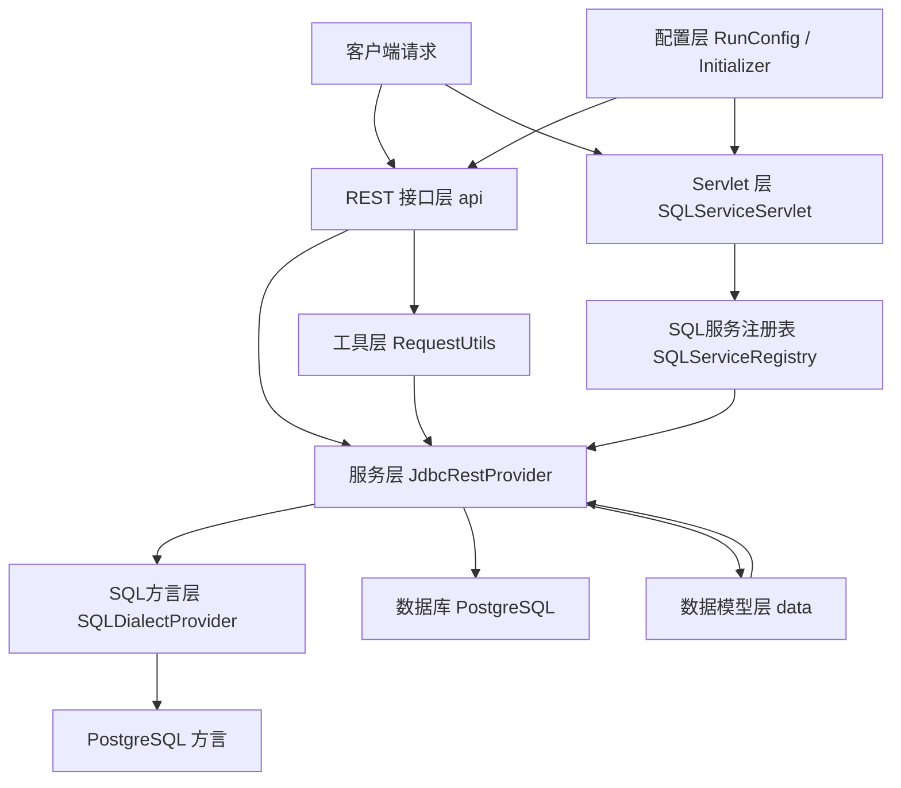

# JDBC 转 REST 服务模块

## 基本信息

| 属性 | 值 |
|---|---|
| groupId | `com.snz1.gateway` |
| artifactId | `dashboard` |
| version | `2.0.0-SNAPSHOT` |
| 当前版本 | `1.0.0-1121` |
| 产品名 | Jdbc转Rest服务 |
| packaging | `jar` |
| parent | `com.snz1:spring-boot2-app:2.4.0` |
| Java | 1.8 |

::: tip artifactId 说明
Maven 坐标中的 artifactId 为 `dashboard`，但实际功能是 JdbcRest 服务，请以功能描述为准。
:::

## 核心依赖

| 依赖 | 说明 |
|---|---|
| `spring-boot-starter-web` | Spring Boot Web 框架 |
| `mybatis-spring-boot-starter` | MyBatis 集成 |
| `druid` | Druid 数据库连接池 |
| `postgresql` | PostgreSQL JDBC 驱动 |
| `commons-lang3` | Apache 通用工具库 |
| `commons-io` | IO 工具库 |
| `freemarker` | 模板引擎 |
| `httpclient` | HTTP 客户端 |
| `spring-boot-starter-actuator` | 应用监控端点 |

## 架构总览



## 架构分层

### REST 接口层（api）

提供标准 RESTful API，将 HTTP 请求映射为数据库操作。

| 类 | 路径 | 方法 | 说明 |
|---|---|---|---|
| `AppPublishApi` | `/version` | GET | 应用版本信息 |
| `AppPublishApi` | `/headers` | GET | 请求头信息 |
| `AppPublishApi` | `/index` | GET | 首页索引 |
| `DatabaseMetaApi` | `/meta` | GET | 数据库元信息 |
| `DatabaseMetaApi` | `/schemas` | GET | Schema 列表 |
| `DatabaseMetaApi` | `/catalogs` | GET | Catalog 列表 |
| `DatabaseMetaApi` | `/tables` | GET | 表列表 |
| `DatabaseMetaApi` | `/tables/{table}/meta` | GET | 表元信息 |
| `DatabaseQueryApi` | `/tables/{table}` | GET | 分页查询表数据 |
| `DatabaseQueryApi` | `/query` | POST | 高级查询 |
| `DatabaseInsertApi` | `/tables/{table}` | POST/PUT | 插入数据 |
| `DatabaseUpdateApi` | `/tables/{table}/{key}` | POST/PUT | 全量更新 |
| `DatabaseUpdateApi` | `/tables/{table}/{key}` | PATCH | 补丁更新 |
| `DatabaseDeleteApi` | `/tables/{table}/{key}` | DELETE | 删除数据 |
| `DatabaseDMLApi` | `/dml` | POST | 批量 DML 操作 |

### Servlet 层

`SQLServiceServlet` 是 SQL 文件服务入口，通过 `POST /services/*` 路径访问，根据 URL 路径查找对应的 SQL 定义并执行。

### 服务层

| 类/接口 | 说明 |
|---|---|
| `JdbcRestProvider`（接口） | 数据库操作抽象 |
| `JdbcRestProviderImpl` | 核心实现（1039 行），包含所有数据库操作逻辑 |
| `SQLDialectProvider`（接口） | SQL 方言抽象 |
| `AbstractSQLDialectProvider` | 通用 SQL 构建基类 |
| `postgresql/SQLDialectProvider` | PostgreSQL 方言，支持 OFFSET/LIMIT 分页和自动建库 |
| `SQLServiceRegistry`（接口） | SQL 服务注册表抽象 |
| `SQLServiceRegistryImpl` | 从文件目录加载 SQL 定义 |
| `AppInfoResolver`（接口） | 应用信息抽象 |
| `AppInfoResolverImpl` | 应用信息实现 |

### 数据模型层（data）

| 类 | 说明 |
|---|---|
| `JdbcQueryRequest` | 查询请求，支持 SELECT/JOIN/GROUP BY/ORDER BY/WHERE/结果定义 |
| `TableQueryRequest` | 表查询请求，继承 `JdbcQueryRequest`，增加 `table_name` |
| `ManipulationRequest` | 数据操作请求，insert/update/delete 通用 |
| `WhereCloumn` | WHERE 条件封装，支持单条件和多条件 AND 组合 |
| `ResultDefinition` | 结果定义，控制返回列/单对象/元信息/行统计/分页 |
| `TableMeta` | 表元信息，包含主键/字段列表/唯一索引 |
| `TableColumn` | 表字段元信息 |
| `SQLServiceDefinition` | SQL 服务定义，支持多片段，关联 MyBatis MappedStatement |
| `Page` | 分页封装，包含 total/offset/data |

### 工具层

| 类 | 说明 |
|---|---|
| `RequestUtils`（443 行） | HTTP 请求参数解析为内部模型 |
| `JdbcUtils`（367 行） | JDBC 工具，继承 Spring JdbcUtils，PgArray 特殊处理 |
| `YamlUtils` | YAML 解析（yamlbeans 库） |
| `Constants` | 所有 REST 请求参数名/请求头名常量 |

### 配置层

| 类 | 说明 |
|---|---|
| `RunConfig` | 运行配置，包含 webroot 默认路径、app.code、app.sql.location |
| `Initializer` | 启动监听器，自动创建数据库 |
| `Swagger2Config` | API 文档配置 |
| `SQLServletConfig` | Servlet 注册 |

## 关键配置项

```yaml
server:
  context-path: /jdbc/rest/api

app:
  code: my-app              # 应用代码
  sql:
    location: classpath:sql # SQL 文件目录

spring:
  datasource:
    url: jdbc:postgresql://localhost:5432/mydb
    username: postgres
    password: secret
    driver-class-name: org.postgresql.Driver
    create:
      database: mydb        # 自动创建数据库名
```

| 配置项 | 默认值 | 说明 |
|---|---|---|
| `server.context-path` | `/jdbc/rest/api` | 服务上下文路径 |
| `app.code` | - | 应用代码 |
| `app.sql.location` | - | SQL 文件目录 |
| `spring.datasource.url` | - | 数据库 JDBC URL |
| `spring.datasource.create.database` | - | 自动创建数据库名 |

## REST API 参数约定

### 查询参数

| 参数 | 说明 |
|---|---|
| `_select` | SELECT 字段 |
| `_order` | 排序，`+字段` 升序，`-字段` 降序 |
| `_groupby` | 分组字段 |
| `_count` | 统计 |
| `_distinct` | 去重 |
| `_join` | 关联查询 |
| `_result.column` | 返回列 |
| `_result.signleton` | 单对象返回 |
| `_result.contain_meta` | 包含元信息 |
| `_result.total` | 返回行统计 |
| `offset` | 分页偏移量 |
| `limit` | 分页大小（默认最大 1000） |

### 请求头

| 请求头 | 说明 |
|---|---|
| `jdbcrest-primary-key` | 自定义主键 |
| `jdbcrest-key-splitter` | 主键分隔符（默认 `\|`） |
| `jdbcrest-update-mode` | 修改模式（`patch` = 补丁更新） |

## 使用示例

### 分页查询表数据

```bash
# 查询 users 表，返回前 10 条
curl "http://localhost:8080/jdbc/rest/api/tables/users?offset=0&limit=10"

# 查询指定字段并排序
curl "http://localhost:8080/jdbc/rest/api/tables/users?_select=id,name&_order=-created_at&offset=0&limit=20"
```

### 高级查询

```bash
curl -X POST "http://localhost:8080/jdbc/rest/api/query" \
  -H "Content-Type: application/json" \
  -d '{
    "table_name": "users",
    "select": ["id", "name", "email"],
    "where": {
      "status": "active"
    },
    "order": ["-created_at"],
    "offset": 0,
    "limit": 10
  }'
```

### 插入数据

```bash
curl -X POST "http://localhost:8080/jdbc/rest/api/tables/users" \
  -H "Content-Type: application/json" \
  -d '{
    "name": "张三",
    "email": "zhangsan@example.com",
    "status": "active"
  }'
```

### 更新数据

```bash
# 全量更新（POST/PUT）
curl -X PUT "http://localhost:8080/jdbc/rest/api/tables/users/1" \
  -H "Content-Type: application/json" \
  -d '{
    "name": "李四",
    "email": "lisi@example.com",
    "status": "inactive"
  }'

# 补丁更新（PATCH，只更新传入字段）
curl -X PATCH "http://localhost:8080/jdbc/rest/api/tables/users/1" \
  -H "Content-Type: application/json" \
  -H "jdbcrest-update-mode: patch" \
  -d '{
    "status": "inactive"
  }'
```

### 删除数据

```bash
curl -X DELETE "http://localhost:8080/jdbc/rest/api/tables/users/1"
```

### 批量 DML 操作

```bash
curl -X POST "http://localhost:8080/jdbc/rest/api/dml" \
  -H "Content-Type: application/json" \
  -d '[
    {
      "type": "insert",
      "table": "users",
      "data": {"name": "王五", "email": "wangwu@example.com"}
    },
    {
      "type": "update",
      "table": "users",
      "key": "2",
      "data": {"status": "active"}
    }
  ]'
```

### 查询表元信息

```bash
# 获取所有表
curl "http://localhost:8080/jdbc/rest/api/tables"

# 获取 users 表的元信息
curl "http://localhost:8080/jdbc/rest/api/tables/users/meta"
```

## SQL 服务说明

SQL 服务通过 `SQLServiceServlet` 暴露，访问路径为 `POST /services/*`。系统根据 URL 路径在 `app.sql.location` 配置的目录中查找对应的 SQL 定义文件并执行。

### SQL 文件结构

SQL 定义文件使用 YAML 格式，通过 `SQLServiceDefinition` 加载，支持多片段组装和 MyBatis MappedStatement 关联：

```yaml
# 示例：services/user/query.yml
id: user-query
statement: |
  SELECT u.id, u.name, u.email, d.name AS dept_name
  FROM users u
  LEFT JOIN departments d ON u.dept_id = d.id
  WHERE u.status = #{status}
  ORDER BY u.created_at DESC
```

### 调用 SQL 服务

```bash
# 调用 services/user/query 对应的 SQL 定义
curl -X POST "http://localhost:8080/jdbc/rest/api/services/user/query" \
  -H "Content-Type: application/json" \
  -d '{
    "status": "active"
  }'
```

### 自动建库

启动时如果配置了 `spring.datasource.create.database`，`Initializer` 会自动检测并创建目标数据库：

```yaml
spring:
  datasource:
    url: jdbc:postgresql://localhost:5432/mydb
    create:
      database: mydb  # 不存在时自动创建
```

::: warning 分页限制
`limit` 参数默认最大值为 **1000**，超过此值的请求会被截断。如需返回更多数据，请使用 `offset` 进行分页遍历。
:::

::: tip PostgreSQL 专属特性
当前 SQL 方言实现基于 PostgreSQL，支持 `OFFSET ... LIMIT` 语法的分页查询和自动建库功能。如需支持其他数据库，需扩展 `SQLDialectProvider` 接口。
:::
