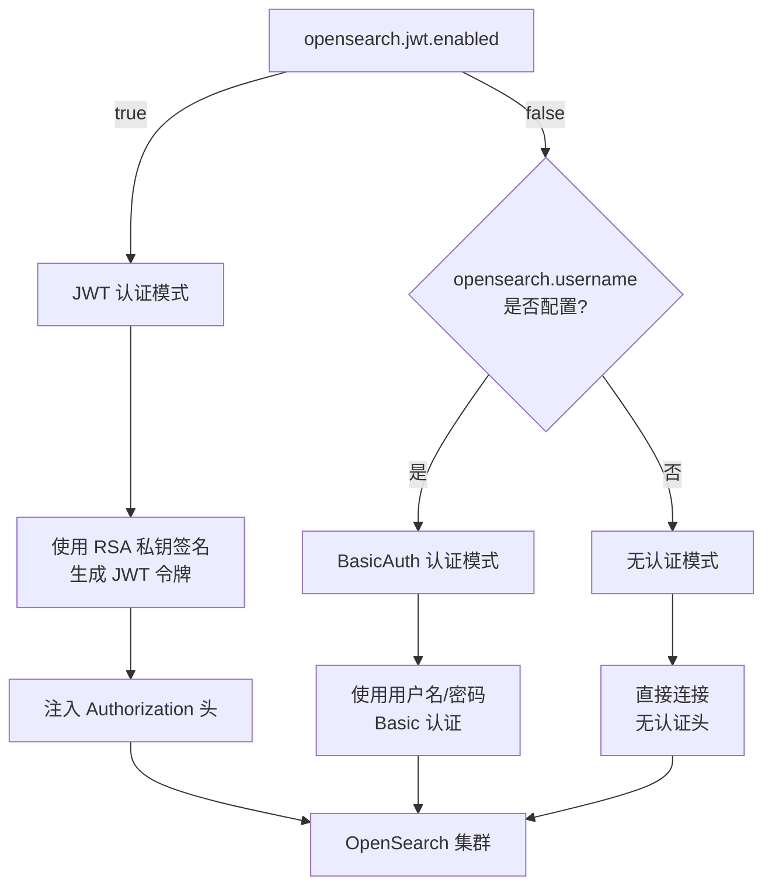

# OpenSearch 客户端自动配置模块

## 基本信息

| 属性 | 值 |
|------|------|
| **GroupId** | `com.snz1`（继承自 parent `spring-boot3-app`） |
| **ArtifactId** | `opensearch-cli-autoconfigure` |
| **Version** | `3.0.0-SNAPSHOT` |
| **Parent** | `com.snz1:spring-boot3-app:3.0.0-SNAPSHOT` |
| **OpenSearch 版本** | 2.19.6 |
| **描述** | OpenSearch 客户端自动配置模块，提供开箱即用的 REST 高级客户端与索引管理能力 |

## 模块概述

`opensearch-cli-autoconfigure` 是基于 Spring Boot 3 的 OpenSearch 客户端自动配置模块。通过 `@EnableOpenSerachClient` 注解一键启用 OpenSearch 客户端，支持 **用户名/密码认证**、**JWT（RSA 私钥签名）认证** 和 **无认证** 三种模式，并提供索引映射定义、Ingest 管道编排等数据模型抽象，实现声明式、零样板代码的 OpenSearch 集成体验。

## 依赖关系

| 依赖 | 版本 | Scope | 说明 |
|------|------|-------|------|
| `org.opensearch.client:opensearch-rest-high-level-client` | 2.19.6 | compile | OpenSearch REST 高级客户端 |
| `org.springframework.boot:spring-boot-starter` | BOM 管理 | compile | Spring Boot 自动配置支持 |
| `org.apache.commons:commons-lang3` | BOM 管理 | compile | Apache Commons Lang 工具库 |
| `com.snz1.gateway:apihelper` | 3.0.0-SNAPSHOT | compile | JWT 令牌管理与 RSA 工具 |
| `org.projectlombok:lombok` | BOM 管理 | provided | 编译期代码生成 |

## 架构设计

```mermaid
graph TD
    subgraph 注解层
        A["@EnableOpenSerachClient<br/>一键启用注解"]
    end

    subgraph 配置层
        B["OpenSerachClientConfig<br/>客户端配置类"]
        C["认证模式选择"]
        D["SSL 信任策略<br/>trust-all"]
    end

    subgraph 认证策略
        E["BasicAuth<br/>用户名/密码"]
        F["JWT<br/>RSA私钥签名"]
        G["无认证"]
    end

    subgraph 数据模型
        H["IndexMappings<br/>索引映射"]
        I["IndexField<br/>索引字段"]
        J["IngestNodePipeline<br/>Ingest管道"]
        K["AttachmentProcessor<br/>附件处理器"]
        L["RemoveProcessor<br/>字段删除处理器"]
    end

    subgraph OpenSearch
        M["OpenSearch Cluster<br/>2.19.6"]
    end

    A -->|"@Import"| B
    B --> C
    C --> E
    C --> F
    C --> G
    B --> D
    D --> M
    E --> M
    F --> M
    G --> M

    H --> I
    J --> K
    J --> L
    J --> M
```



## 配置项

所有配置项以 `opensearch.` 为前缀，通过 `application.yml` 或 `application.properties` 声明。

| 配置项 | 默认值 | 说明 |
|--------|--------|------|
| `opensearch.cluster.name` | `opensearch` | OpenSearch 集群名称 |
| `opensearch.hosts` | `opensearch:9200` | 节点地址列表，逗号分隔多节点 |
| `opensearch.prefix` | — | 请求路径前缀 |
| `opensearch.username` | — | Basic 认证用户名 |
| `opensearch.password` | — | Basic 认证密码 |
| `opensearch.jwt.enabled` | `false` | 是否启用 JWT 认证 |
| `opensearch.jwt.token` | 继承 `app.jwt.token` | JWT 令牌 |
| `opensearch.jwt.private_key` | 继承 `app.jwt.private_key` | RSA 私钥（用于 JWT 签名） |
| `opensearch.jwt.live_time` | `1800` | JWT 有效时长（秒） |
| `opensearch.timeout` | `60000` | 请求超时时间（毫秒） |

::: tip JWT 配置继承
`opensearch.jwt.token` 和 `opensearch.jwt.private_key` 默认继承全局 `app.jwt.token` 和 `app.jwt.private_key` 配置。如果全局已配置 JWT 参数，启用 `opensearch.jwt.enabled=true` 即可自动复用，无需重复声明。
:::

## 核心类说明

### EnableOpenSerachClient（注解）

一键启用 OpenSearch 客户端自动配置的入口注解。标注在启动类或配置类上后，通过 `@Import` 导入 `OpenSerachClientConfig`，自动创建 `RestHighLevelClient` Bean。

| 属性 | 值 |
|------|------|
| **@Target** | `TYPE` |
| **@Retention** | `RUNTIME` |
| **@Documented** | 是 |
| **@Import** | `OpenSerachClientConfig.class` |

### OpenSerachClientConfig（配置类）

核心配置类，负责创建和配置 `RestHighLevelClient` Bean。主要职责：

- **多节点连接**：解析 `opensearch.hosts` 配置项，支持逗号分隔的多节点地址
- **三种认证模式**：根据配置自动选择 BasicAuth、JWT 或无认证
- **SSL 信任策略**：采用 trust-all 策略，简化内部集群的 SSL 证书管理
- **超时控制**：通过 `opensearch.timeout` 统一配置请求超时

### 数据模型（com.snz1.opensearch.data）

模块提供一组数据模型类，用于声明式定义索引映射和 Ingest 管道：

| 类名 | 职责 |
|------|------|
| `IndexMappings` | 索引映射定义，包含 `Map<String, IndexField> properties` |
| `IndexField` | 索引字段定义，支持 type、analyzer、search_analyzer、index、嵌套 properties |
| `IngestNodePipeline` | Ingest 管道编排，支持多处理器链式添加/删除 |
| `IngestProcessor` | 处理器标记接口 |
| `AttachmentProcessor` | 附件处理器（ingest-attachment 插件），配置 base64 字段提取，PipelineId=`attachment` |
| `RemoveProcessor` | 字段删除处理器 |
| `Field` | 字段引用基础类 |

#### IndexField 工厂方法

`IndexField` 提供静态工厂方法，简化字段定义：

```java
// 指定类型
IndexField.of("keyword")

// 指定类型 + 分词器
IndexField.of("text", "ik_max_word")

// 指定类型 + 索引分词器 + 搜索分词器
IndexField.of("text", "ik_max_word", "ik_smart")
```

#### IngestNodePipeline 工厂方法

`IngestNodePipeline` 提供静态工厂方法创建管道实例：

```java
// 创建管道并添加处理器
IngestNodePipeline pipeline = IngestNodePipeline.of(
    "附件提取管道",
    new AttachmentProcessor("content_base64")
);
```

## 快速开始

### 1. 引入依赖

在业务服务的 `pom.xml` 中添加依赖：

```xml
<dependency>
    <groupId>com.snz1</groupId>
    <artifactId>opensearch-cli-autoconfigure</artifactId>
    <version>3.0.0-SNAPSHOT</version>
</dependency>
```

### 2. 启用 OpenSearch 客户端

在启动类上标注 `@EnableOpenSerachClient` 注解：

```java
@EnableOpenSerachClient
@SpringBootApplication
public class MyApplication {
    public static void main(String[] args) {
        SpringApplication.run(MyApplication.class, args);
    }
}
```

### 3. 配置连接信息

在 `application.yml` 中配置 OpenSearch 连接参数：

```yaml
# Basic 认证模式
opensearch:
  cluster:
    name: my-opensearch-cluster
  hosts: opensearch-node1:9200,opensearch-node2:9200
  username: admin
  password: admin@123
  timeout: 60000
```

```yaml
# JWT 认证模式
opensearch:
  cluster:
    name: my-opensearch-cluster
  hosts: opensearch:9200
  jwt:
    enabled: true
    private_key: ${app.jwt.private_key}  # 继承全局 RSA 私钥
    live_time: 1800
  timeout: 60000
```

```yaml
# 无认证模式
opensearch:
  cluster:
    name: opensearch
  hosts: opensearch:9200
  timeout: 60000
```

### 4. 注入客户端使用

```java
import org.opensearch.client.RestHighLevelClient;
import org.springframework.beans.factory.annotation.Autowired;
import org.springframework.stereotype.Service;

@Service
public class SearchService {

    @Autowired
    private RestHighLevelClient restHighLevelClient;

    // 直接使用 RestHighLevelClient 进行索引、搜索等操作
}
```

## 使用示例

### 创建索引映射

```java
import com.snz1.opensearch.data.IndexMappings;
import com.snz1.opensearch.data.IndexField;
import org.opensearch.client.RequestOptions;
import org.opensearch.client.indices.CreateIndexRequest;
import org.opensearch.client.RestHighLevelClient;
import org.opensearch.common.xcontent.XContentType;
import com.fasterxml.jackson.databind.ObjectMapper;
import org.springframework.beans.factory.annotation.Autowired;
import org.springframework.stereotype.Service;

@Service
public class IndexService {

    @Autowired
    private RestHighLevelClient client;

    @Autowired
    private ObjectMapper objectMapper;

    public void createDocumentIndex() throws Exception {
        // 定义索引映射
        IndexMappings mappings = new IndexMappings();
        mappings.getProperties().put("title", IndexField.of("text", "ik_max_word", "ik_smart"));
        mappings.getProperties().put("content", IndexField.of("text", "ik_max_word", "ik_smart"));
        mappings.getProperties().put("status", IndexField.of("keyword"));
        mappings.getProperties().put("create_time", IndexField.of("date"));

        // 构建创建索引请求
        CreateIndexRequest request = new CreateIndexRequest("documents");
        request.mapping(objectMapper.writeValueAsString(mappings), XContentType.JSON);

        // 执行创建
        client.indices().create(request, RequestOptions.DEFAULT);
    }
}
```

### 配置 Ingest 管道

```java
import com.snz1.opensearch.data.IngestNodePipeline;
import com.snz1.opensearch.data.AttachmentProcessor;
import com.snz1.opensearch.data.RemoveProcessor;
import org.opensearch.client.RequestOptions;
import org.opensearch.client.ingest.PutPipelineRequest;
import org.opensearch.client.RestHighLevelClient;
import com.fasterxml.jackson.databind.ObjectMapper;
import org.springframework.beans.factory.annotation.Autowired;
import org.springframework.stereotype.Service;

@Service
public class PipelineService {

    @Autowired
    private RestHighLevelClient client;

    @Autowired
    private ObjectMapper objectMapper;

    public void createAttachmentPipeline() throws Exception {
        // 构建管道：提取附件内容后删除原始 base64 字段
        IngestNodePipeline pipeline = IngestNodePipeline.of(
            "附件提取管道",
            new AttachmentProcessor("content_base64")
        );
        pipeline.addProcessor(new RemoveProcessor("content_base64"));

        // 构建请求
        PutPipelineRequest request = new PutPipelineRequest(
            "attachment_pipeline",
            objectMapper.writeValueAsString(pipeline),
            XContentType.JSON
        );

        // 执行创建
        client.ingest().putPipeline(request, RequestOptions.DEFAULT);
    }
}
```

### 嵌套字段映射

```java
import com.snz1.opensearch.data.IndexMappings;
import com.snz1.opensearch.data.IndexField;

IndexMappings mappings = new IndexMappings();

// 嵌套对象字段
IndexField nestedField = IndexField.of("nested");
nestedField.getProperties().put("name", IndexField.of("keyword"));
nestedField.getProperties().put("value", IndexField.of("text", "ik_max_word"));

mappings.getProperties().put("metadata", nestedField);
```

## 认证模式说明



::: warning SSL trust-all 策略
模块默认采用 trust-all SSL 信任策略，适用于内部集群通信场景。在生产环境中，如果 OpenSearch 使用了正式 CA 签发的证书，建议评估是否需要收紧信任策略以符合安全合规要求。
:::

::: tip OpenSearch 版本兼容性
模块基于 OpenSearch 2.19.6 构建，`RestHighLevelClient` 已在 OpenSearch 2.x 中标记为 deprecated，但仍可正常使用。如需迁移到新的 Java Client API，请关注后续版本更新。
:::
