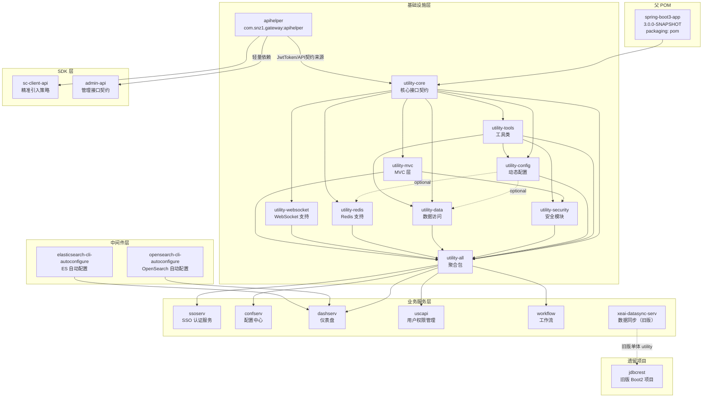
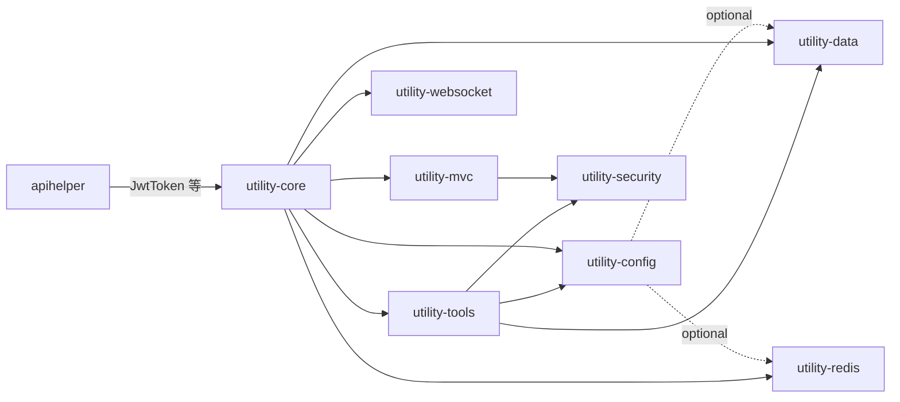
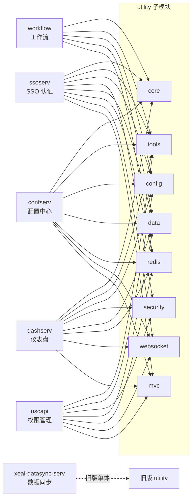
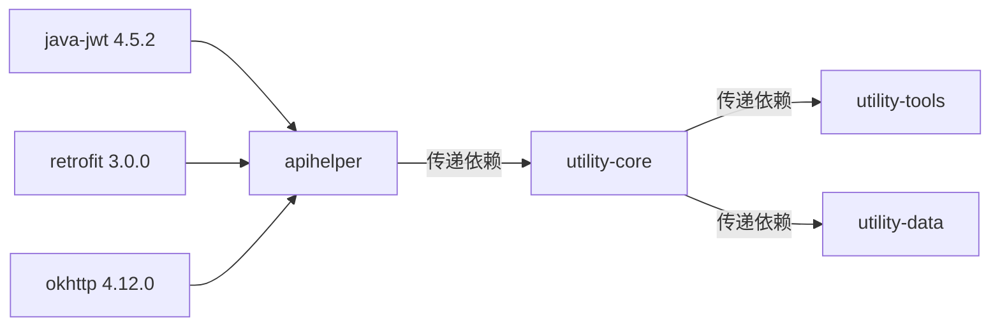

# snz1 Java 框架总览

snz1 Java 框架是一套基于 **Spring Boot 3.5.16 + JDK 21** 的企业级微服务基础设施，经过多业务项目验证，涵盖统一依赖管理、核心工具库、安全认证、数据访问、MVC 增强、中间件集成及 SDK 接口契约等完整能力。

## 技术栈版本总览

| 分类 | 组件 | 版本 | 说明 |
|------|------|------|------|
| **核心框架** | Spring Boot | 3.5.16 | 父 POM 继承 `spring-boot-starter-parent` |
| | Java | 21 | LTS 版本 |
| **ORM** | MyBatis | 3.5.16 | SQL 映射框架 |
| | MyBatis-Spring | 3.0.4 | Spring 集成桥接 |
| | MyBatis Spring Boot Starter | 3.0.5 | Boot 自动配置 |
| **连接池** | Druid | 1.2.28 | `druid-spring-boot-3-starter` |
| **缓存/分布式** | Redisson | 3.52.0 | Redis 客户端 + 分布式锁 |
| **安全** | Spring Security | BOM 管理 | 通过 Spring Boot BOM 统一版本 |
| | Spring Session | BOM 管理 | 会话管理 |
| | java-jwt | 4.5.2 | `com.auth0:java-jwt`，通过 apihelper 引入 |
| **HTTP 客户端** | Retrofit | 3.0.0 | 声明式 HTTP 客户端，通过 apihelper 引入 |
| | OkHttp | 4.12.0 | HTTP 底层引擎，通过 apihelper 引入 |
| **API 文档** | SpringDoc OpenAPI | 2.8.17 | OpenAPI 3 规范文档生成 |
| **加密/编码** | BouncyCastle | 1.84 | 加密算法库 |
| | ZXing | 3.5.3 | 二维码生成/解析 |
| | Pinyin4j | 2.5.1 | 中文拼音转换 |
| **工具** | Lombok | 1.18.36 | 编译期代码生成 |
| | EhCache | 3.10.8 | 本地缓存 |
| **搜索** | OpenSearch | 2.19.6 | `opensearch-cli-autoconfigure` 自动配置 |
| | Elasticsearch Java Client | 8.18.8 | `elasticsearch-cli-autoconfigure` 自动配置 |

## 模块架构

snz1 Java 框架采用分层模块化设计，从父 POM 统一管理依赖版本，到 utility 基础设施层提供核心能力，再到业务服务按需组合。

### 模块依赖关系图

### 模块职责说明

#### 父 POM

| 模块 | GAV | 说明 |
|------|-----|------|
| **spring-boot3-app** | `com.snz1:spring-boot3-app:3.0.0-SNAPSHOT` | 统一父 POM（packaging=pom），parent 为 `spring-boot-starter-parent:3.5.16`。管理全局依赖版本，内置 utility 排除策略。 |

::: tip 目录名说明
项目目录名为 `spring-boot2-app`，但实际 artifactId 为 `spring-boot3-app`，已全面迁移至 Spring Boot 3.x。
:::

#### 基础设施层 — utility 系列

`utility`（`com.snz1:utility:3.0.0-SNAPSHOT`）是聚合 POM，包含 9 个子模块：

| 子模块 | 职责 | 核心类/接口 |
|--------|------|-------------|
| **utility-core** | 核心接口契约，定义框架级 SPI | `GLock`, `ConfigurerProvider`, `WebAuthHeaderProvider`, `DefaultAppConfig` |
| **utility-tools** | 通用工具类库 | `CRCUtils`, `CalendarUtils`, `JsonUtils`, `PinyinUtils`, `QRCodeUtils`, `RSAUtils`, `TimeZoneUtils`, `LocaleUtils`, `DiffMatchPatch`, `JsonDateTypeAdapter` |
| **utility-config** | 动态配置支持 | `EnableDynamicConfig`, `ClusterConfigurerProvider`, `WebSocketConfigurerProvider`, `RemoteAppConfigurerResolver` |
| **utility-security** | 安全认证模块 | `EnableSecurity`, `EnableWebSso`, `JwtProvider`, `JwtToken`, `User`, `AccessToken`, `SsoHeaderAuthenticationFilter`, `WebSecurityConfig` |
| **utility-data** | 数据库访问层 | `EnableDruid`, `EnableMyBatis`, `PageCriteria`, `DruidConfig`, `MyBatisConfig`, `DataSchemaManager` |
| **utility-redis** | Redis 分布式支持 | Redisson 集成 |
| **utility-websocket** | WebSocket 支持 | WebSocket 端点配置 |
| **utility-mvc** | MVC 层增强 | 请求/响应处理增强 |
| **utility-all** | 聚合包 | 一键引入全部子模块 |

**utility 子模块依赖关系：**

#### SDK 层

| 模块 | GAV | 说明 |
|------|-----|------|
| **apihelper** | `com.snz1.gateway:apihelper:3.0.0-SNAPSHOT` | 网关 API 辅助包。提供 `JwtToken`、`RetrofitUtils`、`GsonConverterFactory`、`OkHttpClientJwtInterceptor` 等。是 `java-jwt 4.5.2` 和 `retrofit 3.0.0` 的唯一直接声明者。 |
| **sc-client-api** | `com.snz1.gateway:sc-client-api:3.0.0-SNAPSHOT` | 精准引入策略，只取 `User` 接口，排除 Security 运行时依赖。 |
| **admin-api** | `api.gateway:admin-api:3.0.0-SNAPSHOT` | 管理接口契约，轻量依赖 apihelper。 |

::: warning 历史遗留
apihelper 存在两套包路径（`com.snz1.gateway.api` 和 `gateway.api`），为历史迁移遗留，后续版本将统一。
:::

#### 中间件层

| 模块 | GAV | 说明 |
|------|-----|------|
| **opensearch-cli-autoconfigure** | `com.snz1:opensearch-cli-autoconfigure:3.0.0-SNAPSHOT` | OpenSearch 2.19.6 自动配置，开箱即用。 |
| **elasticsearch-cli-autoconfigure** | `com.snz1:elasticsearch-cli-autoconfigure:3.0.0-SNAPSHOT` | Elasticsearch Java Client 8.18.8 自动配置。 |

#### 业务服务层

| 服务 | GAV | utility 子模块 | 说明 |
|------|-----|----------------|------|
| **ssoserv** | `com.snz1:xeai` | 全部 7 个 | SSO 认证服务 |
| **confserv** | `api.gateway:confserv` | 6 个（缺 security） | 配置中心 |
| **dashserv** | `com.snz1.gateway:dashboard` | 7 个 + 搜索客户端 | 仪表盘 |
| **uscapi** | `api.gateway:upmserv` | 6 个（缺 core） | 用户权限管理 |
| **workflow** | `com.snz1.workflow:workflow:3.0.0` | 5 个 | 工作流引擎 |
| **xeai-datasync-serv** | `com.snz1.xeai` | 旧版单体 utility | 数据同步，未迁移到模块化 |

### 业务服务依赖矩阵

## 关键依赖关系说明

### apihelper 的核心地位

`apihelper` 是框架中 `java-jwt 4.5.2` 和 `retrofit 3.0.0` 的**唯一直接声明者**。其他模块（如 `utility-core`）通过传递依赖获取这些库，避免版本冲突。

### utility-core 依赖 apihelper

`utility-core` 中的 `JwtToken` 等 API 契约类实际来源于 `apihelper`，因此 `utility-core` 依赖 `apihelper`。这是框架中最重要的依赖关系之一。

### optional 依赖策略

`utility-config` 对 `utility-data` 和 `utility-redis` 采用 `optional` 依赖，使用方需按需显式引入这两个模块，避免强制绑定数据库和 Redis。

## 遗留与迁移说明

| 项目 | 状态 | 说明 |
|------|------|------|
| **jdbcrest** | 旧版 Boot2 | `com.snz1.gateway:dashboard:2.0.0-SNAPSHOT`，仍使用旧版 Spring Boot 2.x |
| **xeai-datasync-serv** | 未迁移 | `com.snz1.xeai`，仍使用旧版单体 utility，未拆分为模块化 |
| **apihelper 包路径** | 历史遗留 | 存在 `com.snz1.gateway.api` 和 `gateway.api` 两套包路径，后续版本将统一 |

## 快速导航

| 文档 | 说明 |
|------|------|
| [spring-boot3-app](/framework/spring-boot3-app) | 父 POM 依赖管理详解 |
| [utility-core](/framework/utility-core) | 核心接口契约 |
| [utility-tools](/framework/utility-tools) | 工具类库 |
| [utility-security](/framework/utility-security) | 安全认证模块 |
| [utility-data](/framework/utility-data) | 数据访问层 |
| [opensearch-cli](/middleware/opensearch-cli) | OpenSearch 自动配置 |
| [elasticsearch-cli](/middleware/elasticsearch-cli) | Elasticsearch 自动配置 |
| [apihelper](/sdk/apihelper) | 网关 API 辅助包 |
| [sc-client-api](/sdk/sc-client-api) | 精准引入策略 |
| [最佳实践](/best-practices/) | 业务项目实践 |
| [V2 → V3 迁移](/migration/) | Spring Boot 2→3 迁移指南 |
