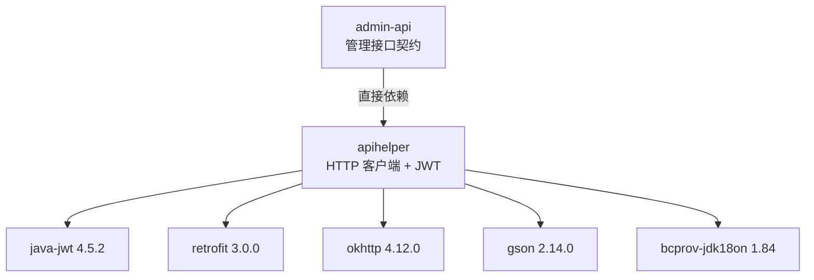
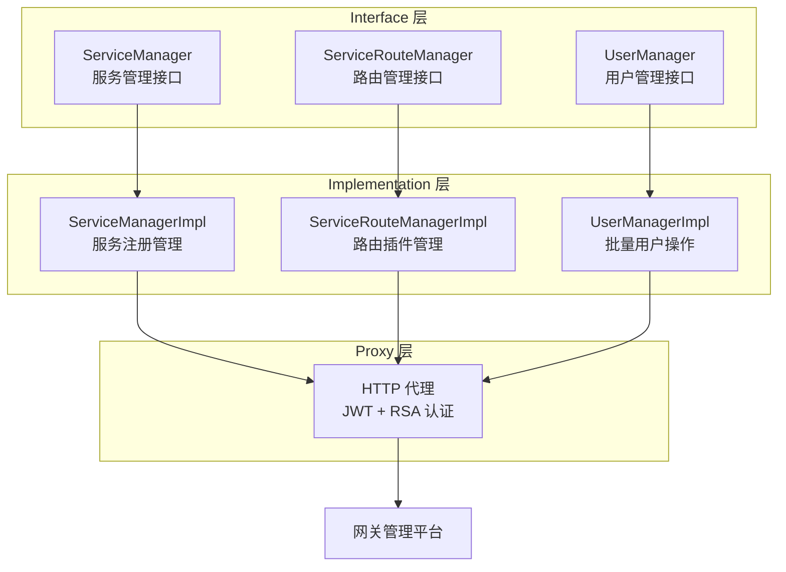
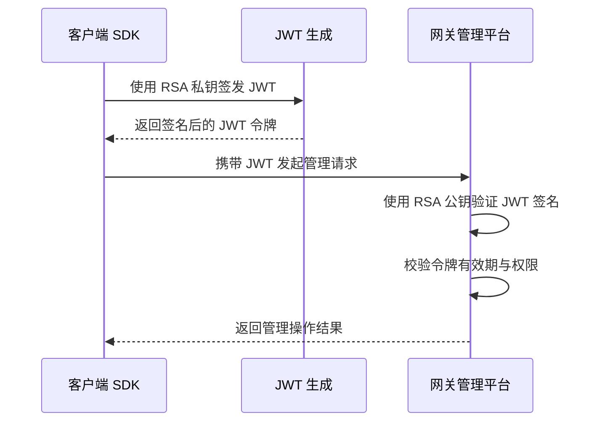
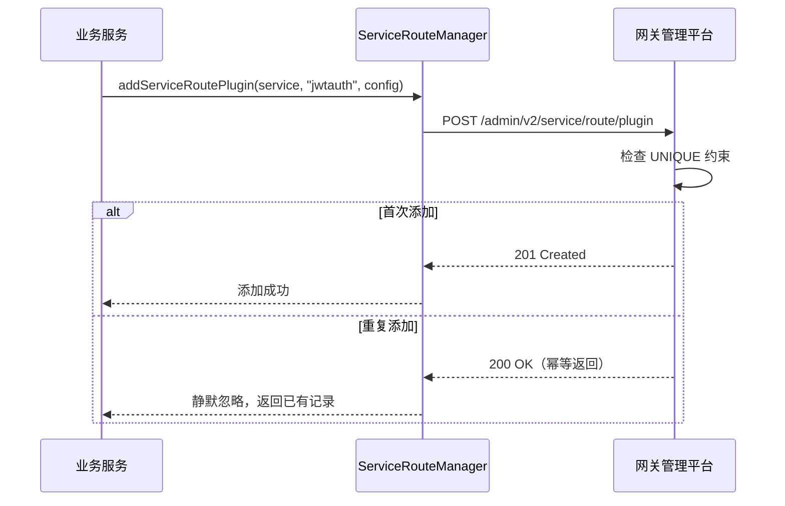

# admin-api 管理接口契约 SDK

## 模块概述

`admin-api` 是网关管理接口契约 SDK 模块，定义了网关管理的接口规范，涵盖微服务注册、路由管理、用户管理等核心管理能力的接口契约。模块采用 **Interface → Implementation → Proxy** 三层架构模式，通过接口契约隔离调用方与实现细节。作为轻量级契约 SDK，`admin-api` 直接依赖 `apihelper` 获取 HTTP 客户端与 JWT 能力，不引入完整的 utility 安全运行时栈。

| 属性 | 值 |
|------|------|
| **groupId** | `api.gateway` |
| **artifactId** | `admin-api` |
| **version** | `3.0.0-SNAPSHOT` |
| **packaging** | `jar` |
| **核心包路径** | `com.snz1.gateway.admin.v2` |
| **定位** | 管理接口契约 SDK，定义网关管理接口规范 |
| **主要消费方** | `jdbcrest` 等项目作为依赖引入 |

::: tip 模块定位
`admin-api` 是管理接口的**契约定义层**，关注接口规范而非具体实现。业务服务通过引入此模块获得网关管理能力的接口契约，具体实现由 Proxy 层通过 HTTP 调用网关管理平台完成。
:::

## 基本信息

| 属性 | 值 |
|------|------|
| **groupId** | `api.gateway` |
| **artifactId** | `admin-api` |
| **version** | `3.0.0-SNAPSHOT` |
| **packaging** | `jar` |
| **核心包路径** | `com.snz1.gateway.admin.v2` |
| **直接依赖** | `com.snz1.gateway:apihelper` |
| **Java 版本** | 21 |
| **认证机制** | JWT + RSA 私钥 |

::: warning groupId 说明
`admin-api` 的 groupId 为 `api.gateway`，与同系列的 `sc-client-api`（`com.snz1.gateway`）不同。该 groupId 从 `jdbcrest` 的 pom.xml 依赖中确认，引入时请注意使用正确的 groupId。
:::

## 引入方式

### Maven 依赖引入

在业务服务的 `pom.xml` 中添加以下依赖：

```xml
<dependency>
    <groupId>api.gateway</groupId>
    <artifactId>admin-api</artifactId>
    <version>3.0.0-SNAPSHOT</version>
</dependency>
```

### 通过父 POM 版本管理引入

如果业务服务继承了 `spring-boot3-app` 父 POM，且父 POM 中已声明 `admin-api` 的版本管理，则无需指定版本号：

```xml
<dependency>
    <groupId>api.gateway</groupId>
    <artifactId>admin-api</artifactId>
    <!-- 版本由父 POM 统一管理 -->
</dependency>
```

### 与 sc-client-api 的选择

| 维度 | `admin-api` | `sc-client-api` |
|------|-------------|-----------------|
| **groupId** | `api.gateway` | `com.snz1.gateway` |
| **定位** | 管理接口契约定义 | 网关客户端完整 SDK |
| **直接依赖** | `apihelper`（轻量） | `utility-security`（完整安全栈） |
| **适用场景** | 仅需管理接口契约 | 需要完整安全认证能力 |
| **依赖体积** | 轻量 | 较重（含 Security 运行时） |

::: tip 选择建议
- 如果只需要网关管理的接口契约定义，优先选择 `admin-api`，依赖更轻量
- 如果业务服务本身也需要 SSO 单点登录、JWT 令牌管理等安全认证能力，选择 `sc-client-api`
- 两者共享相同的包路径 `com.snz1.gateway.admin.v2` 和核心接口定义
:::

## 依赖关系

### 传递依赖链路

`admin-api` 的核心依赖传递链路如下：

```text
admin-api
  └── com.snz1.gateway:apihelper
        └── com.auth0:java-jwt:4.5.2
        └── com.squareup.retrofit2:retrofit:3.0.0
        └── com.squareup.okhttp3:okhttp:4.12.0
        └── com.google.code.gson:gson:2.14.0
        └── org.bouncycastle:bcprov-jdk18on:1.84
```

### 框架内依赖关系图



::: tip 轻量依赖策略
`admin-api` 直接依赖 `apihelper` 而非 `utility-security`，这意味着它不会引入 Spring Security 过滤器链、SSO 认证过滤器等运行时组件。引入方获得的是纯粹的接口契约定义和 HTTP 调用能力，启动开销更小，依赖冲突风险更低。
:::

## 三层架构模式

`admin-api` 采用 **Interface → Implementation → Proxy** 三层架构模式，通过接口契约定义业务能力，实现类承载具体逻辑，代理层处理远程调用与认证注入。



### 设计优势

| 特性 | 说明 |
|------|------|
| **接口隔离** | 调用方依赖接口契约，不耦合具体实现 |
| **代理透明** | 认证、重试等横切逻辑由 Proxy 层统一处理 |
| **可测试性** | 接口层可轻松 Mock，便于单元测试 |
| **可扩展性** | 新增管理能力只需扩展接口和实现 |
| **契约优先** | 接口定义即契约，消费方仅依赖契约不依赖实现 |

## 接口契约说明

### ServiceManager — 微服务注册管理

微服务注册管理接口契约，提供服务的新增、查询、更新、注销等能力。

| 方法 | 说明 |
|------|------|
| `doCreateService(...)` | 注册微服务，捕获 UNIQUE 约束违规实现幂等性 |
| `doDeleteService(...)` | 注销微服务 |
| `doGetService(...)` | 查询微服务信息 |
| `doUpdateService(...)` | 更新微服务配置 |

**幂等性设计：**

`ServiceManagerImpl` 在执行 `doCreateService` 时，会捕获数据库 UNIQUE 约束违规异常。当重复注册同一微服务时，不会抛出异常而是返回已有记录，实现注册操作的幂等性。

```java
// 幂等性处理伪代码
try {
    // 执行 INSERT 操作
    serviceRepository.insert(service);
} catch (DataIntegrityViolationException e) {
    // UNIQUE 约束违规 → 查询并返回已有记录
    return serviceRepository.findByName(service.getName());
}
```

### ServiceRouteManager — 路由管理

路由管理接口契约，提供服务路由插件的添加、删除、查询、更新等能力。

| 方法 | 说明 |
|------|------|
| `addServiceRoutePlugin(...)` | 添加路由插件，捕获 UNIQUE 违规实现幂等性 |
| `removeServiceRoutePlugin(...)` | 移除路由插件 |
| `getServiceRoutePlugins(...)` | 查询路由插件列表 |
| `updateServiceRoutePlugin(...)` | 更新路由插件配置 |

**安全插件常量：**

| 常量 | 说明 |
|------|------|
| `ssoauth` | SSO 单点登录认证插件 |
| `jwtauth` | JWT 令牌认证插件 |
| `authacl` | 访问控制列表（ACL）鉴权插件 |

```java
// 添加 JWT 认证路由插件示例
serviceRouteManager.addServiceRoutePlugin(
    serviceName,
    ServiceRoutePluginConstants.JWTAUTH,
    pluginConfig
);
```

### UserManager — 用户管理

用户管理接口契约，提供批量用户操作能力。

| 方法 | 说明 |
|------|------|
| `batchCreateUsers(...)` | 批量创建用户 |
| `batchUpdateUsers(...)` | 批量更新用户 |
| `batchDeleteUsers(...)` | 批量删除用户 |
| `getUsers(...)` | 分页查询用户 |

**批量操作限制：**

`UserManagerImpl` 定义了 `MAX_BATCH_SIZE = 500` 的批量操作上限。该限制受 HTTP 请求头大小约束，因为批量操作的数据通过 HTTP 请求传递，过大的批量会导致请求头超限。

```java
public class UserManagerImpl implements UserManager {
    private static final int MAX_BATCH_SIZE = 500;

    public void batchCreateUsers(List<User> users) {
        if (users.size() > MAX_BATCH_SIZE) {
            throw new IllegalArgumentException(
                "批量操作数量不能超过 " + MAX_BATCH_SIZE
            );
        }
        // 执行批量创建...
    }
}
```

## 认证配置

`admin-api` 通过 **JWT + RSA 私钥** 机制与网关管理平台进行认证通信。

### 配置项

在 `application.yml` 中配置网关管理平台连接和认证参数：

```yaml
app:
  gateway:
    # 网关管理平台地址
    admin-url: https://gateway-admin.example.com
    # JWT Token
    token: your-jwt-token
    # RSA 私钥（PEM 格式，去除头尾标记）
    private_key: MIIEvQIBADANBgkqhkiG9w0BAQEFAASCBKcwggSjAgEAAoIBAQ...
    # Token 有效期（秒）
    live_time: 3600
    # 签名密钥
    secret: your-secret-key
    # 签名算法
    algorithm: RS256
```

### 配置项说明

| 配置项 | 说明 | 示例值 |
|--------|------|--------|
| `app.gateway.admin-url` | 网关管理平台基础 URL | `https://gateway-admin.example.com` |
| `app.gateway.token` | JWT Token | JWT 令牌字符串 |
| `app.gateway.private_key` | RSA 私钥，用于 JWT 签名 | PEM 格式私钥内容 |
| `app.gateway.live_time` | Token 有效期（秒） | `3600` |
| `app.gateway.secret` | 令牌签名密钥 | 自定义密钥字符串 |
| `app.gateway.algorithm` | JWT 签名算法 | `RS256` |

::: warning 配置项命名差异
`admin-api` 的认证配置采用扁平命名风格（如 `app.gateway.private_key`、`app.gateway.live_time`），与 `sc-client-api` 的嵌套命名风格（如 `app.gateway.token.private-key`）不同。引入时请根据实际模块使用对应的配置项名称。
:::

### 认证流程



## 安全插件

`admin-api` 通过 `ServiceRouteManager` 管理三种安全路由插件，用于控制微服务的访问安全策略。

### 插件类型

| 插件标识 | 名称 | 说明 |
|----------|------|------|
| `ssoauth` | SSO 单点登录认证 | 基于 SSO 会话的认证插件，用户需通过 SSO 登录后才能访问服务 |
| `jwtauth` | JWT 令牌认证 | 基于 JWT 令牌的认证插件，请求需携带有效的 JWT 令牌 |
| `authacl` | 访问控制列表鉴权 | 基于 ACL 的鉴权插件，按访问控制列表限制请求路径和操作权限 |

### 插件管理流程



### 插件配置示例

```java
import com.snz1.gateway.admin.v2.ServiceRouteManager;

@Service
public class SecurityPluginConfigService {

    private final ServiceRouteManager routeManager;

    public SecurityPluginConfigService(ServiceRouteManager routeManager) {
        this.routeManager = routeManager;
    }

    // 配置 JWT 认证
    public void enableJwtAuth(String serviceName) {
        routeManager.addServiceRoutePlugin(serviceName, "jwtauth", null);
    }

    // 配置 SSO 认证
    public void enableSsoAuth(String serviceName) {
        routeManager.addServiceRoutePlugin(serviceName, "ssoauth", null);
    }

    // 配置 ACL 鉴权
    public void enableAcl(String serviceName, String aclRules) {
        routeManager.addServiceRoutePlugin(serviceName, "authacl", aclRules);
    }
}
```

## 使用示例

### 1. 服务注册

```java
import com.snz1.gateway.admin.v2.ServiceManager;

@Service
public class ServiceRegistrationService {

    private final ServiceManager serviceManager;

    public ServiceRegistrationService(ServiceManager serviceManager) {
        this.serviceManager = serviceManager;
    }

    public void registerService(String serviceName, String serviceUrl) {
        // 幂等注册：重复调用不会抛出异常
        serviceManager.doCreateService(serviceName, serviceUrl);
    }
}
```

### 2. 路由插件管理

```java
import com.snz1.gateway.admin.v2.ServiceRouteManager;

@Service
public class RouteConfigService {

    private final ServiceRouteManager routeManager;

    public RouteConfigService(ServiceRouteManager routeManager) {
        this.routeManager = routeManager;
    }

    public void configureJwtAuth(String serviceName) {
        // 幂等添加：重复添加同一插件不会报错
        routeManager.addServiceRoutePlugin(serviceName, "jwtauth", null);
    }

    public void configureSsoAuth(String serviceName) {
        routeManager.addServiceRoutePlugin(serviceName, "ssoauth", null);
    }

    public void configureAcl(String serviceName, String aclConfig) {
        routeManager.addServiceRoutePlugin(serviceName, "authacl", aclConfig);
    }
}
```

### 3. 批量用户操作

```java
import com.snz1.gateway.admin.v2.UserManager;
import java.util.List;

@Service
public class UserBatchService {

    private final UserManager userManager;

    public UserBatchService(UserManager userManager) {
        this.userManager = userManager;
    }

    public void importUsers(List<User> users) {
        // 确保批量大小不超过 MAX_BATCH_SIZE (500)
        if (users.size() > 500) {
            // 分批处理
            int batchSize = 500;
            for (int i = 0; i < users.size(); i += batchSize) {
                int end = Math.min(i + batchSize, users.size());
                userManager.batchCreateUsers(users.subList(i, end));
            }
        } else {
            userManager.batchCreateUsers(users);
        }
    }
}
```

### 4. 完整配置示例

```yaml
spring:
  application:
    name: my-business-service

app:
  gateway:
    admin-url: https://gateway-admin.internal.company.com
    token: ${GATEWAY_JWT_TOKEN}
    private_key: ${GATEWAY_RSA_PRIVATE_KEY}
    live_time: 3600
    secret: ${GATEWAY_TOKEN_SECRET}
    algorithm: RS256
```

```xml
<!-- pom.xml -->
<dependency>
    <groupId>api.gateway</groupId>
    <artifactId>admin-api</artifactId>
    <version>3.0.0-SNAPSHOT</version>
</dependency>
```

## 注意事项

### 1. groupId 差异

::: warning groupId 确认
`admin-api` 的 groupId 为 `api.gateway`，与同系列的 `sc-client-api`（`com.snz1.gateway`）不同。引入依赖时请使用正确的 groupId，否则将无法解析依赖。
:::

### 2. 批量操作大小限制

`UserManagerImpl` 的 `MAX_BATCH_SIZE = 500` 是硬性限制，受 HTTP 请求头大小约束。批量操作时需自行分批处理，避免超出限制导致请求失败。

### 3. 幂等性保证

`ServiceManagerImpl.doCreateService` 和 `ServiceRouteManagerImpl.addServiceRoutePlugin` 通过捕获数据库 UNIQUE 约束违规实现幂等性。这意味着：

- 重复注册同一服务不会报错，而是返回已有记录
- 重复添加同一路由插件不会报错，操作被静默忽略
- 幂等性仅针对 UNIQUE 约束场景，其他数据库异常仍会正常抛出

### 4. RSA 私钥安全

::: warning 密钥管理
- 私钥应通过环境变量或配置中心注入，不要硬编码在配置文件中
- 生产环境建议使用 `${GATEWAY_RSA_PRIVATE_KEY}` 等环境变量引用
- 私钥泄露将导致 JWT 令牌可被伪造，造成严重安全风险
:::

### 5. JDK 版本要求

`admin-api` 基于 **JDK 21** 编译，与 `spring-boot3-app` 父 POM 的 Java 版本要求一致。引入方需确保运行环境为 JDK 21 或以上版本。

### 6. 与 apihelper 的关系

`admin-api` 直接依赖 `apihelper`，通过 `apihelper` 获取 HTTP 客户端能力（Retrofit + OkHttp）和 JWT 令牌能力（java-jwt）。这些能力由 Proxy 层使用，对调用方透明。如需直接使用 HTTP 调用能力，可直接引入 `apihelper`。

### 7. 配置项命名风格

::: warning 配置项差异
`admin-api` 使用扁平配置项命名（`app.gateway.private_key`、`app.gateway.live_time`、`app.gateway.secret`、`app.gateway.algorithm`），与 `sc-client-api` 的嵌套命名（`app.gateway.token.private-key` 等）不同。切换模块时需同步修改配置项名称。
:::

## 版本信息

| 属性 | 值 |
|------|------|
| **当前版本** | `3.0.0-SNAPSHOT` |
| **groupId** | `api.gateway` |
| **artifactId** | `admin-api` |
| **核心包路径** | `com.snz1.gateway.admin.v2` |
| **Java 版本** | 21 |
| **认证机制** | JWT + RSA 私钥 |
| **批量操作上限** | 500 |
| **直接依赖** | `com.snz1.gateway:apihelper:3.0.0-SNAPSHOT` |
| **安全插件** | `ssoauth`、`jwtauth`、`authacl` |
