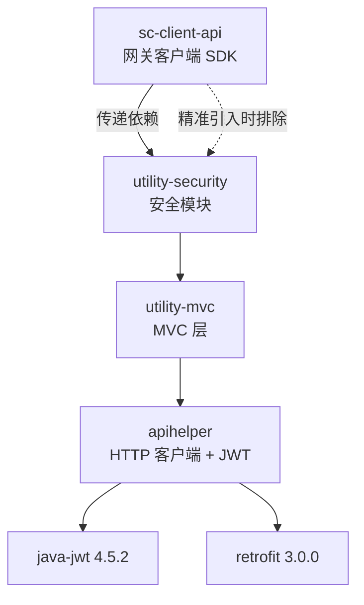
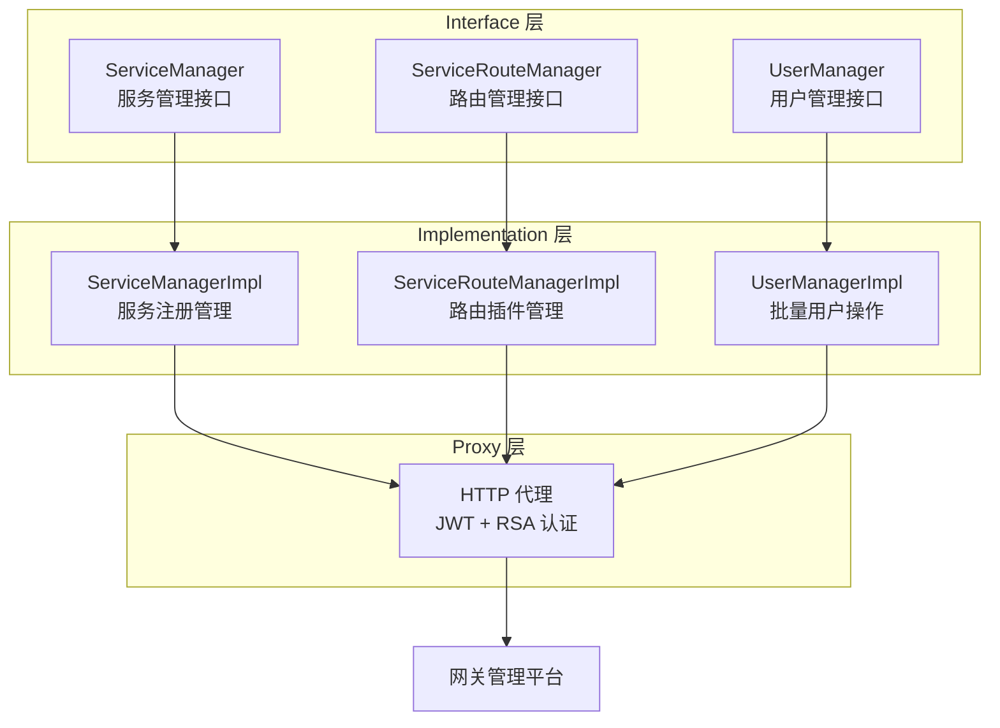
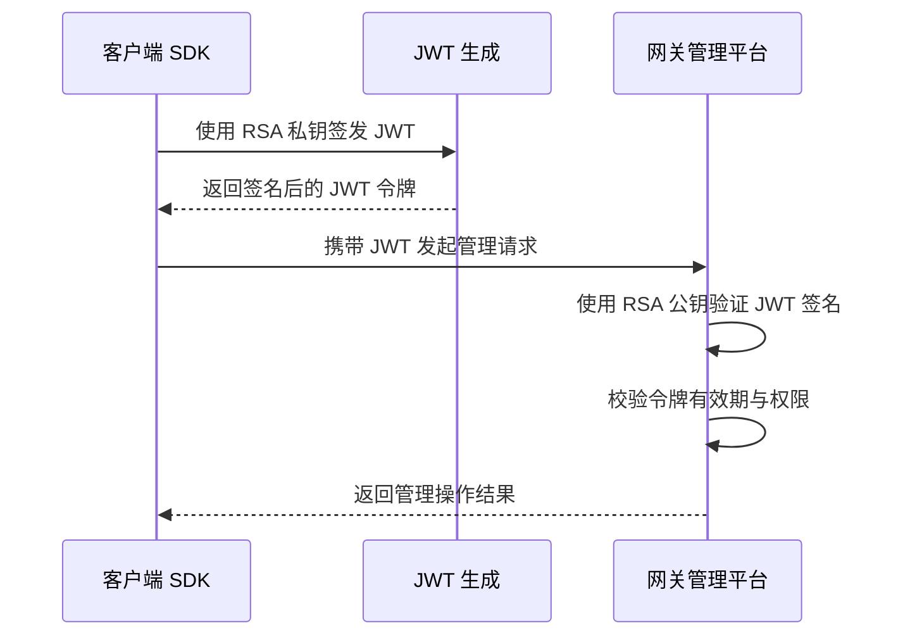

# sc-client-api 网关客户端 SDK

## 模块概述

`sc-client-api` 是微服务网关的客户端 SDK 模块，为上层业务服务提供与网关管理平台交互的能力，涵盖微服务注册、路由管理、用户管理、认证鉴权等核心功能。模块采用 **Interface → Implementation → Proxy** 三层架构模式，通过接口契约隔离调用方与实现细节，支持精准引入策略和灵活的依赖排除配置。

| 属性 | 值 |
|------|------|
| **groupId** | `com.snz1.gateway` |
| **artifactId** | `sc-client-api` |
| **version** | `3.0.0-SNAPSHOT` |
| **packaging** | `jar` |
| **核心包路径** | `com.snz1.gateway.admin.v2` |
| **版本管理属性** | `sc-client-api.version`（由 `spring-boot3-app` 父 POM 统一管理） |

::: tip 版本管理
`sc-client-api` 的版本通过 `spring-boot3-app` 父 POM 中的 `sc-client-api.version` 属性统一管理，业务服务继承父 POM 后无需显式指定版本号。
:::

## 引入策略

### 标准引入

在业务服务的 `pom.xml` 中添加以下依赖：

```xml
<dependency>
    <groupId>com.snz1.gateway</groupId>
    <artifactId>sc-client-api</artifactId>
    <!-- 版本由 spring-boot3-app 父 POM 的 sc-client-api.version 属性管理 -->
</dependency>
```

### 精准引入策略（推荐）

`sc-client-api` 会传递引入 `utility-security` 及其完整的安全运行时栈。在客户端场景下，通常只需要 `User` 接口进行类型定义，不需要完整的 Spring Security 运行时。因此推荐排除 `utility-security` 的运行时依赖：

```xml
<dependency>
    <groupId>com.snz1.gateway</groupId>
    <artifactId>sc-client-api</artifactId>
    <exclusions>
        <exclusion>
            <groupId>com.snz1</groupId>
            <artifactId>utility-security</artifactId>
        </exclusion>
    </exclusions>
</dependency>
```

排除后，客户端可以引用 `User` 接口进行类型定义，但不会引入完整的 Spring Security 过滤器链和认证运行时栈，减少不必要的依赖冲突和启动开销。

### 完整引入（需要安全能力时）

如果业务服务本身需要安全认证能力（如 SSO 单点登录、JWT 令牌管理等），则保留完整依赖即可：

```xml
<dependency>
    <groupId>com.snz1.gateway</groupId>
    <artifactId>sc-client-api</artifactId>
    <!-- 不排除 utility-security，保留完整安全运行时栈 -->
</dependency>
```

## 依赖关系

### 传递依赖链路

`sc-client-api` 的核心依赖传递链路如下：

```text
sc-client-api
  └── com.snz1:utility-security
        └── com.snz1:utility-mvc
              └── com.snz1:utility-tools
        └── com.snz1:utility-tools
              └── com.snz1.gateway:apihelper
                    └── com.auth0:java-jwt:4.5.2
                    └── com.squareup.retrofit2:retrofit:3.0.0
                    └── com.squareup.okhttp3:okhttp:4.12.0
```

### 框架内依赖关系图



::: warning 依赖排除后的影响
排除 `utility-security` 后，以下能力将不可用：
- `JwtProvider` 令牌签发与验证
- `SsoHeaderAuthenticationFilter` SSO 认证过滤器
- `WebSecurityConfig` Spring Security 配置
- `ContextUtils.getCurrentUser()` 获取当前用户

仅保留 `User` 接口供类型引用。如需安全能力，请使用完整引入策略。
:::

## 三层架构模式

`sc-client-api` 采用 **Interface → Implementation → Proxy** 三层架构模式，通过接口契约定义业务能力，实现类承载具体逻辑，代理层处理远程调用与认证注入。



### 设计优势

| 特性 | 说明 |
|------|------|
| **接口隔离** | 调用方依赖接口契约，不耦合具体实现 |
| **代理透明** | 认证、重试等横切逻辑由 Proxy 层统一处理 |
| **可测试性** | 接口层可轻松 Mock，便于单元测试 |
| **可扩展性** | 新增管理能力只需扩展接口和实现 |

## 核心接口说明

### ServiceManager — 微服务注册管理

微服务注册管理接口，提供服务的新增、查询、更新等能力。

| 方法 | 说明 |
|------|------|
| `doCreateService(...)` | 注册微服务，捕获 UNIQUE 约束违规实现幂等性 |
| `doDeleteService(...)` | 注销微服务 |
| `doGetService(...)` | 查询微服务信息 |
| `doUpdateService(...)` | 更新微服务配置 |

**幂等性设计：**

`ServiceManagerImpl` 在执行 `doCreateService` 时，会捕获数据库 UNIQUE 约束违规异常。当重复注册同一微服务时，不会抛出异常而是返回已有记录，实现注册操作的幂等性。

```java
// 幂等性处理伪代码
try {
    // 执行 INSERT 操作
    serviceRepository.insert(service);
} catch (DataIntegrityViolationException e) {
    // UNIQUE 约束违规 → 查询并返回已有记录
    return serviceRepository.findByName(service.getName());
}
```

### ServiceRouteManager — 路由管理

路由管理接口，提供服务路由插件的添加、删除、查询等能力。

| 方法 | 说明 |
|------|------|
| `addServiceRoutePlugin(...)` | 添加路由插件，捕获 UNIQUE 违规实现幂等性 |
| `removeServiceRoutePlugin(...)` | 移除路由插件 |
| `getServiceRoutePlugins(...)` | 查询路由插件列表 |
| `updateServiceRoutePlugin(...)` | 更新路由插件配置 |

**安全插件常量：**

| 常量 | 说明 |
|------|------|
| `ssoauth` | SSO 单点登录认证插件 |
| `jwtauth` | JWT 令牌认证插件 |
| `authacl` | 访问控制列表（ACL）鉴权插件 |

```java
// 添加 JWT 认证路由插件示例
serviceRouteManager.addServiceRoutePlugin(
    serviceName,
    ServiceRoutePluginConstants.JWTAUTH,
    pluginConfig
);
```

### UserManager — 用户管理

用户管理接口，提供批量用户操作能力。

| 方法 | 说明 |
|------|------|
| `batchCreateUsers(...)` | 批量创建用户 |
| `batchUpdateUsers(...)` | 批量更新用户 |
| `batchDeleteUsers(...)` | 批量删除用户 |
| `getUsers(...)` | 分页查询用户 |

**批量操作限制：**

`UserManagerImpl` 定义了 `MAX_BATCH_SIZE = 500` 的批量操作上限。该限制受 HTTP 请求头大小约束，因为批量操作的数据通过 HTTP 请求传递，过大的批量会导致请求头超限。

```java
public class UserManagerImpl implements UserManager {
    private static final int MAX_BATCH_SIZE = 500;

    public void batchCreateUsers(List<User> users) {
        if (users.size() > MAX_BATCH_SIZE) {
            throw new IllegalArgumentException(
                "批量操作数量不能超过 " + MAX_BATCH_SIZE
            );
        }
        // 执行批量创建...
    }
}
```

## 认证配置

`sc-client-api` 通过 **JWT + RSA 私钥** 机制与网关管理平台进行认证通信。

### 配置项

在 `application.yml` 中配置网关管理平台连接和认证参数：

```yaml
app:
  gateway:
    # 网关管理平台地址
    admin-url: https://gateway-admin.example.com
    # JWT 令牌配置
    token:
      # RSA 私钥（PEM 格式，去除头尾标记）
      private-key: MIIEvQIBADANBgkqhkiG9w0BAQEFAASCBKcwggSjAgEAAoIBAQ...
      # 令牌有效期（秒）
      live-time: 3600
      # 签名密钥
      secret: your-secret-key
      # 签名算法
      algorithm: RS256
```

### 配置项说明

| 配置项 | 说明 | 示例值 |
|--------|------|--------|
| `app.gateway.admin-url` | 网关管理平台基础 URL | `https://gateway-admin.example.com` |
| `app.gateway.token.private-key` | RSA 私钥，用于 JWT 签名 | PEM 格式私钥内容 |
| `app.gateway.token.live-time` | JWT 令牌有效期（秒） | `3600` |
| `app.gateway.token.secret` | 令牌签名密钥 | 自定义密钥字符串 |
| `app.gateway.token.algorithm` | JWT 签名算法 | `RS256` |

### 认证流程



## 使用示例

### 1. 服务注册

```java
import com.snz1.gateway.admin.v2.ServiceManager;

@Service
public class ServiceRegistrationService {

    private final ServiceManager serviceManager;

    public ServiceRegistrationService(ServiceManager serviceManager) {
        this.serviceManager = serviceManager;
    }

    public void registerService(String serviceName, String serviceUrl) {
        // 幂等注册：重复调用不会抛出异常
        serviceManager.doCreateService(serviceName, serviceUrl);
    }
}
```

### 2. 路由插件管理

```java
import com.snz1.gateway.admin.v2.ServiceRouteManager;

@Service
public class RouteConfigService {

    private final ServiceRouteManager routeManager;

    public RouteConfigService(ServiceRouteManager routeManager) {
        this.routeManager = routeManager;
    }

    public void configureJwtAuth(String serviceName) {
        // 幂等添加：重复添加同一插件不会报错
        routeManager.addServiceRoutePlugin(
            serviceName,
            "jwtauth",
            null  // 使用默认插件配置
        );
    }

    public void configureSsoAuth(String serviceName) {
        routeManager.addServiceRoutePlugin(
            serviceName,
            "ssoauth",
            null
        );
    }

    public void configureAcl(String serviceName, String aclConfig) {
        routeManager.addServiceRoutePlugin(
            serviceName,
            "authacl",
            aclConfig
        );
    }
}
```

### 3. 批量用户操作

```java
import com.snz1.gateway.admin.v2.UserManager;
import java.util.List;

@Service
public class UserBatchService {

    private final UserManager userManager;

    public UserBatchService(UserManager userManager) {
        this.userManager = userManager;
    }

    public void importUsers(List<User> users) {
        // 确保批量大小不超过 MAX_BATCH_SIZE (500)
        if (users.size() > 500) {
            // 分批处理
            int batchSize = 500;
            for (int i = 0; i < users.size(); i += batchSize) {
                int end = Math.min(i + batchSize, users.size());
                userManager.batchCreateUsers(users.subList(i, end));
            }
        } else {
            userManager.batchCreateUsers(users);
        }
    }
}
```

### 4. 完整配置示例

```yaml
spring:
  application:
    name: my-business-service

app:
  gateway:
    admin-url: https://gateway-admin.internal.company.com
    token:
      private-key: ${GATEWAY_RSA_PRIVATE_KEY}
      live-time: 3600
      secret: ${GATEWAY_TOKEN_SECRET}
      algorithm: RS256
```

```xml
<!-- pom.xml -->
<dependency>
    <groupId>com.snz1.gateway</groupId>
    <artifactId>sc-client-api</artifactId>
    <exclusions>
        <exclusion>
            <groupId>com.snz1</groupId>
            <artifactId>utility-security</artifactId>
        </exclusion>
    </exclusions>
</dependency>
```

## 注意事项

### 1. 精准引入与完整引入的选择

::: warning 依赖策略选择
- **精准引入（排除 utility-security）**：适用于仅需调用网关管理 API 的场景，不启动安全过滤器链
- **完整引入（保留 utility-security）**：适用于业务服务本身也需要安全认证的场景
- 切勿在同一项目中混用两种策略，避免类加载不一致问题
:::

### 2. 批量操作大小限制

`UserManagerImpl` 的 `MAX_BATCH_SIZE = 500` 是硬性限制，受 HTTP 请求头大小约束。批量操作时需自行分批处理，避免超出限制导致请求失败。

### 3. 幂等性保证

`ServiceManagerImpl.doCreateService` 和 `ServiceRouteManagerImpl.addServiceRoutePlugin` 通过捕获数据库 UNIQUE 约束违规实现幂等性。这意味着：
- 重复注册同一服务不会报错，而是返回已有记录
- 重复添加同一路由插件不会报错，操作被静默忽略
- 幂等性仅针对 UNIQUE 约束场景，其他数据库异常仍会正常抛出

### 4. RSA 私钥安全

::: warning 密钥管理
- 私钥应通过环境变量或配置中心注入，不要硬编码在配置文件中
- 生产环境建议使用 `${GATEWAY_RSA_PRIVATE_KEY}` 等环境变量引用
- 私钥泄露将导致 JWT 令牌可被伪造，造成严重安全风险
:::

### 5. JDK 版本要求

`sc-client-api` 基于 **JDK 21** 编译，与 `spring-boot3-app` 父 POM 的 Java 版本要求一致。引入方需确保运行环境为 JDK 21 或以上版本。

### 6. 与 apihelper 的关系

`sc-client-api` 通过传递依赖链获取 `apihelper` 提供的 HTTP 客户端能力（Retrofit + OkHttp）和 JWT 令牌能力（java-jwt）。这些能力由 Proxy 层使用，对调用方透明。如需直接使用 HTTP 调用能力，建议直接引入 `apihelper`。

## 版本信息

| 属性 | 值 |
|------|------|
| **当前版本** | `3.0.0-SNAPSHOT` |
| **版本管理属性** | `sc-client-api.version` |
| **父 POM** | `com.snz1:spring-boot3-app:3.0.0-SNAPSHOT` |
| **核心包路径** | `com.snz1.gateway.admin.v2` |
| **Java 版本** | 21 |
| **认证机制** | JWT + RSA 私钥 |
| **批量操作上限** | 500 |
